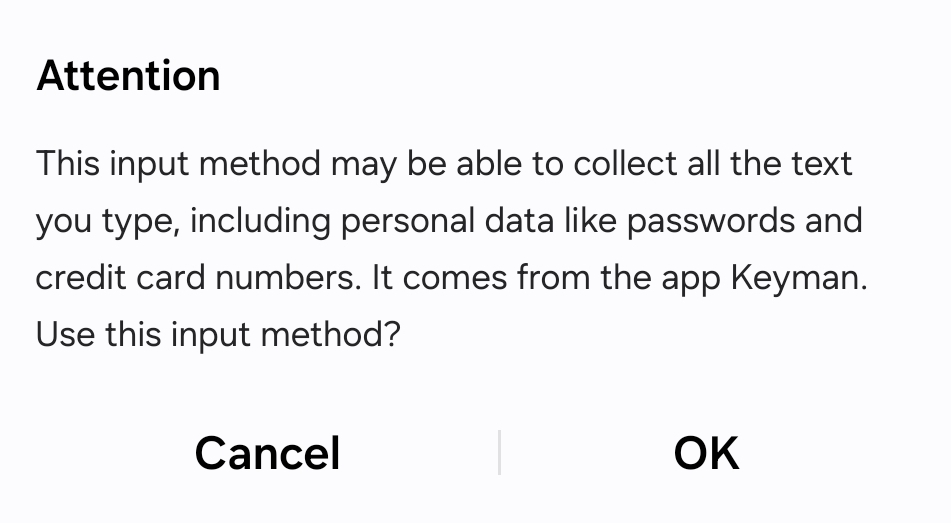

No!

We never have and never will include adware or spyware components. 

Keyman does contact the keyman.com website periodically to check for updates for the keyboards and predictive text dictionaries you have installed. 
In this process, the only information communicated is the current version of Keyman and the version of the keyboards and dictionaries.

When [enabling Keyman as a system keyboard](../start/enabling-system-keyboard), Android displays the following warning, which is the same message that is displayed for any keyboard app that is installed onto an Android device.

> Attention: This input method may be able to collect all the text you 
> type, including personal data like passwords and credit card numbers.
> It comes from the app Keyman. Use this input method? Cancel / OK

The Keyman app does not record the keystrokes you type and does not send keystrokes off-device, unlike many other keyboard apps. All predictive text suggestions are entirely on your device.

Keyman is an open source application, and you are most welcome to inspect the source code at https://github.com/keymanapp/keyman.