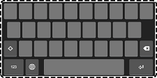

## Adjust Keyboard Height

This menu is used to adjust the height of the on-screen keyboard (OSK), which does not include the suggestion banner.

Drag the blank OSK at the bottom of the screen to increase or decrease the keyboard height for the device's current orientation (portrait vs landscape). The adjusted keyboard heights are automatically saved when the blank OSK is released.

### Reset to Default Height
Press the button to reset the OSK height to the default values.

