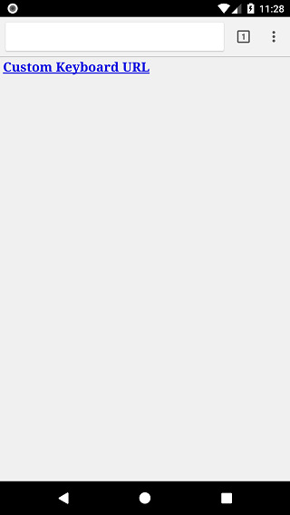
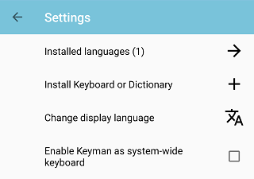
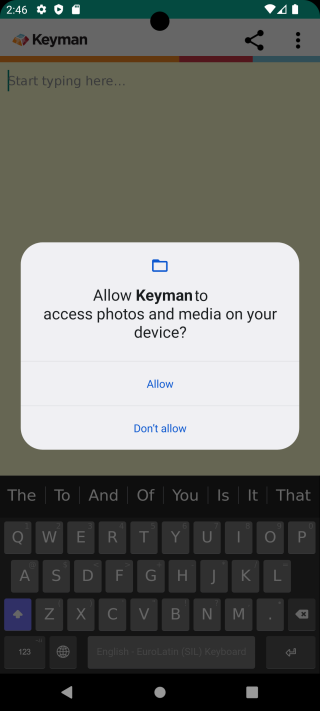
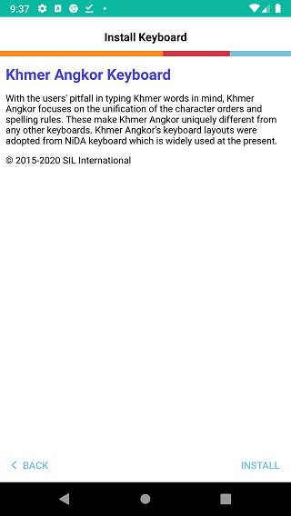
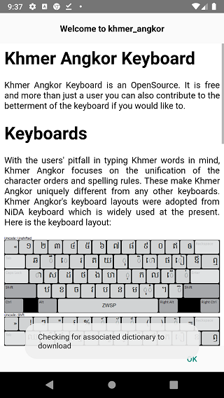
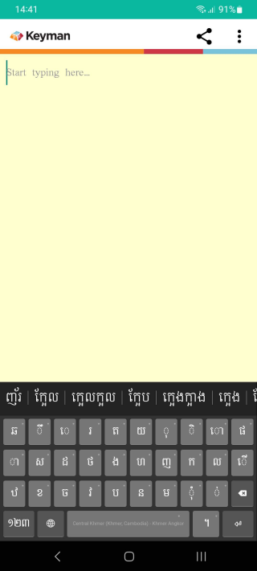

## Installing Custom Keyboards/Dictionaries
These same steps can be used for installing custom keyboard or custom dictionary packages. This example is for Khmer Angkor keyboard.

Step 1) Click the link to your custom package file.

Step 2) Once the KMP file is on your device, you will need to browse to the KMP file and select it.
From the Keyman menu, select 'Settings'.

From the Keyman Settings menu, select 'Install Keyboard or Dictionary'.

From the 'Install Keyboard' menu, select 'Install from local file'.

The device will launch a file browser where you'll browse to the directory of your KMP file.
A common place to look is the "Downloads" folder.

Selecting the KMP file should bring you to Step 3)

Step 3) On Android 6.0 (Marshmallow) and higher, mobile apps need to request permissions to access storage. Keyman
for Android needs access to read storage for installing the KMP file. At the dialog, select **"ALLOW"**. Once authorized,
Keyman for Android won't need to ask for storage permission again, unless the user revokes or uninstalls the app.

Older versions of Android grant Storage permissions at app installation time, so those users can skip this step.

Step 4) Keyman for Android will verify the package, and display more information about it, including package version and 'readme' notes if available.

This will be displayed at the confirmation to install the keyboard package.

If "readme.htm" is not included, a generic page with the package ID and package version will be shown. Click the
**"Install"** button to install the entire keyboard package.

Step 5) All the keyboards in the package are installed as a group. In this example, the package only has the
"Khmer Angkor" keyboard, so it becomes the active keyboard. For custom dictionary packages, only one dictionary
will be installed.

If the keyboard package includes Welcome documentation, it will be displayed after the keyboard package is installed.
This documentation helps you to get started using the keyboard.

Click the **"OK"** button to finish installing the keyboard. You should be able to select it from the Keyman globe key 
and start typing with it in any app.

To learn how to create a custom keyboard package,
[click here](https://help.keyman.com/developer/current-version/guides/distribute/)

