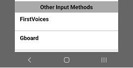

## Switching Between Keyboards
To switch keyboards, follow these steps:

Step 1)
With the keyboard visible, press and release the globe key:

| Keyboard Type | # Keyman Keyboards | Short press and release to |
|---------------|:------------------:|----------------------------|
| In-app        | 1                  | Display keyboard picker menu |
| In-app        | 2+                 | Quickly switch to next Keyman keyboard |
| System        | 1                  | Quickly switch to previous system keyboard |
| System        | 2+                 | Quickly switch to next Keyman keyboard |

A long press on the globe key will bring up a list of all currently installed languages (the default is **English EuroLatin (SIL)**). 

If you have already downloaded additional languages, they will appear here.
Simply select them and the keyboard will re-appear with the new language.

## Hotkey
To switch between languages while using an external keyboard (i.e. a bluetooth keyboard), a quick and easy way is to
use a hotkey combination. Press and hold <kbd>Ctrl</kbd> and then press <kbd>Tab</kbd>.
You should then see the same listing of languages/keyboards. Tap on any available language of your choice.

### Alternate Step for System Keyboard

The Keyman system keyboard lists **Other Input Methods** that are enabled at the bottom of
the keyboard picker menu. Selecting any of those keyboards close Keyman and switch to the selected system keyboard.

