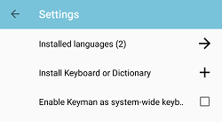

## Removing a Keyboard
To uninstall a keyboard, follow these steps:

Step 1)
Open the menu for additional options. Select 'Settings'

Step 2)
From the Keyman Settings menu, select 'Installed languages'

Step 3)
From the 'Installed languages' menu, select the language for the keyboard you want to remove.

Step 4)
The language Settings menu lists currently installed keyboards associated with the language.
Select the keyboard you want to uninstall

Step 5)
The bottom of the keyboard settings menu displays an option to uninstall the keyboard.
Select 'Uninstall keyboard' to get a prompt to delete the keyboard.

**Note:** Two or more keyboards need to be installed in order to display this option of uninstalling a keyboard.

Step 6)
Press **"Delete"** to uninstall the keyboard.

You'll see a notification when the keyboard is deleted.

