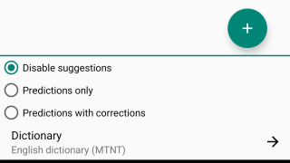
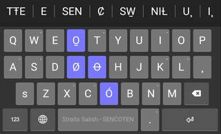
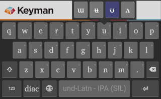

## About the Keyboard Banner

Keyman keyboards now always display a banner above the keyboard for one of the following functionalities:

* Display suggestions (See "Using the Suggestion Banner" below)
* Display a Keyman-themed banner so popups and gestures for the top row of keys are visible
* Reserved for future functionality

## Controlling the Keyboard Banner Mode

The banner mode can be controlled by going to Keyman Settings --> (select an installed language)

At the bottom of the language settings menu are three controls for the banner:

* Disable suggestions (Display image banner instead)
* Predictions only (Suggestion banner displays predictions)
* Predictions with corrections (Suggestion banner displays predictions and corrections)

## Using the Suggestion Banner

If a [dictionary is installed](installing-dictionaries) and enabled for the active Keyman keyboard, the banner will display suggestions that can be selected.

* Drag the banner horizontally to see more suggestions
* Overly-long suggestions are partially hidden, but expand when a finger is held on them
* Banner displays up to 8 suggestions

## The Keyman Themed Banner

When suggestions are disabled or unavailable, the Keyman-themed banner will display instead. This is displayed so popups and gestures for the top row of keys are visible. 

