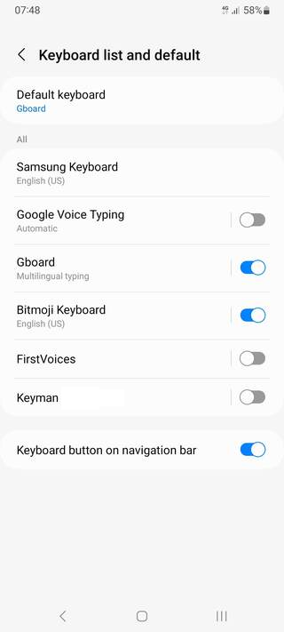
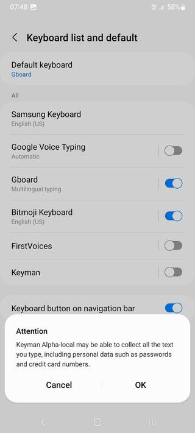
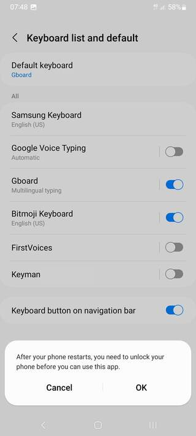
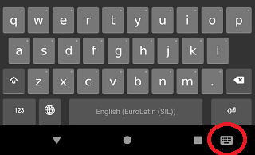
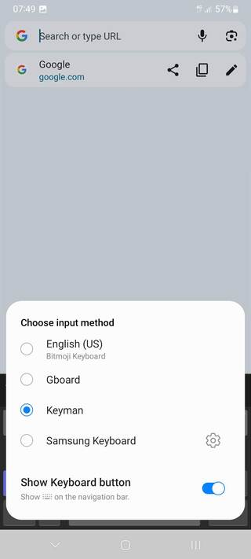

## Enabling System Wide Keyboards
Step 1)
Open the Keyman app and select the menu for additional options.
The screenshots below are of a device running Android 12 Snow Cone.

Step 2)
Select 'Get Started' and then select 'Enable Keyman as system-wide keyboard'.

This will open an Android settings screen for 'Available virtual keyboard'.

Step 3)
Enable 'Keyman' as an available virtual keyboard.
This will bring up two confirmation dialogs.

Select 'OK' on both. Now when the on-screen keyboard appears for apps other than Keyman,
you'll see a keyboard icon at the bottom right.

Click the keyboard icon whenever you want to change the current system keyboard.

