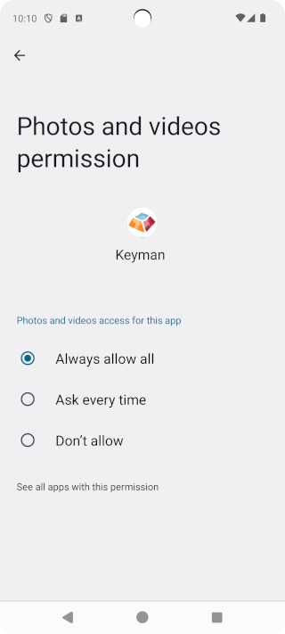

## Granting Storage Permission
If Keyman for Android is permanently denied storage access, attempts to install custom packages will fail with the
notification "Storage permission request was denied". Perform these steps to grant Keyman for Android access to storage

### Android 11.0 to 12L Devices

Step 1)
Go to Android Settings.

Step 2)
Depending on your device, click "Apps", "Apps & notifications", or "App permissions" and grant Keyman
permission to access storage / "file and media". The screenshot below is from Android 12.0 S.

### Android 13.0+ Devices

Step 1)
Go to Android Settings.

Step 2)
Depending on your device, click "Apps" and grant Keyman permission to the following:
  * Photos and videos --> Always allow all

The screenshot below is from Android 14.0.

