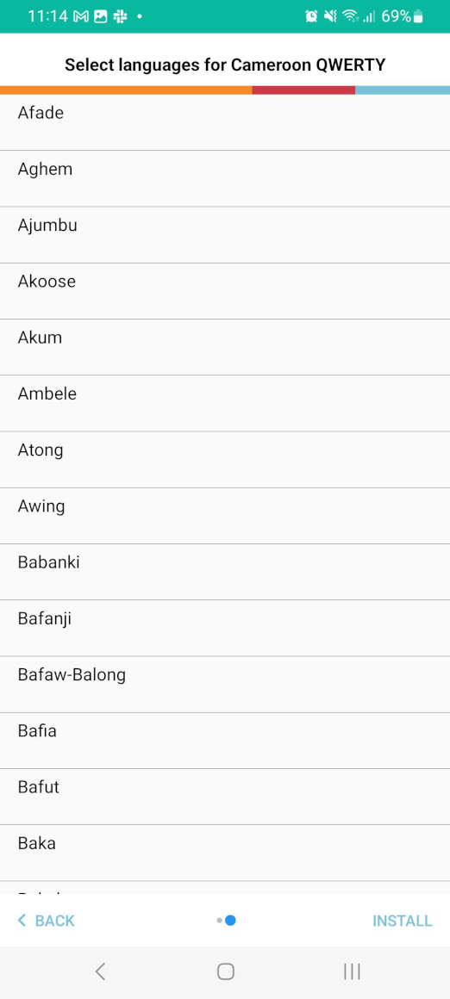

Here are some of the new features we have added to Keyman for Android 14.0:

* Improved UI for installing keyboard packages (#3498)
* Select a language during keyboard package installation (#3481)

* Added new menu to add languages for an installed keyboard package (#3255)
* Consolidated install menus for installing keyboards (#3245)
* Fix slow input in the embedded browser (#3768)
* Add system globe action to show system keyboards (#3197)
* Improved corrections and predictions (#3555)
* Match user input capital letters when offering suggestions (#3845)
* Update minimum Android SDK to 21 (Android 5.0 Lollipop) (#2993)
* Keyman now works more reliably with WeChat and Telegram (#4254)
* Added new menu to change the display language (#4261)
