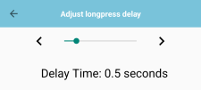

## Adjust Longpress Delay

This menu is used to adjust the duration for triggering a longpress gesture.

Drag the slider to set the delay between 0.3 seconds to 1.5 seconds.

The default value is 0.5 seconds.

