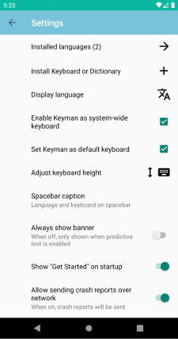
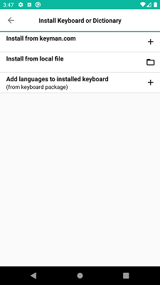

## Using the Settings Screen

This Settings screen is used to configure keyboards and dictionaries.
It also has many of the options that are available on the 'Get Started' menu. To access the Settings screen:

Step 1)
Open the Keyman app.

Step 2)
Click the menu for additional options. Select 'Settings'

Each selection on the Keyman Settings screen is described in further detail below:

## Installed Languages
This displays the number of installed languages in parentheses `()`. Click this line for the 'Installed Languages'
screen where you can [install new keyboards](../../start/installing-keyboards) from the keyman.com catalog.

## Install Keyboard or Dictionary
This displays a few ways to install a keyboard package or dictionary package.

### Install from keyman.com
Click on this to search for a keyboard from keyman.com and install. The process is the same as [installing keyboards](../../start/installing-keyboards).

### Install from local file
Click on this to [install custom keyboard and dictionary packages](../installing-custom-packages).

### Add languages to installed keyboard
For installed keyboard packages, click on this to associate another language with a keyboard.
If all the languages for a keyboard have already been installed,
this won't change anything.

## Enable Keyman as system-wide keyboard
By default, installed Keyman keyboards are only available to use within the Keyman app. Click on this setting to
bring up the Android system configuration so Keyman can be added as a system-wide keyboard.

## Set Keyman as default keyboard
Click on this to bring up the Android system configuration for setting Keyman as the default system-wide keyboard.

## Change Display Language

Click on this to change the display language of the Keyman for Android app. The list of available languages come from [translate.keyman.com](https://translate.keyman.com). If a translation is available, Keyman for Android will default to the device's default locale.

## Always show banner
This toggle is reserved for future features. When off, the text suggestion banner is only displayed when
the dictionary is enabled. The language associated with the keyboard must match the language associated with
the dictionary.

## Show "Get Started" on startup
When enabled, the Keyman app will display the 'Get Started' screen on app startup.

## Allow sending crash reports over network
When enabled, the Keyman app will send crash reporting information to https://sentry.keyman.com. No personally identifiable information or keyboard strokes are recorded.