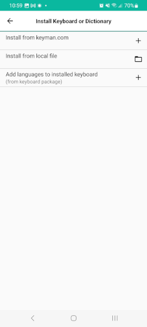

## Install Keyboard or Dictionary
This menu has a few ways to install a keyboard package or dictionary package.

### Install from keyman.com
Click on this to search for a keyboard from keyman.com and install. The process is the same as [installing keyboards](../../start/installing-keyboards).

### Install from local file
Click on this to [install custom keyboard and dictionary packages](../installing-custom-packages).

### Add languages to installed keyboard
For installed keyboard packages, click on this to associate another language with a keyboard.
If all the languages for a keyboard have already been installed,
this won't change anything.