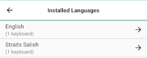
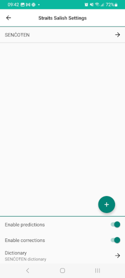
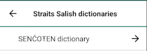
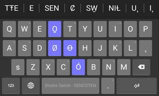

## Adding New Dictionaries
Whenever a keyboard is [added](../start/installing-keyboards), the app automatically adds an associated dictionary
if it's available on keyman.com.

If you've downloaded a dictionary package to your device, you can [install the custom package](installing-custom-packages) to add the dictionary.

If you've already added a keyboard and an associated dictionary later becomes available on keyman.com,
you can add the dictionary from the Keyman Settings menu by following these steps:

Step 1)
From the Keyman Settings menu, select 'Installed languages'

Step 2)
From the 'Installed languages' menu, touch the language for the dictionary you want to add. In this example, we select
"Straits Salish (Latin)".

Step 3)
The settings for that language will appear. At the top is the installed keyboard.
At the bottom, select "Dictionary".

Step 4)
If there's an available dictionary to add, this page will show it. Installed dictionaries will show a checkmark on the left.
Select the dictionary name to add it.

Step 5)
This will be displayed at the confirmation to install the dictionary package.

A notification will appear when the dictionary package is downloading in the background.

Step 6)
Once the download is complete, you'll see the dictionary-provided suggestions when you have the keyboard active.

