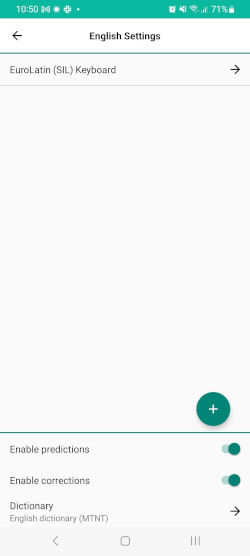
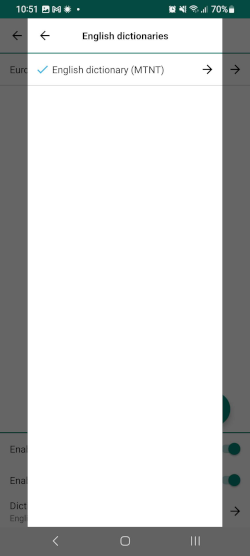
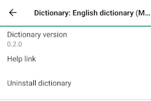
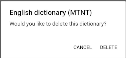
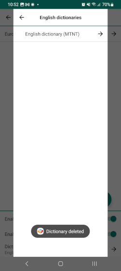

## Removing a Dictionary
To uninstall a dictionary, follow these steps:

Step 1)
Open the menu for additional options. Select 'Settings'

Step 2)
From the Keyman Settings menu, select 'Installed languages'

Step 3)
From the 'Installed languages' menu, select the language for the dictionary you want to remove. In this example,
we will be removing the "MTNT Dictionary" for the English language.

Step 4)
The language Settings menu lists currently installed keyboards and dictionaries associated with the language.
Select the dictionary you want to uninstall at the bottom of the page.

Step 5)
The dictionaries menu displays the dictionaries that are available for a language. Installed dictionaries show a check mark.
Select the dictionary to display the info menu.

Step 6)
The bottom of the dictionary settings menu displays an option to uninstall the dictionary.
Select 'Uninstall dictionary' to get a prompt to delete the dictionary.

Step 7)
Press "Delete" to uninstall the dictionary.

You'll see a notification when the dictionary is deleted.

