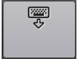
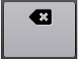
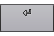

|   | Keyboard Keys  (Keyboard Present) |
|---|---|
|  | Globe key Short press and release this key to: display the keyboard picker menu (when 1 keyboard installed) or select another language/keyboard (when 2+ keyboards installed)  Long press and release this key to display the keyboard picker menu |
|  | Hide the keyboard |
|  | Backspace |
|  | Return |
|  | Shift key. Long press this key to access the <kbd>CTRL</kbd>, <kbd>ALT</kbd> and <kbd>CTRL</kbd><kbd>ALT</kbd> keys (which can access additional key layers) |
|  | Keys with a character (default of small dot) in the top right corner indicate further functionality by one of the following ways:  * long pressing the key  * multi-tapping the key  * a flick gesture in one of 8 directions (up, down, left, right, and the 4 intermediate corners) |

----

|   | Toolbar Icons |
|---|---|
|  | Share your text with other atps like Messages, Gmail, or Twitter. Some versions of Android also let you copy your text to the clipboard. |
|  | Open the menu for additional options |
|  | Adjust the font size |
|  | Delete all current text |
|  | Load this help page |
|  | Open the initial setup screen |
|  | Open the [Keyman Settings](../basic/config/) |
|  | Update available to download for keyboard / dictionary |

### See Also
* [Keyman for Android (Phone Layout)](menu-phone)