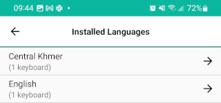

## Adding New Keyboards
To add keyboards, follow these steps:

Step 1)
Open the menu for additional options. Select 'Settings'

Step 2)
From the Keyman Settings menu, select 'Installed languages'

    
Step 3)
From the 'Installed languages' menu, touch the **+**
button in the bottom right corner of your screen.

Step 4)
A keyboard search page will appear. Type in the search box to look for a keyboard based on: keyboard name, language name, or country. 

To search for a specific BCP 47 language code, use a search `l:id:`.

In this example, we search for the word "khmer".

Select a keyboard to show additional information. Click the green button to install.

A notification will appear when the keyboard package is downloading in the background.

Step 5)
Once the download is complete, an installation wizard will start the new keyboard package installation process.

a) The keyboard readme.htm documentation will appear (if available) before proceeding to the next step.

b) If the keyboard supports multiple languages, select languages to install. When a keyboard package only lists one language (`khmer_angkor` only lists **km: Central Khmer**),
the installer proceeds to the next step.

c) The installer will bring you to the welcome.htm documentation that provides additional information before getting started.

After the new keyboard is installed, it will become active.

