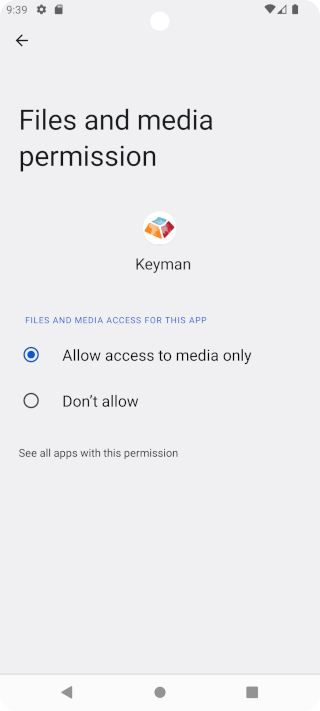

## Granting storage permission
If Keyman for Android is permanently denied storage access, attempts to install custom packages will fail with the
notification "Storage permission request was denied". Perform these steps to grant Keyman for Android access to storage

Step 1)
Go to Android Settings.

Step 2)
Depending on your device, click "Apps", "Apps & notifications", or "App permissions" and grant Keyman
storage permission. The screenshot below is from Android 9.0 Pie.

