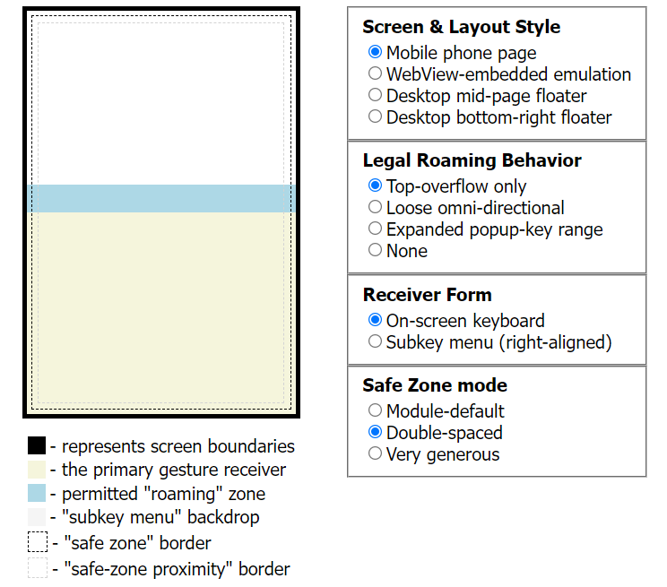

# GestureRecognizer - DOM configuration design

The design for `GestureRecognizer`'s configuration object is based upon the needs and logic
of the on-screen keyboard (the "OSK") as implemented in Keyman Engine for Web 15.0.
Much of its related code is strewn about in various places there; one of the benefits of
developing this module has been to better document the behavior and produce an explicit
abstraction that can both centralize and clarify it.

While many doc-comments have been added to the configuration object's code, a bit more
overview may yet be merited here.

## On "safe zones" and "safe zone padding"

For modeling cancellation of an ongoing touchpoint or cursor-based input sequence, our design
considers it important to have coordinate boundaries that may actually be crossed.  This is
notably complicated by certain use cases.

Consider implementation of an OSK that completely fills a WebView in a mobile application -
we actually use this in Keyman for Android and in Keyman for iPhone and iPad.  Without any
defined "safe zone", it is impossible for a touchpoint within the WebView to actually leave
this OSK's boundaries.  Should the user's finger attempt to leave those boundaries... it
leaves the viewport entirely - and quite possibly, the physical boundaries of the device's
touchscreen!

To facilitate this, we have implemented a "safe zone" of sorts, traditionally based on the
available viewport.  Should a touchpoint cross the boundary of the safe zone - and thus,
become very close to a device boundary - that may then be used as criteria for a cancellation.
In reference to the [demo/host page](../../../../web/testing/gesture-recognizer/), this is
visualized as the outer, darker-colored set of dashed lines nested closely to the emulated
device borders.

However!  What if the user _starts_ their input sequence very close to the safe zone?
Especially with touch-based input, there can be natural shifts in position of the input point
that may accidentally cross that boundary... and it is entirely possible to _start_ in an
"unsafe" area.  To prevent this from auto-canceling user input in these scenarios, we have
also noted a need for "safe zone padding".  In reference to the
[demo/host page](../../../../web/testing/gesture-recognizer/), this is
visualized as the inner, lighter-colored set of dashed lines.

Any input sequence _starting_ within an "unsafe" area - between the lightly-colored dashed
lines and the emulated device border, may ignore the boundaries of the safe zone -
but only for borders on the same side(s) as the violated "padded safe zone" border.

To recap:
- The "safe zone" is designed to facilitate input-sequence cancellation at borders offset from
  specific values - typically, from a web page's viewport.
- "Safe zone padding" is used to allow selective cancellation of specific safe zone borders for
  sequences that start very close to them.

We have generalized the "safe zone" somewhat by allowing versions based on sources aside from
the available viewport.  This is largely intended to facilitate interactive demos and testing
such as the page (and corresponding image) referenced above.

## On "roaming bounds"

At times, it is important to allow an ongoing coordinate-based input sequence to be permitted
extended boundaries before auto-canceling it.  Consider the nature of a "flick" input on
keyboards.  For keys in the top of the keyboard, it may be necessary to allow the touchpoint
to extend beyond the top of the main keyboard element before the flick can be properly
recognized.  For longpresses, it is also possible for the subkey menu may be displayed beyond
this area - though the subkey menu's handling of the input sequence should probably be
handled in its own implementation of `GestureRecognizer`.

The option for "Roaming bounds" exists in order to address such conditions.  This is visualized
in blue in the image seen earlier.