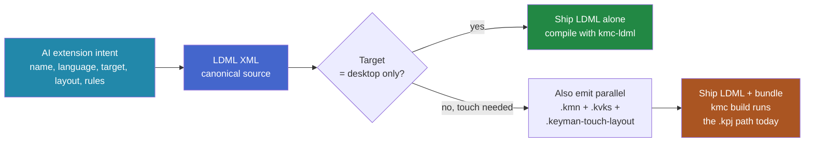
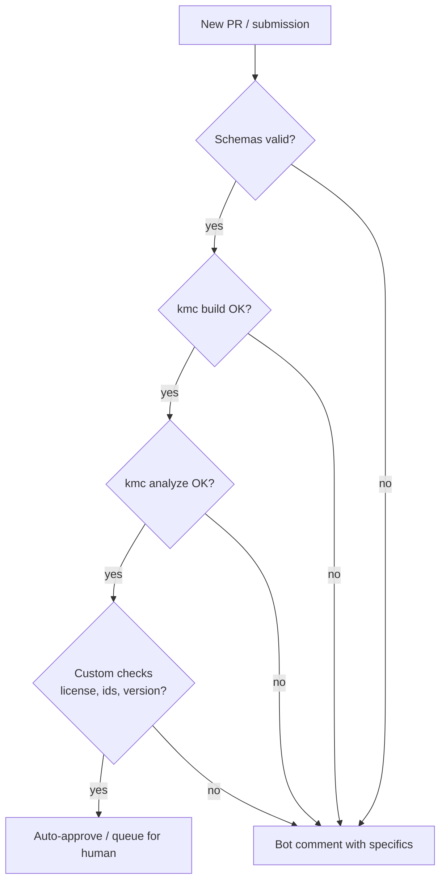
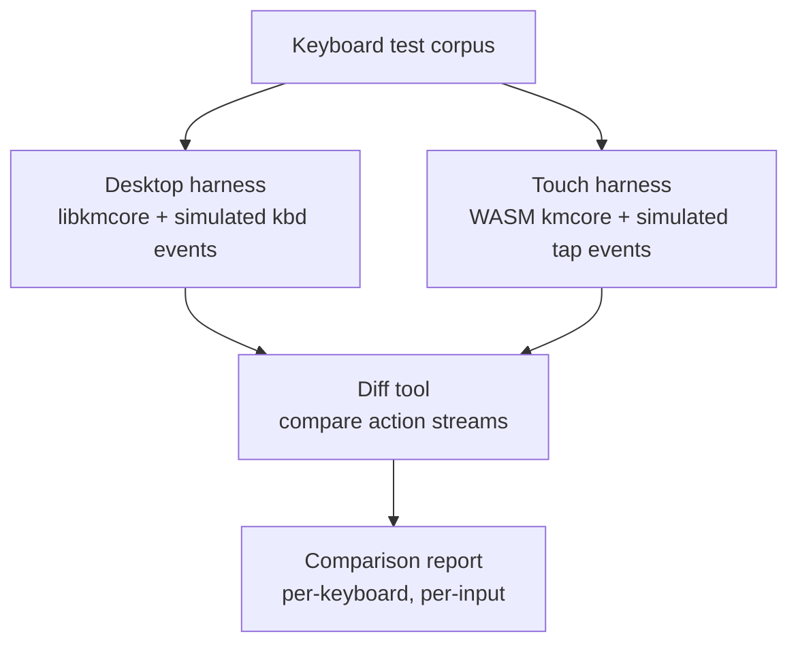

# External Tooling Guide

For people building tools *around* Keyman in other repositories: AI
extensions that assist keyboard development, automated submission
triage for the [keymanapp/keyboards](https://github.com/keymanapp/keyboards)
repo, lint bots, exhaustive test rigs, instrumented forks of the
compiler or engine for documentation work.

This guide is for *you*. It assumes you know what a Keyman keyboard *is*
(see [keyboard-anatomy.md](keyboard-anatomy.md) first if not) and
explains how to drive the Keyman pipeline from external code.

## The strategic frame for tools generating keyboards

Two facts shape every tooling decision here:

1. **The CLDR LDML keyboard spec is complete, including touch.** Layers
   (hardware + touch), forms, flicks, longpress, multi-tap, transforms —
   all defined. A spec-correct LDML keyboard with full touch markup is
   a perfectly valid document today.
2. **Keyman's *read side* for LDML touch isn't complete yet.** Compiler
   has TODOs, the Core C API doesn't expose layer/form data to hosts,
   and the KeymanWeb / mobile OSKs still drive off the legacy
   `.keyman-touch-layout` JSON, not kmx+. The runtime gap is detailed
   in [migration-guide.md § LDML](migration-guide.md#what-s-not-working-yet-the-touch-gap-all-layers)
   and tracked under
   [#7238](https://github.com/keymanapp/keyman/issues/7238) and the
   [`epic-ldml` label](https://github.com/keymanapp/keyman/issues?q=label%3Aepic-ldml).
   Realistic timeline: v21-ish (months out, funding-dependent).

The implication for an AI extension that generates keyboards: **emit
LDML XML as the canonical source of truth**, even though today Keyman
can't yet run all of it natively on mobile/web. The LDML is
forward-compatible — when Keyman closes the read side, the same
generated keyboards become natively runnable with no source rewrite.

### Recommended generation strategy



Concretely:

* **For desktop-only keyboards:** generate LDML XML, compile with
  `kmc build`. Done. No consistency contract to manage.
* **For keyboards that need to run on touch today** (mobile, web):
  generate the LDML XML *and* a derived `.kmn` + `.kvks` +
  `.keyman-touch-layout` bundle. Treat the LDML as the source of
  truth; treat the bundle as a transitional deliverable that exists
  only because the runtime can't read LDML touch yet. When Keyman
  catches up, you delete the bundle and regenerate.

The cross-file consistency contract documented below is for the
**transitional bundle** — keeping its files in sync with the LDML and
with each other. It exists because today's Keyman runtime requires it,
not because the LDML format does.

### Two practical tactics

1. **Start from a kmc-generated scaffold and mutate consistently.** Run
   `kmc generate keyboard ...` to produce a known-good starting set,
   then modify with strict cross-file invariants (see § Cross-file
   consistency contract below). kmc owns the source of truth for "what
   a fresh project looks like" and your tool inherits future kmc
   improvements automatically.
2. **Validate the LDML XML against the CLDR spec independently of
   Keyman** — that way the canonical source is correct even if your
   transitional bundle has gaps. Use the CLDR keyboard schema directly
   (see [§ Validating metadata with JSON Schemas](#validating-metadata-with-json-schemas)).

## The two integration surfaces

```mermaid
graph LR
    subgraph EXT[Your external tool]
      yt[AI extension / triage bot]
    end
    subgraph CLI[CLI surface]
      kmc[kmc<br/>command-line]
    end
    subgraph LIB[Library surface]
      npm[@keymanapp/kmc-*<br/>npm packages]
    end
    subgraph CORE[Native surface]
      core_so[Keyman Core<br/>libkmcore.so / .dll / .dylib]
      wasm[Keyman Core<br/>WebAssembly]
    end

    yt --shell out--> kmc
    yt --import--> npm
    yt --FFI / Emscripten--> core_so
    yt --import wasm--> wasm

    style EXT fill:#28a,color:#fff
    style CLI fill:#284,color:#fff
    style LIB fill:#46c,color:#fff
    style CORE fill:#a52,color:#fff
```

* **CLI surface** — shell out to `kmc` (or `kmcomp` for legacy `.kmn`-only
  work). Easiest, least coupling, but you pay process-startup cost per
  invocation and you parse text output.
* **Library surface** — import the `@keymanapp/kmc-*` packages from npm
  in a Node.js tool. Get TypeScript types, programmatic results, no shell
  parsing. Recommended for any non-trivial tool.
* **Native surface** — for tools that need to *execute* keyboards (not
  just compile them), link Keyman Core as a shared library (desktop /
  server) or import the WebAssembly build (Node.js or browser).

## The `kmc` CLI

`kmc` is the unified TypeScript entry point. Subcommands available:

```
kmc analyze    Analyze a keyboard / project
kmc build      Compile a keyboard, project, model, or package
kmc copy       Duplicate a project with a new id
kmc generate   Scaffold a new project (keyboard, model, etc.)
kmc message    Print info about a kmc compiler message (warning/error)
```

Install (Node 20+):

```bash
npm install -g @keymanapp/kmc
```

Or use directly from a checkout:

```bash
node /path/to/keyman/developer/src/kmc/build/kmc.js <args>
```

Get help:

```bash
kmc --help
kmc <command> --help
```

### Compiling a keyboard programmatically

```bash
# Compile a single .kmn or LDML XML file
kmc build path/to/keyboard.kmn

# Compile an entire .kpj project (produces .kmx + .js + .kmp)
kmc build path/to/keyboard.kpj

# JSON output for machine consumption
kmc build --log-format json path/to/keyboard.kpj
```

Exit code is 0 on success, non-zero on errors. Use
`--log-format json` to get a structured stream of messages your tool
can parse.

### Analyzing a keyboard

```bash
# Lint / static analysis
kmc analyze path/to/keyboard.kpj

# Get the rendered Osk image and other artifacts
kmc analyze osk-char-use path/to/keyboard.kmn
```

### Scaffolding a new keyboard

```bash
kmc generate keyboard \
  --author "Your Name" \
  --copyright "(c) Your Org" \
  --bcp47 "und-Latn" \
  --name "my_keyboard" \
  --license "MIT" \
  --target "any" \
  --description "Demo keyboard"
```

Result is a directory with `.kpj`, `.kmn`, `.keyboard_info`, `.kps`,
`.kvks` (basic touch layout), `welcome.htm`, `README.md`,
`HISTORY.md`, `build.sh`. It compiles out of the box.

This is your starting point for any "reliably produce a Keyman developer
folder that compiles" tool.

## The `@keymanapp/kmc-*` library surface

Each `kmc-*` directory under `developer/src/` is published as an npm
package. Use them as a library when you're already in a Node.js tool
and want structured results instead of shelling out.

Notable packages and their roles:

| Package | What it does |
|---|---|
| `@keymanapp/kmc` | The unified CLI (drives the others) |
| `@keymanapp/kmc-kmn` | Compile `.kmn` → `.kmx` (delegates to native kmcmplib) |
| `@keymanapp/kmc-ldml` | Compile LDML XML → `.kmx+` (TypeScript-native) |
| `@keymanapp/kmc-package` | Build `.kmp` package from `.kps` |
| `@keymanapp/kmc-keyboard-info` | Validate / compile `.keyboard_info` |
| `@keymanapp/kmc-analyze` | Static analysis / lint |
| `@keymanapp/kmc-copy` | Duplicate a project under a new id |
| `@keymanapp/kmc-generate` | Scaffold new projects |
| `@keymanapp/kmc-model` | Compile lexical models |
| `@keymanapp/kmc-model-info` | Validate `.model_info` metadata |
| `@keymanapp/common-types` | TypeScript types for `.kpj`, `.keyboard_info`, etc., plus generated JSON-schema validators |

Example: compiling a keyboard from a Node script.

```ts
import { KmnCompiler } from '@keymanapp/kmc-kmn';
import { CompilerCallbacks, NodeCompilerCallbacks } from '@keymanapp/common-types';

const callbacks: CompilerCallbacks = new NodeCompilerCallbacks();
const compiler = new KmnCompiler();
await compiler.init(callbacks);

const result = await compiler.runCompiler('path/to/keyboard.kmn', /*infile_str=*/null, {
  shouldAddCompilerVersion: true,
});

if (!result) {
  // compile failure: read messages from callbacks
  console.error(callbacks.messages);
}
// result.kmx is the compiled binary
```

The exact API may evolve; check each package's `src/` and exported `index.ts`
for the current shape.

## Cross-file consistency contract

For tools generating or mutating a `.kmn`-based keyboard project (the
non-LDML path), these values must stay aligned across the project files.
Most validation failures and weird runtime behaviors come from breaking
one of these.

### Identity

The **keyboard ID** is the most-replicated value. Treat it as the
canonical key everywhere:

| Where | How it appears |
|---|---|
| Directory name | `<keyboard_id>/` (convention) |
| File names | `<keyboard_id>.kpj`, `.kmn`, `.kps`, `.kvks`, `.keyman-touch-layout`, `.ico`, `.keyboard_info` |
| `.kpj` | The `<KeymanDeveloperProject>` references files by relative path; the ID is implicit in the filenames |
| `.keyboard_info` | The filename stem IS the ID; not repeated inside the JSON |
| `.kps` | Lists output artifacts (`.kmx`, `.js`, `.kvk`) with `<keyboard_id>.<ext>` names |
| Compiled `.kmx`/`.kmp` | Identity baked into the binaries; tools downstream key off it |

Rules: lowercase, ASCII letters / digits / underscores. Must be unique
across the [keymanapp/keyboards](https://github.com/keymanapp/keyboards)
catalog if you plan to submit.

### Display name

The human-readable keyboard name appears in two places:

| Where | Form |
|---|---|
| `.kmn` | `store(&NAME) 'Display Name'` |
| `.kps` | `<Info><Name URL="">Display Name</Name></Info>` |

(`.keyboard_info` does *not* carry the name; consumers display the
package metadata.)

### Versions — three different things, don't confuse them

This is the easiest place to mess up:

| Concept | `.kmn` | `.keyboard_info` | `HISTORY.md` |
|---|---|---|---|
| Keyboard version (what you ship) | `store(&KEYBOARDVERSION) '1.2.3'` | (no field) | top-most heading: `1.2.3 (YYYY-MM-DD)` |
| Min Keyman engine version | `store(&VERSION) '14.0'` | (no field) | n/a |
| Schema/file format version | n/a | n/a (implicit in schema) | n/a |

A bump to the keyboard version touches `.kmn` AND `HISTORY.md`. The
engine min-version (`&VERSION`) only changes when you start using
features that require a newer Keyman.

### Copyright / Author / License

| Where | Form |
|---|---|
| `.kmn` | `store(&COPYRIGHT) '© Your Name'` |
| `.kps` | `<Info><Copyright>…</Copyright><Author>Your Name</Author></Info>` |
| `.keyboard_info` | `"license": "mit"` (SPDX id) |
| `LICENSE.md` | full license text |
| `README.md` / `welcome.htm` | display only |

The `.keyboard_info` license is an SPDX identifier (e.g. `"mit"`,
`"apache-2.0"`) and is what triage uses. The `LICENSE.md` must be the
matching text.

### Language tags (BCP-47)

| Where | Form |
|---|---|
| `.keyboard_info` | `"languages": ["en", "und-Latn", "am"]` (array of BCP-47) |
| `.kmn` (optional) | `store(&BCP47CODE) 'en'` for the primary language |

The `.keyboard_info` array is the authoritative list. Each entry must
be a valid BCP-47 tag — use `@keymanapp/langtags` or `kmc analyze` to
validate.

### Resource references inside `.kmn`

Each "embedded" resource needs the file to exist alongside the `.kmn`:

| Store | Points at | Required if |
|---|---|---|
| `store(&BITMAP)` | `<keyboard_id>.ico` (or `.bmp`) | Always (or omit if no icon) |
| `store(&VISUALKEYBOARD)` | `<keyboard_id>.kvks` | Desktop OSK / mobile touch support |
| `store(&LAYOUTFILE)` | `<keyboard_id>.keyman-touch-layout` | Mobile touch (newer touch layout format) |

If a store points at a missing file, `kmc build` fails. If a `.kvks`
exists but isn't referenced, the OSK is silently omitted from the
package — the failure mode that bites AI generators hardest.

### Targets / platforms

| Where | Form | Notes |
|---|---|---|
| `.kmn` | `store(&TARGETS) 'any'` or `'desktop mobile'` etc. | Space-separated list |
| `.keyboard_info` (optional) | `"platformSupport": { "windows": "full", ... }` | More granular per-platform support |

If `.kmn` says `'mobile'` but there's no `.kvks` / `.keyman-touch-layout`,
`kmc build` warns or errors depending on flags.

### Quick check: does the generated project compile + validate?

A scaffolded keyboard from a healthy generator passes all of:

```bash
kmc build path/to/<keyboard_id>.kpj            # exit 0 = compile clean
kmc analyze path/to/<keyboard_id>.kpj          # exit 0 = lint clean
# JSON Schema validate .keyboard_info
ajv validate -s common/schemas/keyboard_info/keyboard_info.schema.json \
             -d path/to/<keyboard_id>.keyboard_info
```

Treat all three as required checks in your AI extension's
generate-keyboard pipeline.

## Validating metadata with JSON Schemas

For triage tools that just want to *validate* keyboard submissions
without compiling, the schemas live at:

```
common/schemas/keyboard_info/keyboard_info.schema.json     # .keyboard_info
common/schemas/keyboard-info-source/                       # source-side
common/schemas/displaymap/displaymap.schema.json           # display maps
common/schemas/kvk/kvk.schema.json                         # visual keyboards
common/schemas/package/package.schema.json                 # package metadata
common/schemas/kpj/kpj.schema.json                         # project files
```

Pre-generated validators (ajv-style) and TypeScript types are at:

```
common/web/types/obj/schemas/*.schema.validator.{cjs,mjs}  # runtime validators
common/web/types/src/schemas/*.schema.ts                   # TS types
```

If your tool is Node-based, install `@keymanapp/common-types` and
import:

```ts
import { KeymanFileTypes, validateKeyboardInfoFile } from '@keymanapp/common-types';
const { valid, errors } = await validateKeyboardInfoFile('path/to/x.keyboard_info');
```

If your tool isn't Node-based, point any JSON Schema validator (ajv-cli,
jsonschema for Python, etc.) at the `.schema.json` files directly.

## Triage criteria for keymanapp/keyboards submissions

The [keymanapp/keyboards](https://github.com/keymanapp/keyboards) repo
expects each submitted keyboard to clear these gates. A triage bot
should check them in order:

1. **Compiles.** `kmc build path/to/keyboard.kpj` returns exit 0.
2. **Metadata is schema-valid.** `.keyboard_info` validates against the
   schema; `.kps` validates against the package schema.
3. **Identifiers match.** The `id` in `.keyboard_info`, the filename of
   the `.kmn`/`.xml`, and the `id` attribute in `.kpj` are consistent.
4. **License is recognized.** `license` in `.keyboard_info` is one of
   the accepted SPDX identifiers (MIT, Apache-2.0, etc.).
5. **Target language tags are valid BCP-47.** Each `bcp47` in
   `.keyboard_info` is a valid tag (use `kmc analyze` or
   `@keymanapp/langtags`).
6. **Tests pass** (when present). If `kmc analyze` reports test
   failures, the keyboard isn't ready.
7. **No bundled binaries the source doesn't justify.** The package
   shouldn't ship a `.kmx` if there's no matching `.kmn`/`.xml` source.
8. **Documentation present.** A non-empty `welcome.htm` (or
   `welcome.md`) and a `HISTORY.md`.
9. **Version monotonic.** If updating an existing keyboard, version in
   `.keyboard_info` must increase.

Most of these are programmatically checkable via the `@keymanapp/kmc-*`
packages plus the JSON Schemas. Layered approach for a triage bot:



## Forking the compiler or engine for instrumentation

If your goal is to exhaustively test keyboards or compare behavior
(e.g. desktop vs touch), the practical approach is to fork a `kmc-*`
package or Keyman Core itself, add instrumentation, and run your
keyboard corpus through it.

### Instrumenting `kmc` for compile-time analysis

* Fork `developer/src/kmc-kmn/` (for `.kmn` keyboards) or
  `developer/src/kmc-ldml/` (for LDML).
* Add hooks in the compiler's `CompilerCallbacks` interface — log every
  rule, every grouping, every transform.
* Build with `developer/build.sh build:kmc-kmn` (or `:kmc-ldml`); run
  via your fork's CLI.
* Keep the patched files small and isolated so you can rebase the fork
  onto upstream periodically.

### Instrumenting Keyman Core for runtime comparison

For runtime behavior comparisons (e.g. does this keyboard produce the
same output on desktop and touch?):

* Fork `core/src/` and add logging or trace hooks where the
  `km_core_state_process_event()` function dispatches events.
* Build with `core/build.sh build:x64` (or `:wasm` for browser-side).
* For desktop testing: link your instrumented `libkmcore` into a small
  C++ harness that feeds simulated key events.
* For touch testing: build to WASM, load in a Node.js harness with
  `@keymanapp/keyman/engine/web/test` helpers, simulate touch input.

The `core/tests/` directory has examples of how Keyman Core is exercised
from C++ test harnesses — these are good starting points for your own
harness.

### Comparing desktop vs touch behavior

The behavior difference between desktop and touch usually comes from:

* The `.kvks` (OSK layout) — different keys / modifiers exposed
* `&platform()` rules in `.kmn` (or LDML transforms scoped to platforms)
* The host's event handling — what the OS / browser passes to the engine

For exhaustive comparison, instrument both contexts using the same input
corpus:



The `web/src/test/` directory has fixtures and helpers for the touch
side; `core/tests/` has fixtures for the desktop side. Reusing the same
keyboard files in both harnesses is the easy part — generating an
equivalent simulated-input stream is the harder design problem.

## Don't reinvent these

Things the `kmc` / Keyman Core ecosystem already does — don't roll your
own:

* **`.kmn` parsing**: use `kmc-kmn`'s parser (or the C++ parser in
  `kmcmplib` if you need native code).
* **LDML XML parsing**: use `kmc-ldml`'s parser (it handles the
  CLDR-specific quirks).
* **`.keyboard_info` validation**: use the schemas + validators in
  `common/schemas/` and `common/web/types/`.
* **Language-tag handling**: use `@keymanapp/common-types` /
  `@keymanapp/langtags`; the BCP-47 + IANA subtag stuff is non-trivial
  and the team has invested in getting it right.

## Pointers

* [keyboard-anatomy.md](keyboard-anatomy.md) — file format reference
* [repository-map.md](repository-map.md) — where things live inside Keyman
* [migration-guide.md](migration-guide.md) — what's old, what's new,
  what to bias toward
* [help.keyman.com/developer/](https://help.keyman.com/developer/) —
  authoritative user-facing developer docs (the Keyman language
  reference, the touch-layout designer guide, etc.)
* [common/test/keyboards/](../common/test/keyboards/) — small,
  feature-focused example keyboards
* [keymanapp/keyboards](https://github.com/keymanapp/keyboards) — the
  production keyboard catalog; the data your triage tools will work with
* [keymanapp/lexical-models](https://github.com/keymanapp/lexical-models)
  — predictive text models (separate from keyboards but use the same
  `kmc-*` ecosystem)
