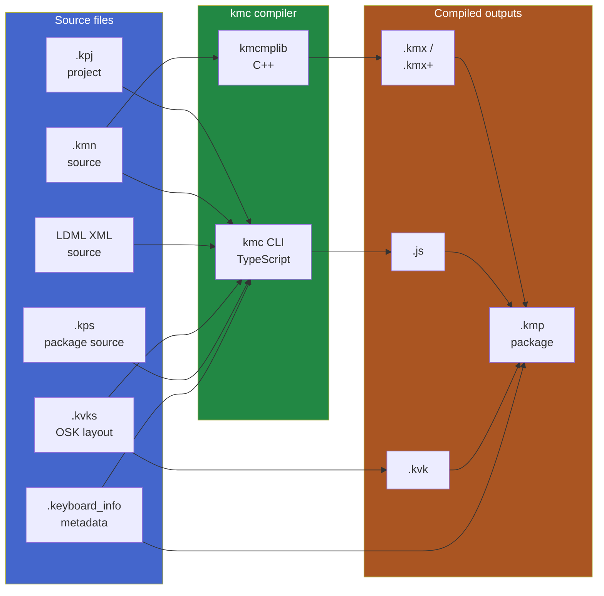

# Keyboard Project Anatomy

A reference for tools that read, write, validate, or generate Keyman
keyboard projects. If you're building something that produces Keyman
keyboards (a scaffolder, an AI-assisted authoring extension, a triage
bot), start here.

For the Keyman *runtime* — how a compiled keyboard actually runs on the
user's machine — see [repository-map.md](repository-map.md). For *why*
some of these formats exist (and which are being phased out), see
[migration-guide.md](migration-guide.md).

## File extensions at a glance

| Extension | Role | Hand-edit? | Notes |
|---|---|---|---|
| `.kpj` | Project file (XML) | Mostly — Tike maintains it | Lists the source files; references metadata |
| `.kmn` | Keyman keyboard source | Yes | The historical proprietary format |
| `.xml` (LDML) | LDML keyboard source | Yes | The modern open-standard format ([CLDR keyboards](https://cldr.unicode.org/index/keyboard-workgroup)) |
| `.kvks` | Visual / on-screen keyboard layout (XML) | Yes (or via Tike) | Touch + desktop OSK definitions |
| `.kvk` | Compiled visual keyboard binary | No | Output of `.kvks` |
| `.keyboard_info` | Keyboard metadata (JSON) | Yes | Schema-validated; published to keyman.com |
| `.kps` | Package source (XML) | Mostly — Tike maintains | Lists what goes into the package |
| `.kmp` | Package binary (ZIP) | No | The single deliverable: contains kmx, js, kvk, fonts, docs |
| `.kmx` | Compiled keyboard binary | No | Output of `.kmn` compilation; runs in Keyman Core |
| `.kmx+` | LDML-extended kmx (same `.kmx` filename) | No | Output of LDML compilation; runs in Keyman Core |
| `.js` | KeymanWeb keyboard | No | Output of compilation; runs in browser |
| `.html` | Welcome / help page | Yes (optional) | Shipped inside the `.kmp` |
| `HISTORY.md` | Version history | Yes | Convention; rendered on keyman.com |
| `README.md` | Documentation | Yes | Optional |
| `fonts/*.ttf` `*.otf` | Embedded keyboard fonts | n/a | Shipped inside the `.kmp` |

## Source → compiled outputs



## File-by-file deep dive

### `.kpj` — Keyman project file

XML, root element `<KeymanDeveloperProject>`. Lists every file in the
project: source `.kmn` / LDML XML files, the `.kvks` OSK layout, the
package source `.kps`, the metadata `.keyboard_info`, the documentation
pages, the fonts.

Hand-editing is sometimes necessary (e.g. adding a file Tike didn't pick
up); for generated projects, follow the structure of one of the
canonical examples (see [Examples in the repo](#examples-in-the-repo)).

### `.kmn` — Keyman source

The historical Keyman keyboard source format. Defines rules in a
domain-specific syntax:

```
store(&NAME) 'My Keyboard'
store(&VERSION) '1.0'
begin Unicode > use(main)
group(main) using keys
'a' > 'A'
```

Reference: <https://help.keyman.com/developer/language/>. New keyboards
should be authored in LDML XML instead where possible — see § below and
[migration-guide.md § LDML](migration-guide.md#migration-2-ldml-keyboards).
`.kmn` is the today-required deliverable for touch keyboards because
Keyman's LDML read side isn't yet complete for touch (the CLDR spec
itself is — the gap is purely on Keyman's side).

### LDML XML — Keyman keyboard authored in CLDR LDML

**The future-canonical keyboard source format.** LDML is the Unicode CLDR
open standard for keyboards. The spec covers everything Keyman needs
including full touch markup (layers/forms/flicks/longpress/multi-tap),
so a spec-correct LDML keyboard is a complete authoring artifact —
hand-editable XML, no parallel files needed.

File extension is `.xml`. Compiles to `.kmx+` (a `.kmx` with extra
LDML-specific sections inside). References:
* [Unicode CLDR keyboard workgroup](https://cldr.unicode.org/index/keyboard-workgroup)
* Keyman compiler: `developer/src/kmc-ldml/`
* Keyman runtime: `core/src/ldml/`

**What works today**: desktop keyboards compile and run end-to-end from
LDML.

**What doesn't work today**: touch keyboards authored in LDML compile,
but Keyman doesn't yet read the LDML touch markup through to the OSK on
mobile/web — the runtime still drives off the legacy `.keyman-touch-layout`
JSON. See [migration-guide.md § LDML touch gap](migration-guide.md#what-s-not-working-yet-the-touch-gap-all-layers)
for details.

**Practical guidance**:
* For desktop-only keyboards, prefer LDML XML. No consistency contract.
* For touch keyboards, generate LDML *and* a parallel `.kmn` + `.kvks` +
  `.keyman-touch-layout` bundle. Treat LDML as the source of truth;
  treat the bundle as transitional until Keyman closes the read gap.
  See [external-tooling.md § Recommended generation strategy](external-tooling.md#recommended-generation-strategy).

### `.kvks` — Visual keyboard source

XML, defines the layout of the on-screen keyboard for *both* desktop OSK
and mobile touch keyboards. Each key is positioned, sized, and bound to
a `.kmn`/LDML rule via key codes or named keys. Reference:
<https://help.keyman.com/developer/12.0/guides/develop/creating-a-touch-keyboard-layout-for-amharic/the-osk-touch-layout-designer>.

Compiles to the binary `.kvk` shipped inside the `.kmp`.

### `.keyboard_info` — Keyboard metadata

JSON document describing the keyboard for the keyboards.keyman.com
catalog and the Keyman app stores. Required fields include name, id,
license, version, supported platforms, supported languages.

**Schema** (validate against this):
[`common/schemas/keyboard_info/keyboard_info.schema.json`](../common/schemas/keyboard_info/keyboard_info.schema.json).

Auto-validators (CommonJS + ESM) are generated and live under
`common/web/types/obj/schemas/keyboard_info.schema.validator.{cjs,mjs}`.
TypeScript types live under
`common/web/types/src/schemas/keyboard_info.schema.ts`.

### `.kps` — Package source

XML describing what goes into the final `.kmp` package: keyboards,
visual keyboards, documentation files, fonts, install behavior.
Reference: <https://help.keyman.com/developer/language/reference/package>.

### `.kmp` — Package (deliverable)

ZIP file containing the compiled `.kmx`/`.kmx+` (one per keyboard),
`.js` (for KeymanWeb), `.kvk` (compiled OSK), `kmp.json`, fonts, and
optional `welcome.htm` / `readme.htm`. This is the single artifact a user
or store installs.

Inspection: any zip tool works. The package's identity, version, and
contents are described in `kmp.json` at the root of the archive.

### `.kmx`, `.kmx+`, `.js`

Binary compiled outputs. Don't hand-edit. Documented for reference:
* `.kmx` format: [docs/file-formats/kmx-file-format.md](../docs/file-formats/kmx-file-format.md)
* `.kmx+` (LDML extensions): [docs/file-formats/kmx-plus-file-format.md](../docs/file-formats/kmx-plus-file-format.md)
* `.js` (KeymanWeb): not documented in repo; generated by `kmc-kmn` /
  `kmc-ldml` to be loaded by KeymanWeb at runtime.

## Schemas

Programmatically validating keyboard metadata / project structure uses
the JSON Schemas under `common/schemas/`:

| Schema | Validates | Path |
|---|---|---|
| `keyboard_info.schema.json` | `.keyboard_info` files | `common/schemas/keyboard_info/keyboard_info.schema.json` |
| `package.schema.json` | `.kps` package metadata | `common/schemas/package/` |
| `kpj.schema.json` (where applicable) | `.kpj` project files | `common/schemas/kpj/` |
| `displaymap.schema.json`, `kvk.schema.json`, etc. | Various subformats | `common/schemas/` |

The TypeScript-generated validators (used by `kmc` internally) live
under `common/web/types/`. External tools can either:
* call the JSON Schemas directly with their own validator (ajv, etc.), or
* import the `@keymanapp/common-types` npm package for the
  pre-generated validators and TS types.

## Examples in the repo

The most useful starting points for tooling work:

| Location | What it is |
|---|---|
| `common/test/keyboards/baseline/` | A directory full of small `.kmn` keyboards, each illustrating one Keyman language feature (deadkeys, virtual keys, options, etc.) |
| `common/test/keyboards/text_selection_tests_keyboard_9073/` | A complete project with `.kpj`, `.kmn`, `.keyboard_info`, `build.sh` |
| `common/test/keyboards/platform-rules/` | Demonstrates platform-specific rule behavior (desktop vs touch) |
| `web/src/test/manual/web/keyboards/diacritic_rota/` | A KeymanWeb test keyboard with full `.keyboard_info` |

To see a *complete*, real-world example, point at the
[keymanapp/keyboards](https://github.com/keymanapp/keyboards) repo —
that's where production keyboards live and where AI submission-triage
tools will spend most of their time. Layout: one keyboard per
subdirectory under `release/<first-letter>/<keyboard-id>/`.

## Minimum viable keyboard project

For a generation tool, this is the smallest set of files that compiles
to a valid `.kmp`:

```
my_keyboard/
├── my_keyboard.kpj            <KeymanDeveloperProject> XML
├── my_keyboard.kmn            store(&NAME), begin Unicode > use(main),
│                               group(main) using keys, at least one rule
├── my_keyboard.keyboard_info  JSON validated against keyboard_info.schema.json
└── my_keyboard.kps            <Package> XML referencing the above
```

Plus optional but normal:
* `my_keyboard.kvks` — touch / OSK layout
* `welcome.htm` — first-run welcome page
* `HISTORY.md` — version history
* `fonts/*.ttf` — embedded fonts

The `kmc generate` subcommand (see
[external-tooling.md](external-tooling.md#scaffolding-a-new-keyboard))
will produce a working scaffold of this set.
