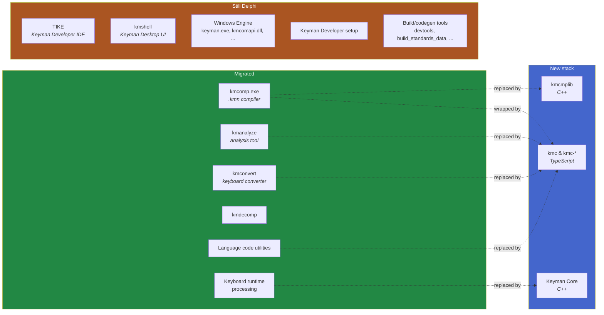
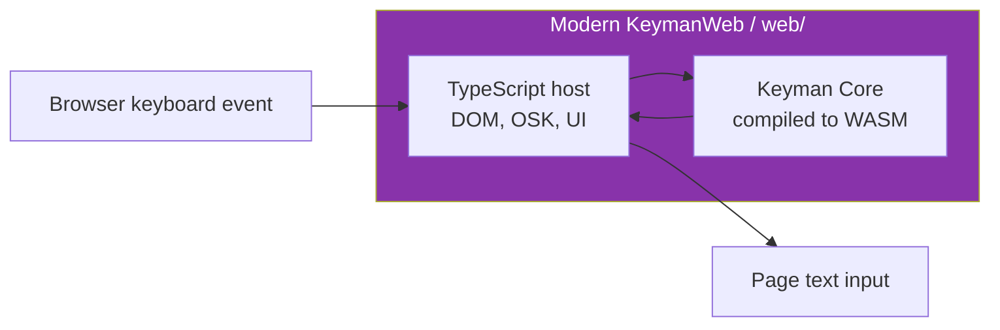

# Migration Guide: The Modernization in Flight

Keyman is in the middle of several long-running migrations. As a contributor,
knowing where each migration is on the timeline is the difference between
modifying code that ships for another decade and modifying code that is
weeks away from deletion. This guide is the map.

Three things to understand before you write any non-trivial patch:

1. **The Delphi removal** — replacing Delphi components with C++ and TypeScript.
2. **LDML keyboards** — replacing the proprietary `.kmn`/`.kmx` keyboard
   format with the open Unicode CLDR LDML keyboard standard.
3. **KeymanWeb modernization** — folding the historical KeymanWeb codebase
   onto the shared Keyman Core (C++ compiled to WebAssembly) and a modern
   TypeScript host.

These are tracked across several long-lived branches and a multi-year
roadmap. The [Keyman roadmap blog](https://blog.keyman.com/category/roadmap/)
is the authoritative high-level source; this document summarizes the state
as understood from the codebase and links into specific issues and source
trees you can read for yourself.

## Migration 1: Delphi removal

### Why

The original Keyman Developer IDE and the Windows Engine were written in
Delphi starting in the 1990s. Delphi was a practical choice then — strong
Win32 integration, a mature VCL UI toolkit. Today the licensing situation
is hostile to open-source contribution: the only freely-available tier
(Community Edition) was crippled in 10.4+ to remove command-line
compilation, leaving contributors stuck on the no-longer-distributed 10.3
CE or on a paid Professional license.

The Keyman team has been [tracking removal](https://github.com/keymanapp/keyman/issues/4599)
since 2022. Progress has been steady but slow as team capacity has
shrunk, so the long tail keeps stretching.

### Scorecard (as of 2026 mid-year)

**Migrated away from Delphi:**

| Old (Delphi) | New stack | Where to find the new code |
|---|---|---|
| `kmcomp.exe` — the `.kmn` keyboard compiler | C++ (`kmcmplib`) + TS wrapper (`kmc-kmn`) | `developer/src/kmcmplib/`, `developer/src/kmc-kmn/` |
| `kmanalyze` — analysis tool | `kmc-analyze` (TS) | `developer/src/kmc-analyze/` |
| `kmconvert` — generation/conversion | `kmc-generate`, `kmc-copy`, `kmc-keyboard-info` (TS) | `developer/src/kmc-{generate,copy,keyboard-info}/` |
| `kmdecomp` — decompiler | (none — marked Unsupported) | — |
| Keyboard runtime engine | Keyman Core (C++) | `core/` |
| Build-time language tag utilities | `kmc` family + `Keyman.System.LanguageCodeUtils` shim | `developer/src/kmc*/` |

**Still Delphi (no replacement yet):**

| Component | Path | Why still Delphi |
|---|---|---|
| Tike — the Keyman Developer IDE | `developer/src/Tike/` | Largest VCL app in the project; replacement is a major design exercise |
| Keyman for Windows shell | `windows/src/desktop/kmshell/` | Deeply integrated with Windows TSF / shell |
| Windows Engine | `windows/src/engine/{keyman,kmcomapi,insthelper,tsysinfo,tsysinfox64}/` | COM API + TSF text service plumbing |
| Desktop helpers | `windows/src/desktop/{kmbrowserhost,kmconfig,setup,insthelp}/` | UI / installer infrastructure |
| Developer installer | `developer/src/setup/` | WiX-driven Delphi setup wizard |
| Build tools | `common/windows/delphi/tools/{devtools,build_standards_data,sentrytool,certificates,test-klog,buildunidata}/` | Codegen used by the Delphi build cascade |

**About the "C# migration"** — there is no Delphi → C# migration in flight.
The repo has 6 `.cs` files in a tiny test sandbox (`windows/src/support/NetInputBoxTest/`)
and nothing else. The actual modernization targets are **C++** (Keyman
Core, kmcmplib, Windows C++ engine pieces like `keyman32.dll`/`kmtip.dll`)
and **TypeScript** (the `kmc-*` compiler suite, KeymanWeb).

### Working with code that's mid-migration

Two practical rules for new contributors:

* **Prefer the new stack for new functionality.** If you're adding a new
  compiler feature, add it to `kmc-*` (TypeScript) or `kmcmplib` (C++),
  not to Tike or kmconvert.
* **Resist the urge to refactor Delphi.** Touching `developer/src/Tike/`
  or `windows/src/engine/keyman/` to "clean up" is often wasted effort
  because the long-term plan is to retire the code. Fix the immediate bug,
  flag the deeper issue in a comment + issue, move on.

### Building Delphi components today

If you must work in the Delphi tree, see the build doc that matches your
Delphi version:

* [docs/build/windows.md](../docs/build/windows.md) — the canonical flow
  (Delphi 10.3 / Pro)
* [docs/build/windows-d12.md](../docs/build/windows-d12.md) — the
  workaround for Delphi 12 Community Edition contributors

## Migration 2: LDML keyboards

### What's changing

Keyman's historical keyboard formats — `.kmn` (source) and `.kmx`
(compiled binary) — predate the Unicode CLDR project's LDML keyboard
standard. The team is adding first-class support for LDML XML keyboards
so that:

* Keyboards authored for LDML work natively in Keyman everywhere
* Keyman authors can publish keyboards to the CLDR repository
* Tooling between Keyman and other CLDR-aware projects becomes shared

### Where it lives

* **Compiler**: `developer/src/kmc-ldml/` — TypeScript module that compiles
  LDML XML directly to a `.kmx` (the existing binary format that Keyman
  Core runs).
* **Core runtime**: `core/src/ldml/` and `core/include/ldml/` — the C++
  LDML processor inside Keyman Core. Same C API as `.kmx` keyboards; the
  binary format `kmx+` ([docs/file-formats/kmx-plus-file-format.md](../docs/file-formats/kmx-plus-file-format.md))
  carries the LDML data through to runtime.
* **Tests**: `core/tests/unit/ldml/` (runtime) and
  `developer/src/kmc-ldml/test/` (compiler).

### Status — what works today vs what's still in flight

LDML support is shipping in pieces. The
[March 2026 roadmap](https://blog.keyman.com/2026/03/keyman-roadmap-march-2026/)
lays out the next several versions:

* **v19 (current)**: "web-core" — bring LDML keyboard support to mobile,
  tablet, and embedded web. This is where most LDML work landed in
  shipped releases.
* **v20**: an **LDML keyboard visual editor** (built as a VSCode plugin —
  see [epic-ldml-editor scaffolding, issue #12798](https://github.com/keymanapp/keyman/issues/12798)),
  plus the Delphi-to-C++ Windows-UI migration. The visual editor is the
  long-term replacement for hand-editing LDML XML.
* **v21**: rebuild the on-screen keyboard rendering using web technologies
  so the touch/OSK experience is consistent across platforms.
* **v22**: deprecate `.js` keyboards in favor of LDML everywhere.

#### What works today (master)

* `.kmn` → `.kmx`: fully working via `kmcmplib`
* LDML XML → `.kmx+`: working for the **desktop** keyboard layer.
  Compile via `kmc build path/to/keyboard.xml`.
* Keyman Core runtime executes both `.kmx` and `.kmx+` keyboards.
* `core/src/ldml/` handles transforms, markers, deadkeys, syllable-based
  scripts (with some known edge cases under
  [active LDML-runtime work](https://github.com/keymanapp/keyman/issues?q=label%3Aepic-ldml+is%3Aopen)).

#### What's NOT working yet (the touch gap, all layers)

**The CLDR LDML keyboard spec itself is complete for touch** — layers
(hardware and touch), forms, flicks, longpress, multi-tap, transforms,
markers, all defined. The gap is entirely on **Keyman's read side**: an
LDML keyboard with full touch layer markup is a valid spec-compliant
document today, but Keyman doesn't yet consume that touch markup
end-to-end.

A consequence for tool builders: an AI extension *can* generate
spec-correct LDML touch keyboards today, and those keyboards will
become natively runnable on mobile/web when Keyman finishes the read
side — no source rewriting needed at that point. Generating to the
LDML spec is a forward-compatible bet even though runtime delivery
today still requires a parallel `.kmn` + `.kvks` set.

That said, fully consuming the LDML touch markup end-to-end on mobile
and the browser through the kmx+ pipeline requires **four** layers of
implementation, not just the compiler:

| Layer | State | Where to look |
|---|---|---|
| kmc-ldml writing LAYR data | **Partial** | TODOs in `developer/src/kmc-ldml/src/compiler/` (see table below) |
| kmx+ binary carrying LAYR | Done | Format defined; runtime parser at `core/src/kmx/kmx_plus.cpp:659+` |
| Keyman Core C API exposing layout to hosts | **Missing** | No `km_core_keyboard_get_layer` / `get_form` in `core/include/` |
| KeymanWeb / Mobile OSK consuming kmx+ layout | **Missing** | KeymanWeb OSK still drives off the legacy `.keyman-touch-layout` JSON spec; mobile engines the same |

The interim today: kmc-ldml's
`visual-keyboard-compiler.ts` emits a legacy `.kvk` from the LDML source
so a touch-LDML keyboard *can* render through the existing OSK path. But
that's a stopgap — it's not "LDML XML drives the touch experience
natively through kmx+ on mobile and web", which is what the design aims
for and what the roadmap's v21 OSK rebuild promises to deliver
cross-platform.

#### Compiler-side gaps (kmc-ldml)

The specific TODOs in current master, all in
`developer/src/kmc-ldml/src/compiler/`:

| File | TODO | Effect |
|---|---|---|
| `metadata-compiler.ts:52` | `dpString: 'desktop'` hardcoded | `&TARGETS` store always says `'desktop'` even if the source declares touch layers |
| `keys.ts:240` | "do nothing if only touch layers" | A touch-only LDML keyboard produces no keymap |
| `keys.ts:148` | "TODO-LDML: } else { touch?" | Touch layer validation skipped |
| `layr.ts:60` | "does not validate touch layers yet" | Layer count gate doesn't enforce touch |
| `visual-keyboard-compiler.ts:7` | "This is an interim solution until Keyman Core supports interrogation of the KMX+ data for OSK" | Today's stopgap is to emit a legacy `.kvk` from the LDML source rather than carry touch through in kmx+ |

Tracking issue: **[#7238 — support touch layouts in kmc-ldml](https://github.com/keymanapp/keyman/issues/7238)**
(labelled `epic-ldml`, milestone A19S1).

For the broader LDML editor / authoring story, see the
[`epic-ldml-editor` label](https://github.com/keymanapp/keyman/issues?q=label%3Aepic-ldml-editor)
and the umbrella scaffolding issue [#12798](https://github.com/keymanapp/keyman/issues/12798).

#### Cheapest contributions if you want to accelerate

In order of leverage (smallest to largest):

1. **`metadata-compiler.ts:52` one-liner** — emit `'desktop touch'`
   when the source declares touch layers instead of the current
   hardcoded `'desktop'`. Doesn't fix runtime, but lets correctly-built
   LDML keyboards declare their actual platform support. Probably a
   1-line PR + tests.
2. **Finish `keys.ts` touch handling** — the `keys.ts:148, 240` TODOs.
   A few hundred lines; lands "touch-aware LDML compilation" without
   needing runtime changes.
3. **Finish `layr.ts:60` validation** — modest PR.

Steps 1–3 close the compiler-side gap. The runtime gap (Core C API +
KeymanWeb/Mobile OSK refactors) is the v21-scale effort; not a small
PR. If a contributor wanted to make LDML touch keyboards *compile
correctly today* (with the legacy `.kvk` runtime stopgap still doing
the actual touch rendering), the three items above are the path.

### What this means for you as an intern

* **For desktop-only keyboards**: emit LDML XML. No consistency
  contract; works today end-to-end. Bias new test keyboards toward
  LDML.
* **For keyboards that need to run on touch today** (mobile, web):
  emit LDML XML as the canonical source AND a derived `.kmn` + `.kvks`
  + `.keyman-touch-layout` bundle. Treat the LDML as authoritative; the
  bundle is transitional until Keyman closes the read gap. See
  [external-tooling.md § Recommended generation strategy](external-tooling.md#recommended-generation-strategy).
* The CLDR LDML spec is complete for touch — your generated LDML is
  forward-compatible. When Keyman finishes the read side, you delete
  the transitional bundle and the same LDML just works.
* If you encounter an LDML-related bug at runtime, look in `core/src/ldml/`
  (the C++ runtime); at compile time, look in `developer/src/kmc-ldml/`.
* `kmx+` files are still `.kmx` files on disk — same Keyman Core entry
  point. The "+" refers to additional LDML-specific binary sections.

## Migration 3: KeymanWeb modernization

### What changed

Original KeymanWeb was a large standalone JavaScript engine — a parallel
implementation of the Keyman keyboard runtime in JavaScript, separate
from the desktop/mobile engines. Two engines meant two divergent feature
sets, two bug surfaces, two test matrices.

The modernization replaces the JS-side keyboard engine with **Keyman Core
compiled to WebAssembly**. The TypeScript code in `web/` is now a host
that integrates with browser inputs (DOM events, OSK rendering, language
switcher) and delegates *all* keyboard logic to Keyman Core via the WASM
binding.

### Where it lives

* **Host**: `web/src/` — TypeScript organized into:
  * `web/src/engine/` — the WASM-binding glue and runtime helpers
  * `web/src/app/` — browser entrypoints (KeymanWeb embedded library,
    keyman.com app integration)
  * `web/src/test/` — Karma + Mocha test suites
* **WASM core**: built from `core/` via `core/build.sh build:wasm` and
  consumed by `web/`'s build at link time. Lives in `web/build/engine/`
  after build.
* **Build**: `web/build.sh build` is the single entry point. Internally
  it manages the emsdk toolchain, node packages, and the wasm dependency.

### Status

The Core-via-WASM model is shipping in 17+ release lines. Active work
focuses on feature parity edge cases (touch-keyboard interactions,
predictive text, IME interaction) and removing remaining legacy paths
inherited from the original JS engine. Search the issue tracker for
`web/` and `kmw` for current work.

### What this means for you

* When you debug a KeymanWeb keyboard bug, ask first: is the bug in the
  keyboard logic (Keyman Core / WASM) or in the host (DOM event handling,
  rendering)? The split is more useful than the old "look anywhere in the
  KeymanWeb monolith."
* If a behavior differs between desktop Keyman and KeymanWeb, the bug is
  *probably* in the web host (`web/src/`), not in Keyman Core — Core is
  shared.

## Long-running migration branches

The three migrations above don't always land directly on `master`. Some
larger work happens on long-lived branches that periodically merge back.
Conventional name prefixes you'll see in `git branch -r`:

* `feat/core/...` — runtime features in `core/`, often coordinated with
  LDML or platform-engine work
* `feat/developer/...` — compiler / Developer-side features (kmc-* etc.)
* `feat/web/...` — KeymanWeb modernization work
* `chore/windows/...` — incremental cleanups in the Windows / Delphi tree
* `auto/...` — automated branches (version bumps, etc.); not for human
  contribution

Before starting a non-trivial feature, search the open issues by `epic-*`
label first, then `git branch -r | grep -i <topic>` against
`upstream/` to see if a long-running branch already covers it.

## Roadmap and decision context

The Keyman team publishes high-level direction on the
[Keyman roadmap blog](https://blog.keyman.com/category/roadmap/). The
current public roadmap is the
[**March 2026 update**](https://blog.keyman.com/2026/03/keyman-roadmap-march-2026/) —
read it before making bets on what to invest effort in. Headlines:

| Version | Theme | Highlights |
|---|---|---|
| **19** (current) | LDML / web-core | CLDR keyboards on mobile, tablet, embedded web |
| **20** | Compiler & UI modernization | **Delphi → C++ for Windows UI**, LDML visual editor (VSCode plugin, [#12798](https://github.com/keymanapp/keyman/issues/12798)), compiler rewrite |
| **21** | Touch/OSK rebuild | On-screen keyboard rebuilt with web tech for cross-platform consistency |
| **22** | Distribution & deprecation | KeymanWeb on npm; deprecate `.js` keyboards in favor of LDML; CLDR predictive text wordlists |

All version targets are funding-dependent (the roadmap is explicit about
this).

**Umbrella tracking issues to watch:**

* [#4599 — Delphi removal](https://github.com/keymanapp/keyman/issues/4599)
  (filed 2022, umbrella)
* [#7238 — LDML touch layout compilation](https://github.com/keymanapp/keyman/issues/7238)
  (epic-ldml, see § Migration 2 above)
* [#12798 — VSCode plugin scaffolding](https://github.com/keymanapp/keyman/issues/12798)
  (epic-ldml-editor, milestone 20.0)
* [`epic-ldml` label](https://github.com/keymanapp/keyman/issues?q=label%3Aepic-ldml)
  — open work on the LDML keyboard format support
* [`epic-ldml-editor` label](https://github.com/keymanapp/keyman/issues?q=label%3Aepic-ldml-editor)
  — open work on LDML authoring tooling
* [`epic-keyman-developer` label](https://github.com/keymanapp/keyman/issues?q=label%3Aepic-keyman-developer)
  — broader Developer-side work

## TL;DR for new contributors

* **New features**: write them in the new stack (C++ for runtime, TS for
  tooling). Don't add to Delphi unless you specifically have to.
* **Bug fixes**: fix them where the bug is. If it's in Delphi-bound code,
  patch Delphi. Don't refactor surrounding code.
* **LDML**: it's the future format. Bias new test keyboards toward LDML
  XML, not `.kmn`.
* **KeymanWeb**: the engine *is* Keyman Core. The host is TypeScript.
  Debug accordingly.
* **When in doubt**: check the roadmap blog, search issues, ask in the
  [SIL/Keyman forum](https://community.software.sil.org/c/keyman).
