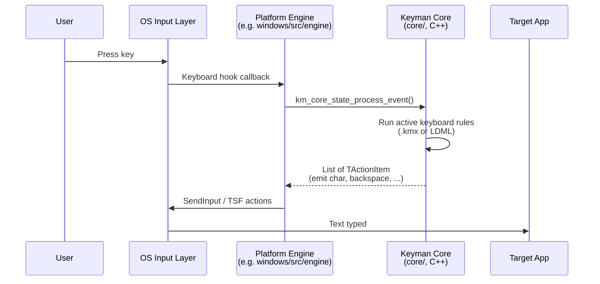
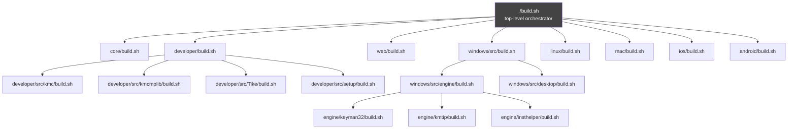

# Repository Map

This is a tour of the Keyman monorepo. By the end of it you should know
where to find each major component, what tech stack it uses, which
platforms it targets, and how the components connect to each other.

If you only read one section, read [Top-level layout](#top-level-layout) and
[The four big subsystems](#the-four-big-subsystems).

## What Keyman is, in three sentences

Keyman is an open-source cross-platform input system that lets people type in
any of the world's languages. It runs on Windows, macOS, Linux, iOS, Android,
and in web browsers — same keyboard files everywhere. The repo contains the
runtime engines for each platform, the developer tooling for authoring
keyboards, the Keyman Developer IDE, the KeymanWeb JavaScript engine, and a
shared C++ keyboard-processing core.

## Top-level layout

```mermaid
graph TD
    root[keyman/]
    root --> core[core/<br/>Keyman Core<br/>C++ shared runtime]
    root --> common[common/<br/>Shared code &amp; tools]
    root --> developer[developer/<br/>Keyman Developer<br/>compiler + IDE]
    root --> web[web/<br/>KeymanWeb<br/>browser engine]
    root --> windows[windows/<br/>Windows engine + desktop]
    root --> mac[mac/<br/>macOS]
    root --> linux[linux/<br/>Linux]
    root --> ios[ios/<br/>iOS]
    root --> android[android/<br/>Android]
    root --> oem[oem/<br/>OEM builds<br/>e.g. FirstVoices]
    root --> docs[docs/<br/>Build &amp; format docs]
    root --> resources[resources/<br/>Build scripts &amp; data]
    root --> devdocs[dev-docs/<br/>You are here]

    style root fill:#444,color:#fff
    style devdocs fill:#28a,color:#fff
    style core fill:#284,color:#fff
```



## The four big subsystems

```mermaid
graph LR
    subgraph SC[Shared C++]
      kmcore[core/<br/>Keyman Core]
    end
    subgraph DV[Developer tooling]
      kmcmplib[kmcmplib<br/>.kmn compiler library]
      kmc[kmc &amp; kmc-*<br/>CLI compiler suite]
      tike[Tike<br/>Developer IDE]
    end
    subgraph RT[Runtime engines]
      eng_win[Windows Engine<br/>Delphi + C++]
      eng_mac[macOS Engine<br/>Swift + ObjC]
      eng_lin[Linux Engine<br/>C++]
      eng_ios[iOS Engine<br/>Swift]
      eng_and[Android Engine<br/>Java/Kotlin + C++]
    end
    subgraph WB[KeymanWeb]
      kmweb[KeymanWeb<br/>TypeScript + WASM]
    end

    kmcore -.shared lib.-> eng_win
    kmcore -.shared lib.-> eng_mac
    kmcore -.shared lib.-> eng_lin
    kmcore -.shared lib.-> eng_ios
    kmcore -.shared lib.-> eng_and
    kmcore -.wasm.-> kmweb

    kmcmplib --> kmc
    kmc --> tike
    kmcmplib -.compiles .kmn.-> tike

    style SC fill:#284,color:#fff
    style DV fill:#46c,color:#fff
    style RT fill:#a52,color:#fff
    style WB fill:#83a,color:#fff
```

* **Shared C++** — `core/` is a single shared keyboard-processing engine
  used by *every* runtime. When you press a key, the platform-specific
  engine translates that into Keyman Core API calls; Core runs the keyboard
  logic and returns the resulting text actions; the engine then injects
  text into the focused application using platform APIs.

* **Developer tooling** — under `developer/src/`. The historical Delphi
  IDE (Tike) and the modern TypeScript CLI compiler family (`kmc` and the
  ten `kmc-*` modules) live side by side. The `.kmn` keyboard compiler
  itself is C++ (`kmcmplib`).

* **Runtime engines** — one per platform under `windows/`, `mac/`,
  `linux/`, `ios/`, `android/`. Each is a thin shell over Keyman Core that
  handles the platform's keyboard hooks, IME registration, OS integration,
  and configuration UI.

* **KeymanWeb** — under `web/`. The same Keyman Core code compiled to
  WebAssembly via Emscripten, plus a TypeScript host that integrates with
  HTML inputs and embeds in Keyman web apps and `keyman.com`.

## Tech stack per directory

| Directory | Primary language(s) | Build system | Platforms |
|---|---|---|---|
| `core/` | C++ | Meson + Ninja | Cross (Win, Mac, Linux, WASM) |
| `common/` | Mixed (C++, TS, Delphi, data) | Various | Shared |
| `common/web/` | TypeScript | npm + esbuild | Cross |
| `common/windows/delphi/` | Delphi | build.sh / Delphi IDE | Windows only |
| `developer/src/kmcmplib/` | C++ | Meson | Cross |
| `developer/src/kmc*/` | TypeScript | npm + esbuild | Cross |
| `developer/src/Tike/` | Delphi (VCL) | build.sh + Delphi IDE | Windows only |
| `developer/src/kmconvert/`, `setup/` | Delphi | build.sh + Delphi IDE | Windows only |
| `web/` | TypeScript + WASM | build.sh + npm | Browsers |
| `windows/src/engine/` | Delphi + C++ | build.sh + Delphi/VS | Windows |
| `windows/src/desktop/` | Delphi | build.sh + Delphi IDE | Windows |
| `mac/` | Swift, Objective-C | Xcode | macOS |
| `linux/` | C++, Python | meson, debhelper | Linux |
| `ios/` | Swift | Xcode | iOS |
| `android/` | Java, Kotlin, C++ | Gradle | Android |
| `oem/firstvoices/` | Platform-specific | Per-platform | Cross |
| `resources/` | Bash, data files | Plain | Build infra |

## How a keystroke flows (runtime)



The platform engine never implements keyboard logic itself; it always
delegates to Keyman Core. That's why a single keyboard file works across
Windows, macOS, Linux, iOS, Android, and the web.

## How a keyboard is built (developer flow)

```mermaid
flowchart LR
    src[Source<br/>.kmn or LDML XML]
    kmc[kmc<br/>TypeScript CLI]
    kmcmplib[kmcmplib<br/>C++ compiler]
    kmx[.kmx<br/>Keyman binary]
    js[.js<br/>KeymanWeb bundle]
    kmp[.kmp<br/>Package zip]

    src --> kmc
    kmc -.delegates .kmn.-> kmcmplib
    kmcmplib --> kmx
    kmc --> js
    kmc --> kmp
    kmx --> kmp
    js --> kmp
```

The TypeScript `kmc` CLI is the modern entry point. For `.kmn` source it
delegates to the C++ `kmcmplib`. For LDML XML source, `kmc-ldml` handles
compilation directly in TypeScript. The single `.kmp` package contains
the platform binaries plus metadata (`keyboard_info`, fonts, docs).

## Subsystem deep-dives

### `core/` — Keyman Core

The cross-platform shared C++ runtime. Implements the keyboard-rule
processor in a host-agnostic way. Exposed through a stable C API
(`km_core_*` functions) so every platform engine and KeymanWeb can call
the same logic.

* **Build**: `core/build.sh build:x64` / `:x86` / `:wasm` / per-platform
  targets. Output goes to `core/build/<arch>/<config>/src/libkmcore-*.{dll,so,dylib}`.
* **Tests**: `core/tests/` with `kmnkbd`, `ldml`, `kmx`, `kmx_plus`
  unit-test directories.
* **API**: see `core/docs/api.md` and the public headers in `core/include/`.

### `developer/src/` — Keyman Developer

The keyboard authoring side. Two halves:

* **Modern compiler stack** (TypeScript): `kmc/` is the unified CLI;
  `kmc-kmn/` delegates `.kmn` to `kmcmplib`; `kmc-ldml/` handles LDML
  keyboards; `kmc-package/`, `kmc-keyboard-info/`, `kmc-analyze/`,
  `kmc-copy/`, `kmc-generate/`, `kmc-model/`, `kmc-model-info/` cover the
  other authoring tasks.
* **Legacy Delphi IDE**: `Tike/Tike.dproj` is the visual authoring tool,
  built with VCL. `setup/` is the Developer installer. `kmconvert/` is a
  legacy conversion tool — marked Legacy and being phased out in favor of
  the kmc-* family. See [migration-guide.md](migration-guide.md).

### `web/` — KeymanWeb

The browser-side keyboard engine. Same Keyman Core, compiled to
WebAssembly via Emscripten and wrapped in a TypeScript host. Used by
keyman.com web apps, by sites that embed the keyman.js script, and by
Keyman Developer's preview mode.

* **Build**: `web/build.sh build` (needs node + emsdk; sets up both).
* **Output**: `web/build/app/`, `web/build/engine/`, `web/build/publish/`
  for the release bundles.
* **Tests**: `web/build/test/` after `build`, runnable via Karma.

### `windows/src/engine/` — Windows runtime engine

A mix of Delphi (the COM API, configuration helpers, TSF text service
plumbing) and C++ (the actual input hook, `keyman32.dll`, the TSF text
processor `kmtip.dll`). For a tour of which dproj does what, see
`windows/src/engine/engine.groupproj` — the five Delphi projects build
together as a group; the C++ pieces (`keyman32`, `kmtip`, `keymanhp`,
`kmrefresh`, `mcompile`, `testhost`) build standalone via msbuild.

### `windows/src/desktop/` — Keyman for Windows (the user-facing app)

Delphi VCL apps: `kmshell` is the configuration tray app; `kmconfig` is
the legacy settings UI; `kmbrowserhost` embeds CEF for the
in-app browser; `setup` is the installer; `insthelp` is the install helper.

### `mac/`, `linux/`, `ios/`, `android/`

Each runs Keyman Core under the hood, with a platform-native shell:

* **macOS** (`mac/Keyman4MacIM/`): Objective-C / Swift Input Method bundle.
* **Linux** (`linux/ibus-keyman/`): IBus engine module written in C++,
  packaged via the `keyman-config` Python helpers.
* **iOS** (`ios/keyman/`): Swift app + KeymanEngine framework.
* **Android** (`android/KMAPro/`): Kotlin/Java app + KMEA library;
  Keyman Core compiled for NDK is loaded via JNI.

### `common/` — Shared anything-and-everything

Anything used by more than one platform lives here. Highlights:

* `common/web/` — shared TypeScript helpers (`keyman-version`, `langtags`,
  `types`, `utils`).
* `common/windows/delphi/` — Delphi units shared by every Windows-Delphi
  project (engine, desktop, developer). Plus bundled third-party Delphi
  libraries: JCL, JVCL, mbcolor, dcpcrypt, CEF4Delphi.
* `common/windows/cpp/` — Windows-specific C++ headers.
* `common/include/`, `common/test/` — cross-platform shared includes and
  test fixtures.
* `common/tools/` — small cross-platform helpers like `hextobin`.

### `resources/`, `build/`, `docs/`

* `resources/build/` — the shared bash-builder framework (`builder-full.inc.sh`
  etc.) that every project's `build.sh` sources. Read this once when you
  start writing a new `build.sh`.
* `resources/standards-data/` — language tag and ISO data used to generate
  the BCP-47 Pascal modules.
* `docs/` — build instructions, file-format references, history.

## Build orchestration

Every top-level directory has a `build.sh` that obeys the same conventions.
A typical invocation is:

```bash
./<dir>/build.sh <action>[:<target>] [options...]
```

Where:
* `<action>` is `clean`, `configure`, `build`, `test`, `publish`, `install`,
  `api`, or `edit`.
* `<target>` is component-specific (e.g. `./web/build.sh build:engine`).

Read `<dir>/build.sh --help` to see available targets. Most scripts inherit
the cross-platform builder framework from `resources/build/builder-*.inc.sh`,
so they all have the same look-and-feel.



## Cross-platform matrix

Which directories actually build on which OS:

| Directory | Win 11 | macOS | Linux |
|---|---|---|---|
| `core/` | ✓ (x86, x64, ARM64, WASM) | ✓ (universal) | ✓ |
| `common/` | ✓ | ✓ | ✓ |
| `developer/src/kmcmplib/` | ✓ | ✓ | ✓ |
| `developer/src/kmc*/` | ✓ | ✓ | ✓ |
| `developer/src/Tike/`, `setup/`, `kmconvert/` | Delphi only | — | — |
| `web/` | ✓ | ✓ | ✓ |
| `windows/` | ✓ | — | — |
| `linux/` | — | — | ✓ |
| `mac/`, `ios/` | — | ✓ | — |
| `android/` | ✓ (Java/Kotlin/NDK) | ✓ | ✓ |

When the `docs/build/windows.md` doc says "the following projects cannot be
built on Windows: Keyman for Linux / Keyman for macOS / Keyman for iOS" —
this matrix is what it's reflecting.

## Where to start as an intern

Depending on what you're working on:

* **Keyboard runtime work**: start with `core/` and one of the platform
  engines (most likely `windows/src/engine/` or `linux/ibus-keyman/`).
* **Compiler / authoring work**: start with `developer/src/kmc/` and
  follow the dependency from there into the `kmc-*` modules.
* **Web work**: start with `web/` and the TypeScript app under
  `web/src/app/`.
* **Mobile**: `android/KMAPro/` or `ios/keyman/`.
* **Delphi UI work (Tike, kmshell)**: read [migration-guide.md](migration-guide.md)
  *first* — the long-term direction matters before you invest time in
  Delphi changes.

Whatever you touch first, read its `build.sh --help` and the `README.md`
in that directory (most components have one).
