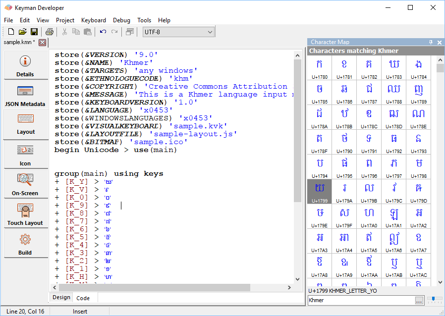
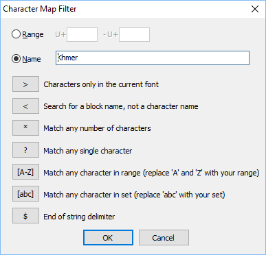

To display the Character Map:

-   Press <kbd>Ctrl</kbd> + <kbd>Shift</kbd> + <kbd>c</kbd>
-   Select **View** &#8594; **Character Map**

The Character Map will appear by default docked to the right hand side
of the IDE but can be undocked or re-docked on any side of the window.

### Using the Character Map

To insert a character:
1. Position the text cursor where you want to insert the character
2. Locate the desired character in the Character Map and insert it by:
    - selecting the character and pressing the Enter key, or
    - double-clicking on the character, or
    - right-clicking on the character and selecting Insert Character.

    > ### Note
    If the Insert Mode is set to Code or Name, pressing Enter or
    double-clicking on the character will insert the Unicode code or
    name of the character, not the character itself. These options are
    most useful when writing or editing keyboard source files (.KMN).

### Insert Modes

There are three insert modes: Code, Character and Name:

- Code: inserts the character's Unicode code
- Character: inserts the character itself
- Name: inserts the character's Unicode name

To change the insert mode:

1. Right-click on the Character Map.
2. Highlight the Insert Mode submenu.
3. Choose the desired mode from the Insert Mode submenu.

### Character Map Options

When you right click on the Character Map, the following menu options
are displayed:

Insert Character
:   Inserts the selected character at the cursor position in your
    document.

Filter...
:   Displays the Filter dialog box. See [Filtering](#toc-filtering) below.

Goto...
:   Displays the Goto dialog box. See Using [Goto](#toc-goto) below.

Font...
:   Allows you to choose a different font for viewing the Character Map.  
    Note: This does not affect the font being used in your document!

Insert Mode
:   Allows you to select the character insert mode you want. See [Insert
    Modes](#toc-insert-modes) above.

Display Quality
:   Allows you to select a different font display quality for the
    Character Map. The options are:   
    - Plain: no font smoothing
    - Antialiased: uses the Windows standard font smoothing
    - ClearType: uses the Windows ClearType font smoothing method

### Characters and Fonts

When a character is not available in the selected font, the Character
Map will fall back to **Code2000**, **Code2001**, **Code2002**, **Arial Unicode MS** and
**Lucida Sans Unicode** fonts. If the character is not found in these
fallback fonts, the Character Map will use font linking to attempt to
find a character from other fonts installed on the system, and as a last
resort, will show a square box if no suitable font can be found.

If a character is not displayed from other than the selected font, it
will be shown in blue instead of black.

### Filtering

The Character Map can be filtered by Unicode character name or character
range. Filters can be entered in the Filter By field at the bottom of
the Character Map; a quick reference user interface dialog to help you
edit the filter is available by clicking the \[...\] button.

When no filter is applied, the Character Map will show all characters
from the Unicode 8.0 standard.

All filter strings are case insensitive. Character names use the letters
`A-Z`, numerals `0-9`, and punctuation underscore (`_`) and hyphen
(`-`).

Spaces between words in the filter are represented either by underscore
(`_`) or space (` `) and can be used interchangeably.

A filter can be for a range or on the Unicode Character Name.

The filter format for a range is: `[U+]XXXX-[U+]YYYY`, where `U+` is
optional, `XXXX` is the starting Unicode value and `YYYY` is the
finishing Unicode value.

The filtering options for Unicode Character Names are:

### Examples

|                          |                         |
|--------------------------|-------------------------|
| Filter                   | Result                  |
| `LATIN CAPITAL LETTER A` | Finds all Latin capital A variations         |
| `LATIN * LETTER A`       | finds all Latin capital and lower case A variations |
| `LATIN * LETTER [AEIOU]` | finds all Latin A,E,I,O or U vowel combinations |
| `<Thai`                  | finds the Thai Unicode block        |
| `>LAO`                   | finds all characters with names starting in "LAO" in the current font  |
| `YI_`                    | finds all characters with names starting in "YI " - you must use `_` (underscore) and not `( )` space at the end of a search string.   Note that without the `_`, this search also matches YIN_YANG. |
| `LATIN * LETTER A$`      | finds only "a" and "A"             |
| `1000-119F`              | finds all characters between U+1000 and U+119F (inclusive) - the Myanmar alphabet in this case    |

### Goto

The Goto tool can be used to move directly to a specific Unicode
character or value.

1. Right click on a character and select Goto. The **Enter Unicode character value or name** dialog box will be displayed.
2. Enter the Unicode character value - e.g. `006B` or `U+006B` OR enter the start of the character name, e.g. `LAO_LETTER` will go
    to **LAO_LETTER_KO**, being the first character that matches. You
    can substitute spaces for underscores if you prefer.
3. Click OK. The character map will attempt to move to the character you specified.
