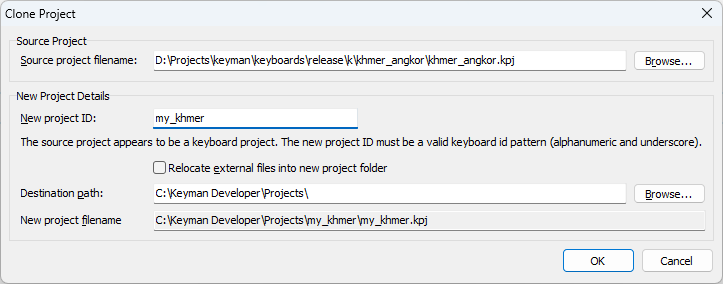

Allows you to clone a project from your local filesystem, giving the project a
new id, and organizing project files following the
[file layout](/developer/keyboards/) used in the
[Keyman keyboards repository](https://github.com/keymanapp/keyboards).

Keyboard and lexical model projects can be cloned.

Projects can also be cloned from the command line with [`kmc copy`](kmc).

### Parameters

Source project filename
:   The full path of the source project .kpj file to copy.

Destination path
:   Specifies the base path where the project folder will be created.
    The project folder name will be the keyboard ID. If the folder
    already exists, then you will be prompted before Keyman Developer
    overwrites files inside it.

New project ID
:   The base filename of the keyboard/model, project and package. This must
    conform to the Keyman keyboard or lexical model identifier rules.

Relocate external files into new project folder
:   When selected, if the project references files that are not inside the same
    folder as the .kpj file, move these files into an `external` subfolder

