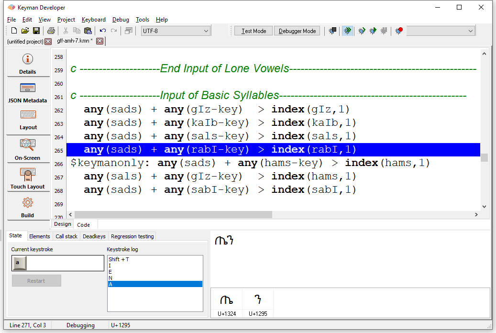
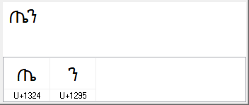
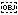
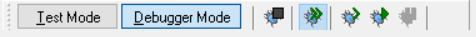
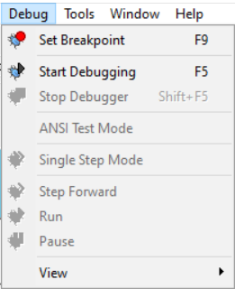
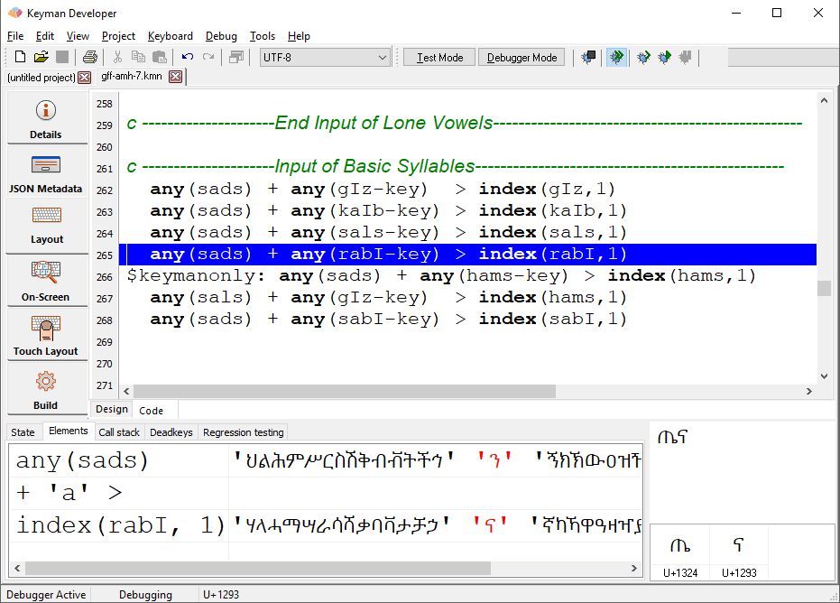
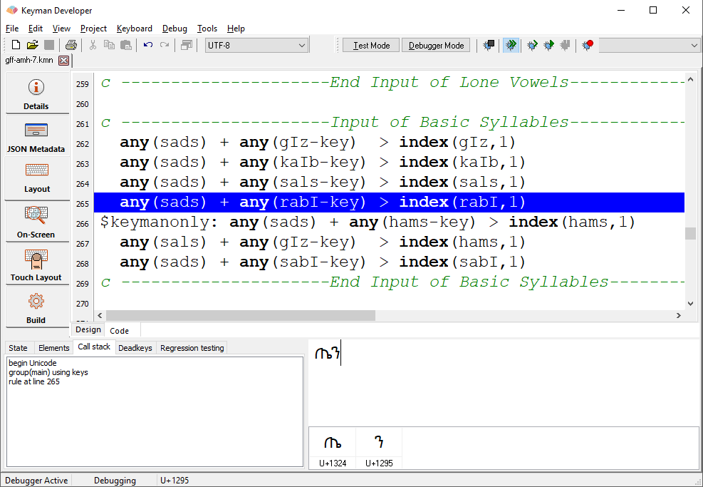
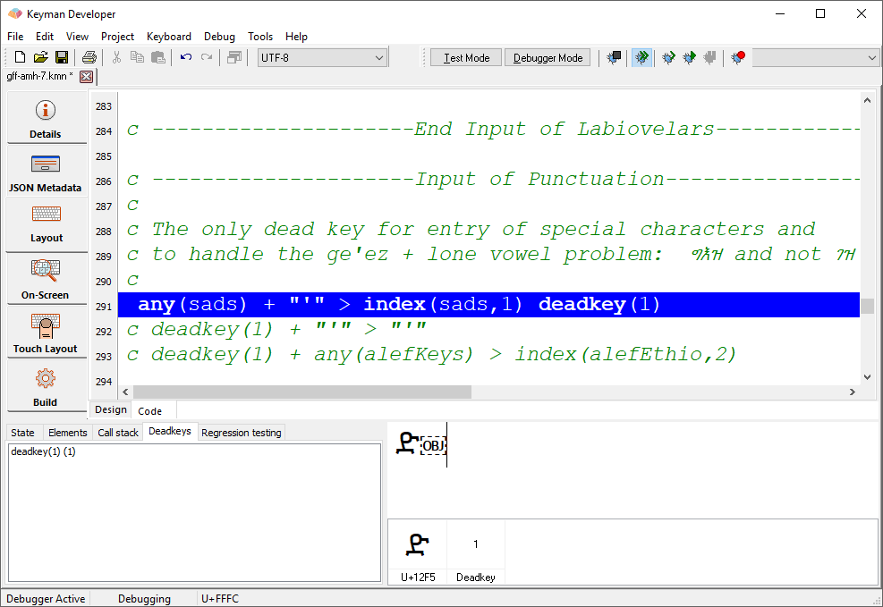
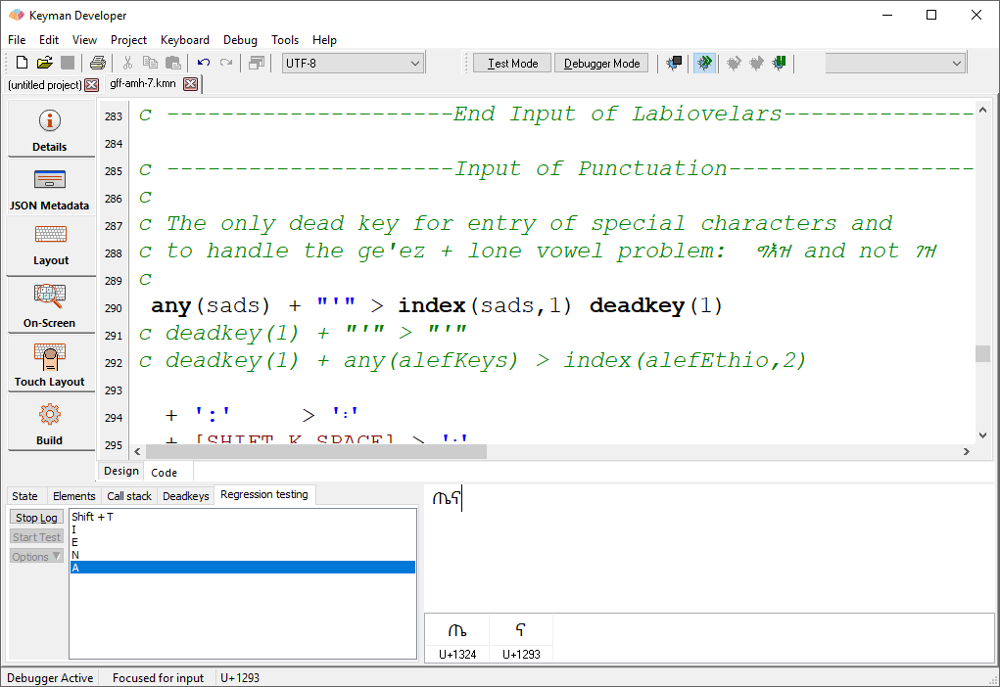

The debug window is shown at the bottom of the keyboard editor when
debugging the keyboard. There are several user interface areas: The
debugger input window, the debugger status window, a debugger toolbar
(usually docked under the menu), and the status bar will show the
current debugger status.

## Debugger input window

The debugger input window is used for typing input to test the keyboard.
In the top half of this window, input you type while testing your
keyboard will be displayed, exactly the same as in use, with one
exception: deadkeys will be shown visually with an
 symbol.

The lower half of the window shows a grid of the characters to the
virtual left of the insertion point, or the selected characters if you
make a selection. Deadkeys will be identified in the grid. The grid will
show characters in right-to-left scripts in backing store order, from
left to right. If there are more characters in your text than can fit on
the screen, then only those that fit will be shown in the grid.

## Debug controls

The debug menu and debug toolbar control the debugger.

Set/Clear breakpoint
:   A breakpoint can be put on a line of code to ask Keyman Developer to
    stop and show what is happening in the keyboard layout when that
    line is reached. Typically, you would put a breakpoint on a
    particular rule, so you could debug an unexpected behaviour on that
    rule.

Start Debugging
:   Starts the debugger

Stop Debugger
:   Stops the current debug session

Single Step Mode
:   When this option is active, you will step through every group and
    rule that your keyboard applies when a keystroke is pressed. The
    Step Forward and Run controls are only relevant in Single Step Mode.

Step Forward
:   Move to the next step in your keyboard code.

Run
:   Stop processing the current keystroke event in single step mode
    (unless a breakpoint is hit). The next keystroke event will drop
    into single step mode again.

Pause
:   Use the Pause button or press <kbd>Shift</kbd> + <kbd>Esc</kbd> to pause the debugger. When
    the debugger is paused, it will not accept any input, and ordinary shortcut keys (<kbd>Shift</kbd> + <kbd>F5</kbd>, <kbd>Alt</kbd> + <kbd>Tab</kbd>, etc.) will function as usual. Press Pause again to resume debugging.

<!-- System keyboard
:   The system keyboard layout currently being used. You can test your
    keyboard with a different underlying layout by selecting
    **Select System Keyboard** from the **Debug** menu. -->

## Debug State box

The debug state box shows the internal state of the keyboard
interpreter.

### State

This window shows the current keystroke state, and the sequence of
keystrokes that were typed to arrive at this state. Clearing the text in
the debug window will also clear the keystroke log; as will pressing the
Restart button.

The Restart button is disabled while stepping through an event.

### Elements

This shows the elements that make up rule currently being processed: the
context, the key, and also what the output will be. If the rule uses
stores, the contents of the store will be shown in the right-hand
column, with the matched letter in red.

### Call Stack

Here all the lines that have been processed to this point are shown in a
list. You can double-click on any entry in the list to display the line
in the keyboard source.

### Deadkeys

This lists all the deadkeys that are currently in the context. You can
select one from the list to see it highlighted in the debug input box.
This information can also be seen in the character grid in the lower
half of the debugger input window.

### Regression Testing

The idea in regression testing is to record a sequence of keystrokes and
the output the keyboard produced, in order to test for the same
behaviour when you make changes to the keyboard.

Use Start Log/Stop Log to record the input and output. You can then use
Start Test to run the test again, or go the Options menu to clear the log,
or save or load a test, or use the batch mode to run several tests in a
row.

If the output produced while running a test is different to that stored
when recording it, Keyman will halt the test on the line where the
failure occurred, and activate Single Step mode.

### Status bar

The input status is shown in the second pane of the status bar. It can
show one of the following messages:

Ready for input
:   The debugger is waiting for more input

Focused for input
:   The debugger is waiting for more input, and the Debug Input window
    is active

Paused
:   The debugger is paused

Receiving events
:   The debugger is processing input

Debugging
:   The debugger is active during Single Step mode or after a breakpoint

## Test mode

Enter test mode by clicking the **Test Mode**
button on the debugger toolbar.

The test mode lets you test your keyboard without the debugger being
active. This lets you test functionality that is not available within
the debugger - primarily [IMX code](../guides/develop/imx/).

Once in test mode, no debugger controls are available.

You can see the character codes for the current or selected characters
in the status bar, which can be useful when debugging your keyboard.
