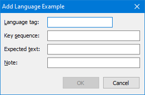

This dialog allows you to create or edit example key sequences to demonstrate
how to use your keyboard. Examples should be relatively short -- one to five
words is ideal, but if possible, should demonstrate sequences that may be hard
for users to discover on their own.

These language examples can be seen live, for example, on
[keymanweb.com](https://keymanweb.com).

## Language tag

Enter the BCP 47 language tag that this example corresponds to. It should be a
language tag that is listed in the package file.

## Key sequence

This is a space separated list of keys. For spacebar, use `space`. For modifier
key combinations, use the modifier key(s) followed by `+` and the key that they
are pressed together with, e.g. `right-alt+shift+A`.

* modifiers indicated with "+"
* spacebar is "space"
* plus key is "shift+=" or "plus" on US English (all other punctuation as per
  key cap).
* Hardware modifiers are: "shift", "ctrl", "alt", "left-ctrl", "right-ctrl",
  "left-alt", "right-alt"
* Key caps should generally be their character for desktop (Latin script case
  insensitive), or the actual key cap for touch
* Caps Lock should be indicated with "caps-on", "caps-off"

## Expected text

Here, put the actual output generated by the key sequence.

## Note

You may include a translation of the text or another note that highlights an
aspect of how the text is typed.

