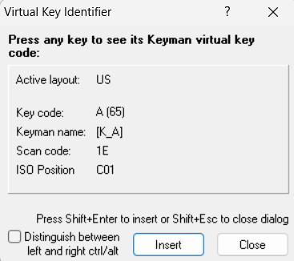

This dialog lets you check the virtual key code for any key combination
(except Window reserved key combinations such as
<kbd>Alt</kbd> + <kbd>Tab</kbd>). You can then
insert the virtual key code into the last active edit window at the
current cursor position.

Press
<kbd>Ctrl</kbd> / <kbd>Shift</kbd> / <kbd>Alt</kbd>
and the key you wish to discover. You can see the virtual key codes for
left and right <kbd>Ctrl</kbd> / <kbd>Alt</kbd> combinations by checking the "Distinguish between left and right ctrl/alt" checkbox.

To close the dialog, click the Close button or press
<kbd>Shift</kbd> + <kbd>Esc</kbd>.

Press <kbd>Shift</kbd> + <kbd>Enter</kbd> to insert the current virtual key code into your source at the insertion point.