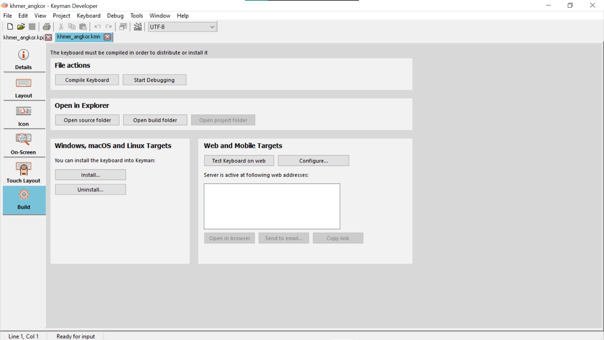

The keyboard editor is the heart of Keyman Developer. This window allows
you to edit all aspects of a keyboard layout, from the visual layout of
the keyboard, to logic rules, to touch interactions, and more.

The editor is divided into multiple tabs. Initially, only three tabs
will be visible: Details, Layout, and Build. A keyboard can have
multiple source files, which are all managed within this one editor.

The following image shows the first tab of the editor, the Details tab,
for a brand new keyboard, with those three initial tabs.

> ### Note
Users of earlier versions of Keyman Developer may initially have trouble
finding tabs such as the Icon tab or the On-Screen tab, as they are not
initially visible. The Features grid on the Details tab allows you to
add these extra features into the keyboard.

## Keyboard component files

A keyboard contains multiple source files. The following table lists the
file types and which tabs are used to edit them. The filenames shown are
defaults and can be modified, by editing the corresponding line in the
source file (and renaming the file). However, where possible the default
names should be used.

| File type      | Tabs            | Feature                    | Store name      | Description    |
|-------------------|-----------------|--------------------|----------------------|------------------------|
| `file.kmn`   | Details, Layout |  | The primary keyboard source file. Required.       | |
| `file.kvks`  | On-Screen       | Desktop On-Screen Keyboard | [`&visualkeyboard`](/developer/language/reference/visualkeyboard) | The visual presentation of the keyboard for desktop computers. |
| `file.ico`, `file.bmp`     | Icon      | Icon     | [`&bitmap`](/developer/language/reference/bitmap)    | An icon that represents the keyboard in the user interface on desktop computers.  |
| `file.keyman-touch-layout` | Touch Layout    | Touch-Optimised Keyboard   | [`&layoutfile`](/developer/language/reference/layoutfile)         | The touch layout visual description file                                            |
| `file-code.js`  | Embedded JS   | Embedded Javascript   | [`&kmw_embedjs`](/developer/language/reference/kmw_embedjs) | Additional Javascript code for [IMX](../guides/develop/imx) functionality  |
| `file.css`  | Embedded CSS    | Embedded CSS  | [`&kmw_embedcss`](/developer/language/reference/kmw_embedcss)  | Additional CSS stylesheet for custom touch and web layout styling  |
| `file-help.htm`      | Web Help    | Web Help   | [`&kmw_helpfile`](/developer/language/reference/kmw_helpfile) | HTML file that replaces the On Screen Keyboard on desktop web layouts  |
| `file-codes.txt`  | Include Codes | Include Codes | [`&includecodes`](/developer/language/reference/includecodes) | Code dictionary for use with [named constants](/developer/language/guide/constants) |

Three tabs include both visual and code editors: the Layout, Touch
Layout and JSON Metadata tabs. Changes to one view will be immediately
reflected in the other view. The code in the Layout tab is important
because that reflects both the Details and the Layout tab.

## Details tab

The Details tab grows as you add more options to a keyboard. The fields
here are:

Name
:   The name of the keyboard, corresponding to the [`&name` store](/developer/language/reference/name).

Targets
:   The intended target devices and operating systems, corresponding to
    the [`&targets` store](/developer/language/reference/targets).
    Changing the targets will hide or show parts of the Details and
    Compile tabs. If no targets are selected, Keyman Developer will
    treat the keyboard as a Windows-only keyboard, for backward
    compatibility reasons.

Copyright
:   Enter the details of the copyright owner for the keyboard.
    [`&copyright` store](/developer/language/reference/copyright).

Message
:   Enter a message that will be shown at install time for the keyboard
    (on Windows, macOS). [`&message` store](/developer/language/reference/message).

Keyboard is right-to-left
:   Check this box to indicate that the keyboard is a right-to-left
    keyboard, for web and touch layouts. [`&kmw_rtl` store](/developer/language/reference/kmw_rtl).

Web Help Text
:   A single line of text, with basic HTML allowed, shown at the bottom
    of the desktop web On Screen Keyboard. [`&kmw_helptext` store](/developer/language/reference/kmw_helptext).

Keyboard version
:   The version of the keyboard. Read the reference documentation for
    [`&keyboardversion` store](/developer/language/reference/keyboardversion) to understand
    the legal values for this field. This is not the same as the
    [`&version` store](/developer/language/reference/version), which
    controls the Keyman (and Keyman Developer) version for which a
    keyboard is designed.

Comments
:   This field corresponds to the first lines of comments in the
    keyboard source, and is visible only to the keyboard designer.

Features
:   The Features grid controls which additional file components are
    included in the keyboard, as listed in the Component Files section
    above. Each of the features relates to a system store. Adding a
    feature will add an extra tab to the editor, and add the
    corresponding store to the keyboard source. Removing a feature will
    not delete the component file, but will just remove the store from
    the keyboard source.

## Layout tab

The Layout tab gives you a simple interface to quickly create a keyboard
using a visual representation of a desktop/laptop computer keyboard. You
can drag and drop characters from the character map to create keyboard
layouts. You cannot access most of Keyman's more powerful features from
the Layout Design view, but it will be useful to get you started on your
design.

Each key can have zero or more characters assigned to it. Each key can
be assigned a different set of characters for each shift state. You can
change the shift state by clicking on the Shift, Ctrl, and Alt keys.

There are two ways to assign characters to the keys:

-   Click on a key, and then type the character's code into the Unicode
    Character Value(s) field, or the type/paste the character itself
    into the Output character(s) field.
-   Select the character from the Character Map and drag and drop it
    onto the appropriate key. This will set the key to output that
    character.

>    ### Hint
    To add the character to a key with existing characters, hold
<kbd>Ctrl</kbd> while dropping it onto the key.

<!-- Saperator -->
>   ### Note
    Any key that does not have a character assigned to it will output what the selected Windows layout specifies.

Distinguish between left and right Ctrl/Alt
:   A Keyman keyboard can treat left and right Ctrl and Alt identically,
    or it can distinguish between them. The Design view allows one or
    the other mode (in Code view, you can use both interchangeably).

Display 102nd Key (as on European keyboards)
:   European keyboards have one extra key that is not on US keyboards.
    This key is positioned to the right of the left shift key. Some
    other keyboards have additional keys; these are not shown on the
    layout designer. If you have a European layout selected as your
    Windows layout, the 102nd key will always be visible in the
    designer. When a European layout is selected as your Windows layout,
    the shape of the Enter key will also change to take two rows, and
    the backslash key will move down one row, but not otherwise change
    in behaviour.

You can press and release <kbd>Ctrl</kbd> to select
another key on the keyboard using your keyboard.

 

The Code view shows the source code of the keyboard file. This is where
all the information in the Details and Layout tab is stored, and
additional logic and complex keyboard layouts will be edited entirely in
the Code view.

See the [Editor topic](editor) for more information on how to use the
editor shown within this view.

## On-Screen tab

This tab allows you to edit the visual representation of your keyboard
layout. The content on this tab is stored in the .kvks file associated
with your keyboard. The visual representation is used only in desktop
and desktop web; however if no touch layout is defined, this layout will
be synthesized into a touch layout automatically.

An On-Screen keyboard is optional but in most keyboards is recommended.
The On-Screen keyboard may not always match the actual layout
identically, because you may choose to hide some of the details of
encoding from the interface presented to the user. The user can also
choose to print the layout.

This keyboard layout can also be printed or included in HTML or other
documentation. The editor allows you to export the file to HTML, PNG or
BMP formats.

Fill from layout
:   Compiles the keyboard file, and processes each possible keystroke in
    the keyboard file to automatically generate an On-Screen Keyboard
    that matches the layout. This can be used to effectively
    pre-populate the On-Screen Keyboard and reduces the complexity of
    designing it from scratch.

Import
:   Imports an On-Screen Keyboard from an XML file.

Export
:   Exports the On-Screen Keyboard to an XML file.

Text
:   The key cap for the selected key

Bitmap
:   A bitmap that is displayed on the selected key (not recommended, as
    it will not scale cleanly)

Display underlying layout characters
:   If checked, then the base or underlying layout will show in small
    letters at the top left of each key cap. This can be helpful to
    provide users with a guide as to the position of each key on the
    keyboard, especially for non-Latin scripts.

Distinguish between left and right Ctrl/Alt
:   If checked, treats the left and right Ctrl/Alt as separate layers

Display 102nd Key (as on European keyboards)
:   European keyboards have one extra key that is not on US keyboards.
    This key is positioned to the right of the left shift key. Some
    other keyboards have additional keys; these are not shown on the
    layout designer. If you have a European layout selected as your
    Windows layout, the 102nd key will always be visible in the
    designer; ensure you select this checkbox if you want the 102nd key
    to always be visible to end users of the layout, irrespective of
    their selected base layout. When a European layout is selected as
    your Windows layout, the shape of the Enter key will also change to
    take two rows, and the backslash key will move down one row, but not
    otherwise change in behaviour.

Auto-fill underlying layout
:   When the Fill from layout button is clicked, if this option is
    checked, then keys without corresponding rules in the Layout will be
    filled with the base layout character.

## Touch Layout tab

The Touch Layout tab is used to create the visible representation of the
keyboard layout for touch devices. It works similarly to the On Screen
Keyboard Editor conceptually, but has a number of additional features
specific to touch. Keys on the touch layout trigger rules within the
normal Keyman keyboard; if no rule is defined for a given key, it will
be given output if it has a standard code beginning with `K_`, or if it
is a Unicode value code, starting with `U_`.

Follow this
[guide](../guides/develop/touch-keyboard-tutorial/making-touch-keyboard)
for learning how to create a Touch Layout keyboard.

In Design view, the editor can show a number of different device types,
including iPhone and iPad, in different orientations, to allow you to
visualize the keyboard layout before you load it onto a device. The
following image shows all aspects of the touch design view.

### Left sidebar controls

Template...
:   The Template button allows you to choose a standard layout of keys
    from a predefined set. These layouts move the standard set of keys
    around and between layers to reduce the number of keys on each
    layer, optimising for mobile phone or other sizes. When Keyman
    Developer switches to a new template, it will transfer key
    definitions to the new layout as far as possible, but if keys on the
    current layout are not in the new template, their definitions will
    be lost. Therefore, selecting an appropriate template early in the
    development process is suggested.

Import from On Screen
:   If you have an existing On-Screen Keyboard for your keyboard layout,
    importing the design from the On-Screen Keyboard can reduce the
    development time considerably. Once you have imported, you will
    probably want to select a new template to transform the
    desktop-oriented design to a tablet or phone design automatically.

View Controls
:   This selector allows you to choose the simulated view of the
    keyboard, either landscape or portrait, for a number of devices. The
    presented keyboard may not be 100% identical to the final layout as
    seen on the device, but this allows you to get a feel for the design
    before testing.

Platform
:   The platform controls allow you to select and add or remove platform
    support for a given layout. If a platform is not defined, then
    Keyman Engine will transform the layout from another platform
    automatically, so you don't necessarily need to define layouts for
    each platform. If the 'Display underlying' checkbox is checked, then
    the base or underlying layout will show in small letters at the top
    left of each key cap. This can be helpful to provide users with a
    guide as to the position of each key on the keyboard, especially for
    non-Latin scripts.

Layer
:   Each layout for each platform is made up of one or more layers of
    keys. Each layer can have a default shift state associated with it,
    which allows keys to trigger specific rules in the Layout code.

### Keyboard area

On the right of the sidebar is the keyboard design area. This shows a device with
a presentation of the key layout. Within the key layout, you can click
on any key to edit it. There are a number of controls:

Red circle with an X
:   This button to the top right of the key will delete the key from the
    row; if it is the last key on the row, the entire row will be
    deleted.

Green arrow with a +
:   These buttons will insert a key to the left or right, or a single
    key on a new row above or below the selected key. Adding extra keys
    scales the entire keyboard.

Dragging the right hand side of the key
:   Dragging the right hand side of the key will resize the key;
    resizing the key will rescale the entire keyboard so it still fits
    within the device screen.

Metrics
:   The metrics displayed on the right hand side of the keyboard show
    the virtual width of each row of the keyboard, and the number of
    keys. For small devices, 10 keys is the maximum recommended number
    in a row; each key has a standard width of 100. While each row can
    be a different length, the last key in the row will be stretched to
    balance the final design; 'spacer' keys can be used to leave a
    visual gap on the right hand side of the keyboard. You should aim to
    make each row the same total width for consistent results.

### Right sidebar controls

Next to the keyboard area is another control bar for editing details of
the selected key.

Keycap Value
:   Assign a type to a key. This is to specifies which keys are Text, AltGr, Shift, Menu, TabLeft, ZWSp and more.

Text
:   You can drop characters from Character Map directly into the key cap
    edit box, or type directly.

Text Unicode
:   Clicking on a text unicode will focus the unicode edit box
    instead of the text edit box.

Hint and Hint Unicode
:   Add any Unicode to indicate the presence of long-press keys for that key, and the hint will be visible in the top right corner of the key.

Key Type
:   The general appearance of each key is determined by the key type,
    which is selected (in Keyman Developer 10) from a drop-down list:

    | Key Type             | Description                |
    |----------------------|----------------------------|
    | Default (normal) key | A standard letter or character key on the keyboard |
    | Special (shift) key  | The grey control type keys, layer shifts, Enter, Backspace, etc. |
    | Special (Active)     | A variation on the Special keys, which shows a highlight, typically used to indicate that a shift key for example is down. |
    | Dead-key             | While this key type has no difference in function to default keys, it will have a different style to indicate that it is different; the logic in the keyboard source may well be a deadkey, for example. |
    | Blank                | This type of key cannot be selected in use and shows as a blank key. |
    | Spacer               | Leaves a space in the keyboard at the point it is inserted, in the background colour of the keyboard area. |

Modifier
:   Determines the state that Keyman Engine will receive from the
    key stroke, such as Default, Right-Alt, Shift, Right-Alt Shift, or Caps. This makes it simpler to design a single keyboard that works across both desktop and mobile interfaces.

ID
:   Each key must be given an identifying ID which is unique to
    the key layer. ID by and large correspond to the virtual key
    codes used when creating a keyboard program for a desktop keyboard,
    and should start with `K_`, for keys mapped to standard Keyman
    virtual key names, e.g. `K_HYPHEN`, and `T_` or `U_` for
    user-defined names, e.g. `T_ZZZ`.
    If keyboard rules exist matching the key code in context, then the output from the key will be
    determined by the processing of those rules. It is usually best to
    include explicit rules to manage the output from each key, but if no
    rules matching the key code are included in the keyboard program,
    and the key code matches the pattern `U_xxxx[_yyyy...]`
    (where `xxxx` and `yyyy` are 4 to 6-digit hex strings), then the
    Unicode characters `U+xxxx` and `U+yyyy` will be output. As of
    Keyman 15, you can use more than one Unicode character value in the
    id (earlier versions permitted only one). The ID is always
    required, and a default code will usually be generated automatically
    by Keyman Developer.

    -   `K_xxxx` is used for a standard Keyman for Windows's key name, e.g.
        `K_W`, `K_ENTER`. You cannot make up your own `K_xxxx` names.
        Many of the `K_` ids have overloaded output behaviour, for
        instance, if no rule is matched for `K_W`, Keyman will output
        'w' when it is touched. The standard key names are listed in
        [Virtual Keys and Virtual Character Keys](/developer/language/guide/virtual-keys). Typically,
        you would use only the "common" virtual ID.
    -   `T_xxxx` is used for any user defined names, e.g. `T_SCHWA`.
        If you wanted to use it, `T_ENTER` would also be valid. If no
        rule matches it, the key will have no output behaviour.
    -   `U_####[_####]` is used as a shortcut for a key that
        will output those Unicode values, if no rule matches it. This is
        similar to the overloaded behaviour for `K_` ids. Thus `####`
        must be valid Unicode characters. E.g. `U_0259` would generate a
        schwa if no rule matches. It is still valid to have a rule such
        as `+ [U_0259] > ...`

Padding Left
:   Padding to the left of each key can be adjusted, and specified as a
    percentage of the default key width (100). If not specified, a
    standard padding of 15% of the key width is used between adjacent
    keys.

Width
:   The layout is scaled to fit the widest row of keys in the device
    width, assuming a default key width of 100 units. Keys that are to
    be wider or narrower than the default width should have width
    specified as a percentage of the default width. For any key row that
    is narrower than the widest row, the width of the last key in the
    row will be automatically increased to align the right hand side of
    the key with the key with the right edge of the keyboard. However,
    where this is not wanted, a "spacer" key can be inserted to leave a
    visible space instead. As shown in the above layouts, where the
    spacer key appears on the designer screen as a narrow key, but will
    not be visible in actual use.

Next layer
:   The virtual keys `K_SHIFT`, `K_CONTROL`, `K_MENU`, etc. are normally
    used to switch to another key layer, which is implied by the ID. The left and right variants of those ID, and also
    additional layer-switching keys mentioned above (`K_NUMERALS`,
    `K_SYMBOLS`, `K_CURRENCIES`, `K_ALTGR`) can also be used to
    automatically switch to the appropriate key layer instead of
    outputting a character. However, it is sometimes useful for a key to
    output a character first, then switch to a new layer, for example,
    switching back to the default keyboard layer after a punctuation key
    on a secondary layer had been used. Specifying the `nextlayer` for a
    key allows a different key layer to be selected automatically
    following the output of the key. Of course, that can be manually
    overridden by switching to a different layer if preferred.

Drag and drop
:   Keys can be moved around the keyboard by dragging them with the
    mouse; a ghost landing box will appear beneath the key when it can
    be dropped. If the key is dropped in an invalid area, no action will
    occur.

Double-click
:   Double clicking on a key with a "Next Layer" defined will switch to
    that layer.

### Middle bar controls

#### Long-press keys area

The keys in the long press area cannot be resized but the controls
otherwise work the same as in the main keyboard area. The keys cannot be
dragged between the main keyboard area and the long press area. The bar
below the long press area contains the corresponding controls for the
long press keys.

The Code view allows you to edit the JSON source of the touch layout
file. This makes certain operations simpler, such as batched rearranging
of keys, or using another text editor to make bulk changes. The Code
view uses the standard [editor](editor).

The format of the layout file is described in [Creating a touch keyboard layout guide](../guides/develop/creating-a-touch-keyboard-layout-for-amharic-the-nitty-gritty).

#### Long-press, Flicks, and Multitaps controls

Underneath the keyboard area is the Long-press, Flicks, and Multitaps controls.

Red circle with an X
:   This button to the top right of the key will delete the key from the
    row; if it is the last key on the row, the entire row will be
    deleted.

Green arrow with a + *(Applies to Long-press and Multitaps)*
:   These buttons will insert a key to the left or right, or a single
    key on a new row above or below the selected key. Adding extra keys
    scales the entire keyboard.

Drag and drop *(Applies to Long-press and Multitaps)*
:   Keys can be moved around the keyboard by dragging them with the
    mouse; a ghost landing box will appear beneath the key when it can
    be dropped. If the key is dropped in an invalid area, no action will
    occur.

#### Right sidebar controls

Next to the three controls is another control bar for editing details of
the selected key for different Gesture Type. The only difference between this control and the [keyboard right sidebar](#toc-right-sidebar-controls) controls is:
* Include Gesture Type box and Default selection check box.
* **No** Hint, Hint Unicode, Padding Left, and Width.

## Icon tab

The icon tab allows you to edit the icon associated with the keyboard. An external icon editor will allow you to create more sophisticated icons with alpha transparency and multiple resolutions, but this will cover the standard 16x16 256 colour icon, which is all that many keyboards require. The controls at the top left are:

Pencil
:   Freehand drawing with the selected colour; use right mouse button
    for secondary colour.

Line
:   Draw a straight line

Open box
:   Draw an outline box

Filled box
:   Draw a filled box in current colour

Open circle
:   Draw an outline circle or ellipse

Filled circle
:   Draw a filled circle or ellipse in the current colour

Fill
:   Fill from the current point all contiguous pixels of the same colour

Text
:   Use this tool to add a letter or letters to the icon. Click in the
    lower left of the icon area and a window opens where you can type
    the text you want. You can also change the quality of the font as
    well as the font properties by clicking on the Change button. Note
    that to change the color of the font, you need to change the color
    setting in the font properties window.

The icon can be exported or imported to/from various other formats. The
transparent colour is the top left colour in the grid with an X in the
box. The icon can be rotated in any direction with the arrow controls
below the toolbox; this will not lose data from the icon but will
instead rotate the edge moving off the grid to the other side of the
grid.

## Embedded JS tab

This tab allows you to edit JavaScript code in the file referenced by
the [`&kmw_embedjs`](/developer/language/reference/kmw_embedjs) store,
implementing [IMX functionality](../guides/develop/imx) of the keyboard.

## Embedded CSS tab

This tab allows you to edit the Cascading Style Sheet rules in the file
referenced by the
[`&kmw_embedcss`](/developer/language/reference/kmw_embedcss) store for
the keyboard.

## Web Help tab

This tab allows you to add a custom HTML snippet to replace the desktop
on screen keyboard, for example useful if the keyboard uses sequences of
keys to produce characters.

## Include Codes tab

This tab allows you to edit the [named constants](/developer/language/guide/constants) for the keyboard.

## Build tab

A set of common controls is across the top of this tab:

Compile Keyboard
:   You can compile the keyboard for testing and installation by
    clicking the <kbd>Compile</kbd> button, or
    selecting Keyboard, Compile Keyboard. This will compile the keyboard
    for all the selected Targets from the Details tab.

Start Debugging
:   To test your keyboard within Keyman Developer, press F5 to start the
    [debugger](debug), or press the Start Debugging button. This is
    suitable for testing desktop layouts.

Open source, build, and project folder
:   Opens the folder which contains the keyboard source, build, and project files.

<!-- Add to Project
:   If the keyboard file is not already part of the project, adds it to
    the project. -->

### Windows, macOS, and Linux Targets

If your keyboard is designed to target Windows and macOS, then the
following buttons will also be visible:

Install
:   Installs the keyboard for use with Keyman Desktop on your computer

Uninstall
:   Uninstalls the keyboard from Keyman Desktop if previously installed

<!-- Package for Distribution
:   Creates a [package file](package-editor) to prepare distribution of
    the keyboard -->

### Web and Mobile Targets

If your keyboard is designed to target KeymanWeb, mobile or tablet
devices, the following controls will also be visible:

Test Keyboard on Web
:   Starts the Keyman Developer Web Server for the current keyboard. This will list the various IP addresses and hostnames that Keyman Developer is listening on

Configure...
:   Pressing this allows the [Options](./options) dialog to pop-up.

Open in browser
:   Starts your default browser with the selected address to allow
    testing of the keyboard directly

Send to email
:   Sends the list of web addresses as an email so that you can more
    easily open the test site on your mobile device, or share with
    someone else on your network.

Copy link
:   Once the IP addresses are shown, feel free to copy any one of the links.

To test on other platforms, open one of the debug host addresses listed
on your device. Your device will need to be on the same network as the
Keyman Developer computer.

You can test within the web browser on your device, or in the native app
if you have it installed: just click the Install button on the debugger
web page.

The Send to email function makes it easier to open the addresses on your
mobile device without having to enter them manually.

Learn more about [testing on the web and mobile devices](../guides/test/).