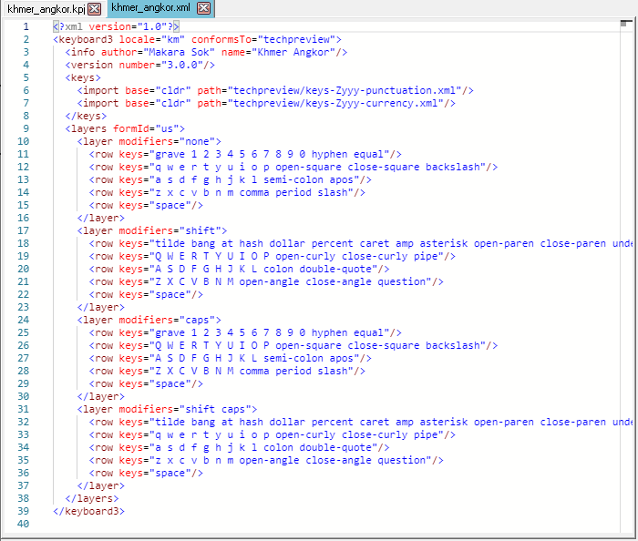

The LDML Keyboard file format is new in Keyman Developer 17. It is an
XML file, and follows the specification at https://www.unicode.org/reports/tr35/tr35-keyboards.html

The LDML editor in this release is very basic, supporting syntax highlighting
and basic editing, but specific support for the keyboard3 format is scheduled
for release in version 18.0.

LDML keyboards can be tested by pressing <kbd>F5</kbd>. This opens the [LDML Debug window](ldml-debug).

The text editor supports standard Windows editing keystrokes. It uses the Monaco
component from Visual Studio Code, so much of the functionality available in
that editor is also available here.
