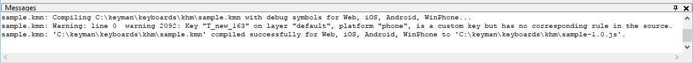

The message window appears at the bottom of the screen, or floating in a toolbar window. It contains a list of error and warning messages returned from a compilation session.

You can double click or press <kbd>Enter</kbd> to select a
line corresponding to an error in the window. To open and close the
window, press <kbd>Ctrl</kbd>+<kbd>Shift</kbd>+<kbd>M</kbd>.
You can save the messages listed in the window, or clear them, through
the context menu available by clicking the right mouse button in the
window (or pressing the Context Menu key).

You can undock and dock the window by dragging its title bar.

The hotkeys for moving to next and previous messages in the list are <kbd>F4</kbd> and <kbd>Shift</kbd>+<kbd>F4</kbd>, respectively.
