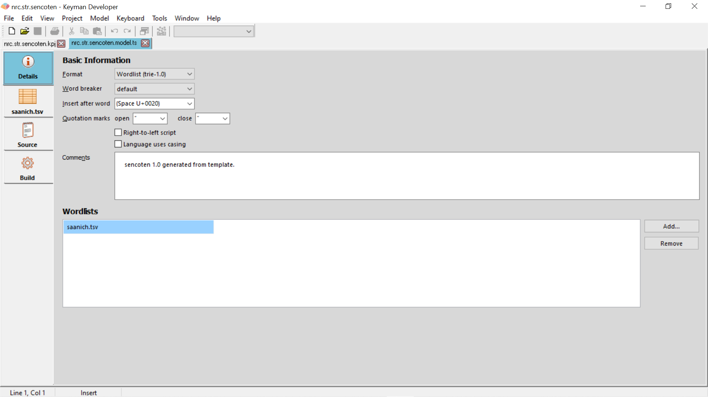
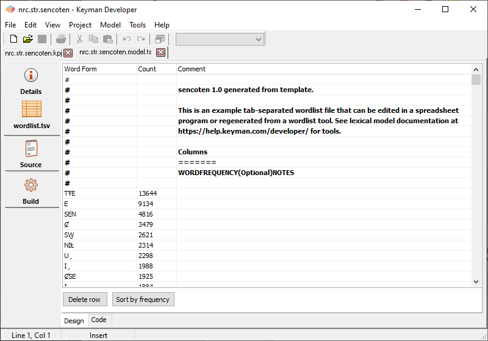
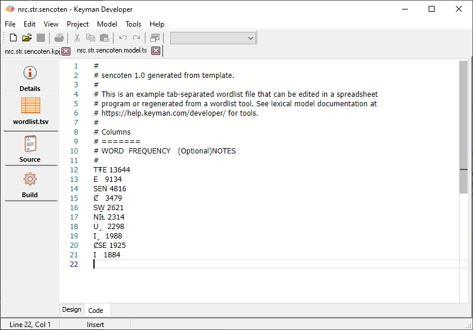
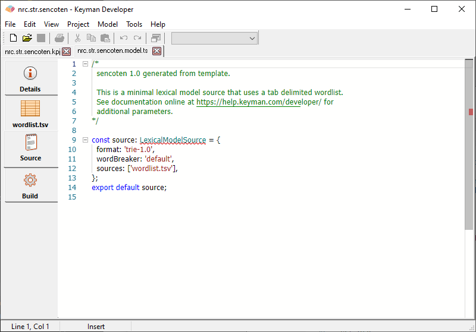
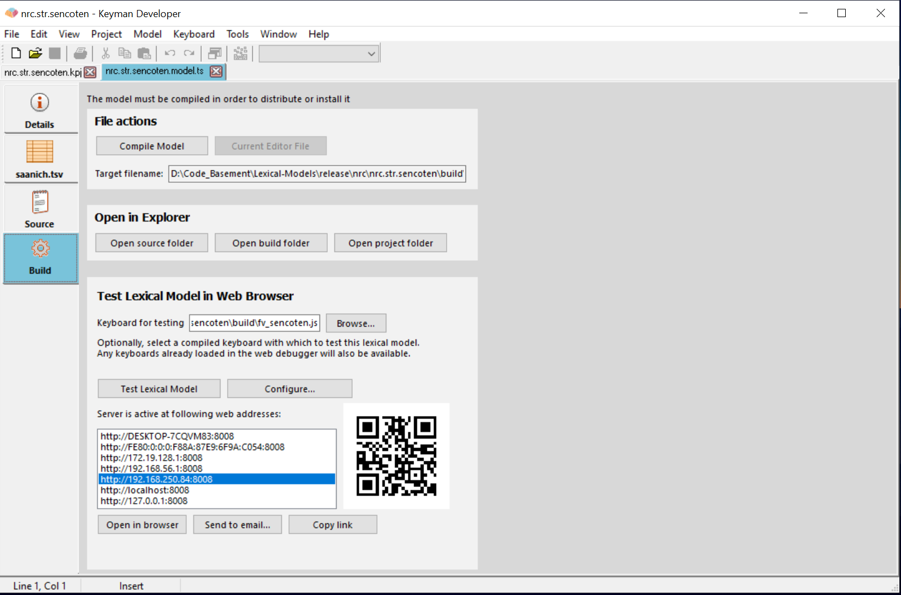

The lexical model editor allows you to create and maintain lexical
models for predictive text.

## Lexical model component files

A lexical model can have multiple source files, all of which can be
managed in this one editor. The source files currently supported by the
editor are:

| File type         | Tabs            | Description |
|-------------------|-----------------|-------------|
| `file.model.ts` | Details, Source | The primary lexical model source file, a TypeScript module.   |
| `wordlist.tsv`  | wordlist.tsv    | One or more wordlists, UTF-8 format tab-separated value files. These files are referenced in the .model.ts source file. |

## Details tab

The following image shows the first tab of the editor, the Details tab.
Changes made to this tab are reflected immediately in the Source tab.



The fields here have corresponding definitions in the [.model.ts source file](../reference/file-types/model-ts), which can be seen in the
**Source** tab:

Format
:   The implementation of the lexical model. This can be either
    **Wordlist** (`trie-1.0`), or **Custom** (`custom-1.0`). Corresponds
    to the `format` property in the [.model.ts source file](../reference/file-types/model-ts).

Word breaker
:   What method is used to separate words in text. This can be one of
    `default`, `ascii`, or `custom`. Corresponds to the `wordBreaker`
    property in the [.model.ts source file](../reference/file-types/model-ts).

Insert after word
: Many languages insert a space after a word. Some languages, like Thai or Khmer, do not use spaces. To suppress the space, you may set insertAfterWord to the empty string:

    ```keyman
    punctuation: {
    insertAfterWord: "",
    },
    ```

[Read more](../guides/lexical-models/advanced/punctuation#toc-customizing-insertafterword)

Quotation marks
: These are the quotation marks that surround the "keep" suggestion when it's displayed in the suggestion banner. [Read about Quotation marks here](../guides/lexical-models/advanced/punctuation#toc-customizing-quotesforkeepsuggestion).

Right-to-left script
: Check this box to indicate that the lexical-model is for a right-to-left script.

Language uses casing
: Tick this box for uppercase, capitalize, or any casing in the predicted word.

Comments
:   This field corresponds to the first lines of comments in the model
    source, and is visible only to the model designer.

Wordlists
:   The Wordlists grid controls which additional wordlist files are
    referenced by the model. Adding a wordlist file will add an extra
    tab to the editor, and add the corresponding reference to the
    lexical model source. Removing a wordlist will not delete the
    component file, but will just remove the reference from the lexical
    model source. Corresponds to the `sources` property in the
    [.model.ts source file](../reference/file-types/model-ts).

> ### Note
If the [.model.ts](../reference/file-types/model-ts) file cannot
be parsed by the model editor, the field shown here will be read only
and you will need to make changes only in the **Source** tab. This can
happen if the .model.ts contains more complex code.

## Wordlist tabs

Each [wordlist file](../reference/file-types/tsv) referenced in the
Wordlists grid is given its own tab. Wordlist tabs have two views:
Design, and Code. Changes to one view are reflected immedaitely in the
other view. [Learn more about wordlists](../guides/lexical-models/tutorial/step-3).

Wordlist files should be stored in UTF-8 encoding (preferably without
BOM), and tab-separated format. Some applications, such as Microsoft
Excel, are unable to export in this format, so the compiler will also
accept UTF-16 encoded files, but this encoding is not recommended as it
is more difficult to manage in version control systems such as Git,
which is the system used by the Keyman Cloud lexical model repository.



Every line of the tab-separated format file is shown here, and can be
edited directly. For most wordlists, it will be more effective to use an
external dictionary tool, such as SIL Fieldworks or SIL PrimerPrep to
generate the wordlist from a text corpus, and use this tab just to
preview the contents of the file.

The **Sort by frequency** button has no effect on the functioning of the
wordlist, but can help you, the editor, by showing more common words
earlier in the list.



> ### Note
The wordlist Code editor will accept the Tab key to insert a Tab
character. In other code editors in Keyman Developer, the Tab key
inserts spaces.

## Source tab



This tab shows the source view of the model, written in the Typescript
programming language. The format of this file is documented in the
[Lexical Model File Format Reference](../reference/file-types/model-ts).

## Build tab



A set of common controls is across the top of this tab:

Compile Model
:   You can compile the model for testing and installation by clicking
    the **Compile Model** button, or
    selecting Model, Compile Model. This will compile the model into a
    single Javascript file, named as shown in the **Target filename**
    field.

Open source, build, and project folder
:   Opens the folder which contains the model source, build, and project files.

<!-- Add to Project
:   If the model file is not already part of the project, adds it to the
    project. (Note: this button can sometimes have the caption "Current
    editor file".) -->

### Test Lexical Model in Web Browser

Before distributing the lexical model, you can test it in a web browser.
[Learn more about testing lexical models](../guides/test/lexical-model).

Keyboard for testing
:   Allows you to select a compiled keyboard to provide input for
    testing the lexical model. You can also choose to start testing a
    keyboard directly from the keyboard source file and it will then be
    available for use when testing the lexical model, until you restart
    Keyman Developer. The keyboard must be a .js format keyboard with a
    touch keyboard.

Test Lexical Model
:   Starts the Keyman Developer Web Server for the current lexical
    model. This will list the various IP addresses and hostnames that Keyman Developer
    is listening on

Configure...
:   Pressing this allows the [Options](./options) dialog to pop-up.

Open in browser
:   Starts your default browser with the selected address to allow
    testing of the model directly

Send to email...
:   Sends the list of web addresses as an email so that you can more
    easily open the test site on your mobile device, or share with
    someone else on your network.

Copy link
:   Once the IP addresses are shown, feel free to copy any one of the links.

To test on other platforms, open one of the debug host addresses listed
on your device. Your device will need to be on the same network as the
Keyman Developer computer.

There is also a QR code which you can scan with your mobile device
camera to automatically load the selected site in the list of debug web
addresses. This is the quickest way to start testing on your mobile
device.

The Send to email function is another way to open the addresses on your
mobile device without having to enter them manually.

Learn more about [testing on the web and mobile devices](../guides/test/lexical-model).