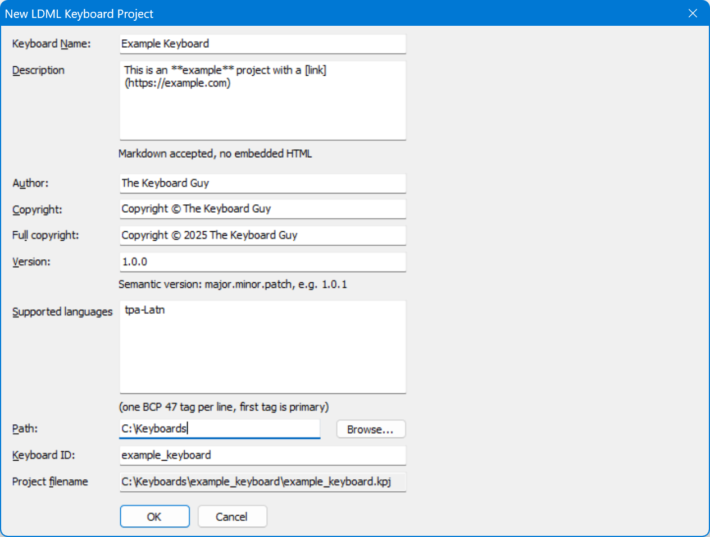

Allows you to quickly fill in common parameters for a new LDML keyboard project, adding keyboard, package, documentation and metadata files, following the [file layout](/developer/keyboards/) used in the [Keyman keyboards repository](https://github.com/keymanapp/keyboards).

Projects can also be created from the command line with [KMConvert](kmconvert).

### Parameters

Keyboard Name

: **Required.** The descriptive name of the keyboard. This will be set in the
  `<info name` attribute value in the keyboard, in the
  package name, and where appropriate in documentation and metadata.

Description

: **Required.** A short description of the purpose of the keyboard. This will
  show up in a keyboard search on keyman.com and supports basic Markdown (no
  embedded HTML). This is stored in the package metadata.

Author

: Optional. The name of the developer of the keyboard. This will be set in
  the package metadata, and where appropriate in documentation and metadata.

Copyright, Full Copyright

: Optional. A copyright string for the keyboard. This will be set in the
  package metadata, and where appropriate in documentation and metadata.

Version

: **Required.** The initial version number of the keyboard. For an LDML keyboard
  this can be a [SEMVER](https://semver.org) compatible version number, but note
  that Keyman as of version 17 is more restrictive and still requires the
  version number to follow the format specified in
  [`&Keyboardversion`](/developer/language/reference/keyboardversion). This will
  be set also in the package metadata, and where appropriate in documentation
  and metadata.

Supported Languages

: **Required.** Specifies the default BCP 47 language tags which will be added
  to the package data and project metadata. (Required) While the LDML keyboard
  specification allows for complete BCP 47 tags, in Keyman, these are currently
  restricted to use of the Language, Script, and Region subtags.

Path

: **Required.** Specifies the base path where the project folder will be
  created. The project folder name will be the keyboard ID. If the folder
  already exists, then you will be prompted before Keyman Developer overwrites
  files inside it.

Keyboard ID

: **Required.** The base filename of the keyboard, project and package. This
  must conform to the Keyman keyboard identifier rules, using the characters
  a-z, 0-9 and _ (underscore) only.