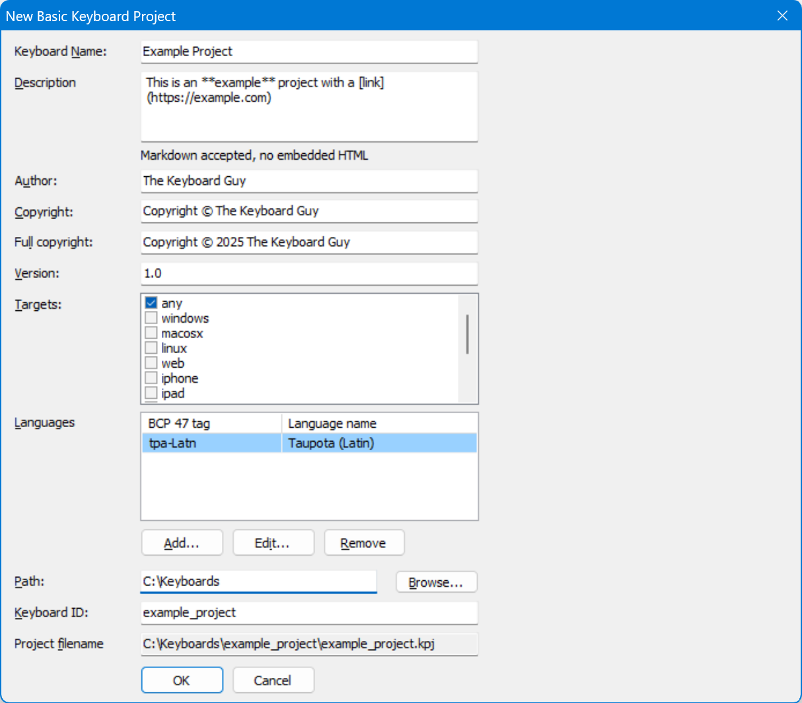

Allows you to quickly fill in common parameters for a new keyboard
project, adding keyboard, package, documentation and metadata files,
following the [file layout](/developer/keyboards/) used in the [Keyman keyboards repository](https://github.com/keymanapp/keyboards).

Projects can also be created from the command line with
[KMConvert](kmconvert).

### Parameters

Keyboard Name
:   The descriptive name of the keyboard. This will be set in the
    [`&Name`](/developer/language/reference/name) store in the keyboard,
    in the package name, and where appropriate in documentation and
    metadata.

Copyright
:   A copyright string for the keyboard. This will be set in the
    [`&Copyright`](/developer/language/reference/copyright) store in the
    keyboard, in the package metadata, and where appropriate in
    documentation and metadata.

Version
:   The initial version number of the keyboard. This should follow the
    format specified in the
    [`&Keyboardversion`](/developer/language/reference/keyboardversion)
    store for the keyboard. This will be set also in the package
    metadata, and where appropriate in documentation and metadata.

Author
:   The name of the developer of the keyboard. This will be set in the
    package metadata, and where appropriate in documentation and
    metadata.

Targets
:   Specifies the default deployment targets for the keyboard, set in
    the [`&Targets`](/developer/language/reference/targets) store in the
    keyboard, and controls the files added to the package initially.
    This also is reflected in documentation and metadata.

Languages
:   Specifies the default BCP 47 language tags which will be added to
    the package metadata and project metadata.

Path
:   Specifies the base path where the project folder will be created.
    The project folder name will be the keyboard ID. If the folder
    already exists, then you will be prompted before Keyman Developer
    overwrites files inside it.

Keyboard ID
:   The base filename of the keyboard, project and package. This must
    conform to the Keyman keyboard identifier rules, using the
    characters a-z, 0-9 and _ (underscore) only.