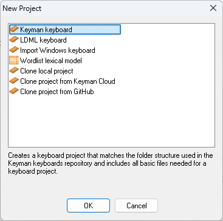

Creates a new keyboard or lexical model project, optionally from a template or by importing from another source.

## Keyman keyboard

Creates a keyboard project that matches the folder structure used in the Keyman [keyboards repository](https://github.com/keymanapp/keyboards) and includes all [basic files](/developer/keyboards/) needed for a keyboard project. Clicking OK will open the [New Project Parameters dialog](new-project-parameters).

## LDML Keyboard
Creates a keyboard project that matches the folder structure used in the Keyman [keyboards repository](https://github.com/keymanapp/keyboards) and includes all [basic files](/developer/keyboards/) needed for a LDML keyboard project. Clicking OK will open the [New LDML Keyboard Project Parameters dialog](new-ldml-project-parameters).

## Import Windows Keyboard

Creates a keyboard project that matches the folder structure used in the Keyman [keyboards repository](https://github.com/keymanapp/keyboards) and includes all [basic files](/developer/keyboards/) needed for a keyboard project, then converts and imports the Windows keyboard that you select into the project. Clicking OK will open the [New Project Parameters dialog](new-project-parameters).

## Wordlist Lexical Model

Creates a lexical model project that matches the folder structure used in the Keyman [lexical models repository](https://github.com/keymanapp/lexical-models) and includes all basic files needed for a lexical model project. Clicking OK will open the [New Lexical Model Project Parameters dialog](new-lm-project-parameters).

## Clone local project

Copies a Keyman keyboard or lexical model project on your local filesystem into
a new folder, giving the project and included files a new name. Clicking OK will
open the [Clone Local Project Parameters dialog](clone-local-project-parameters).

## Clone project from Keyman Cloud

Copies a Keyman keyboard or lexical model project from keyman.com into a new
folder, giving the project and included files a new name. Clicking OK will
open the [Clone Keyman Cloud Project Parameters dialog](clone-keyman-cloud-project-parameters).

## Clone project from GitHub

Copies a Keyman keyboard or lexical model project from a GitHub repository into
a new folder, giving the project and included files a new name. Clicking OK will
open the [Clone GitHub Project Parameters dialog](clone-github-project-parameters).

# Command line access

[`kmc generate`](kmc) can be used to generate new Keyman keyboards, LDML
keyboards, and Wordlist lexical models from the command line.

[KMConvert](kmconvert) can also be used to import Windows keyboards from the
command line.
