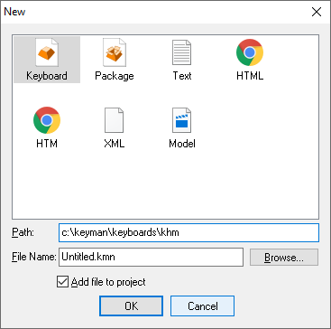

Creates a new file, and optionally adds it to the current project.

## Keyboard

Creates a new keyboard source file. This file will be opened in an
Keyboard Editor window.

## Package

Creates a new keyboard package. A keyboard package contains one or more
keyboard files, and can optionally contain other associated files such
as documentation.

## Text file

Creates a new text file.

## HTML file

Creates a new HTML file.

## XML file

Creates a new XML file.

## Model file

Creates a new `.model.ts` lexical model file.