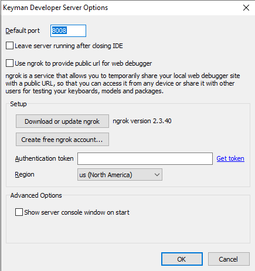

## General tab

The following options are configurable in TIKE in the **General** tab:

Open keyboard files in source view.
:   Instead of opening a keyboard file in the Details tab, open directly
    into the Layout tab, Source pane.

External Editor Path
:   You can open any Keyman source file shown in the project in an
    external text editor by right-clicking on the file and selecting
    "Open in External Editor". The files available for editing
    externally are .kmn, .kps, and .kvks. This field configures which
    editor you wish to use to edit the files. Note: if you need to pass
    command line parameters to the editor, you will need to wrap the
    command in a batch file and reference the batch file here.

<!-- Show splash screen
:   If checked, displays a splash screen when Keyman Developer is
    started.

Allow multiple instances of TIKE
:   Allow Keyman Developer to be started multiple times, instead of
    loading other files in the current instance when selected from
    Explorer.

Save visual keyboard source files (.kvks) as XML
:   Keyman Developer will default to saving .kvks files as XML when
    editing, which makes them easier to share in version control systems
    such as Git. The compiled .kvk files will be binary and will work
    with earlier versions of Keyman Desktop. However, if you are sharing
    keyboard source files with developers using earlier versions of
    Keyman Developer, you should clear this checkbox so they can load
    the files.-->

Proxy Settings...
:   Configure the HTTP proxy settings for online functionality within
    Keyman Developer, such as uploading files to Tavultesoft.

SMTP Settings...
:   Configure your SMTP server settings for email functionality within
    Keyman Developer, such as emailing debug URLs for the touch layout
    debugger.

## Editor tab

Use tab character
:   Sets whether to use the Tab character or spaces for indents.

Indent size
:   The indent size, measured in number of spaces.

Link quoted font size to primary font size
:   If checked, the quoted font size will be the same as the default
    font size.

Default font
:   Sets the font for ordinary text in the editor.

Quoted font
:   Sets the font for displaying comments text and strings in Keyman
    source files in single or double quotes.

Editor theme
:   Sets the display theme and syntax highlighting options for the
    editor. A [custom theme](../reference/editor-themes) can be defined
    in a JSON file.

## Debugger tab

Enable test window (from version 5.0)
:   Enables the Keyman 5-style Test window instead of the debugger.

Breakpoints fire also when exiting line
:   Breakpoints will fire when a rule has finished being processed also.

Turn on single step after breakpoint
:   Activates single-step mode after a breakpoint fires.

Show matched character offsets in stores
:   Displays numeric indices of characters in stores

Automatically recompile if no debug information available
:   When the debugger starts, rebuild a keyboard without prompting if
    the keyboard has no debug symbols included.

Automatically reset debugger before recompiling
:   If you are debugging a keyboard, make a change to the keyboard, and recompile it,
    then the debugger needs to be reset in order to get access to the new keyboard.
    Keyman Developer will normally prompt you to do this, but if you set this option,
    then it will reset the debugger automatically instead.

## Character Map tab

Find character under cursor automatically
:   The character beneath the cursor in the edit window will be
    highlighted in the Character Map. This will intelligently parse the
    character data under the cursor so that a character code (e.g.
    U+1234) will be highlighted correctly.

Disable database lookups
:   Disables looking characters up in the database.

Update database
:   Rebuilds the Unicode character database from source unicodedata.txt
    and blocks.txt. These files can be downloaded from the Unicode
    website at
    [http://www.unicode.org/ucd/](http://www.unicode.org/ucd/).
    This lets you update the character map with a newer version of Unicode.
    Keyman Developer 17.0 was released with Unicode version 15.1 data.

## Server tab

There are two configurations in the Keyman Developer Server section:
1. Configure Server...
2. List local URLs for Server

Configure Server...

:   After clicking the button, a new window will pop-up

    

    You can customize the Keyman Developer server for testing the usability of your keyboard. Features of the Keyman Developer server include:

    * Seamless integration with the IDE (Start, Stop, Live reload, Recompile...)
    * Port configuration
    * Allow testing cross devices
    * Wider range support for NGROK...

    [Find out more](https://github.com/keymanapp/keyman/pull/6073)

    Understanding the three tick boxes will enhance the usability of Keyman Developer:
    - **Leave Server running after closing IDE**: allows keyboard testing on local URLs after closing Keyman Developer.
    - **Use ngrok to provide public url for web debugger**: configure NGROK as instructed, once it looks something like this:
    

        Please restart the machine, and the URL (*link ending in .ngrok-free.app*) will appear in the specified locations:
        
        

        Now, freely share it across multiple devices using the link or QR code.
        

    - **Show server console window on start**: once ticked, Keyman Developer's server console will appear as an independent window as a node application with the default message:
        `Starting Keyman Developer Server 17.0.290-beta, listening on port 8008.`

List local URLs for Server
:   Below Configure Server, untick the box, and it will quit displaying any local URLs for keyboard testing.
    

Explore more: [Keyman Developer Server](server#toc-configuring-keyman-developer-server)
