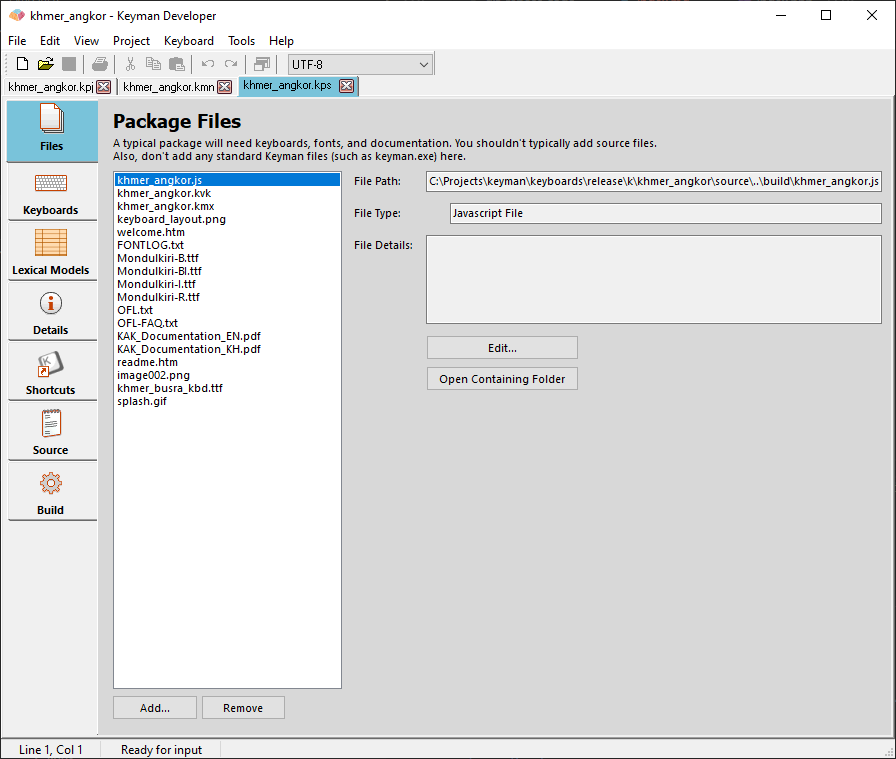
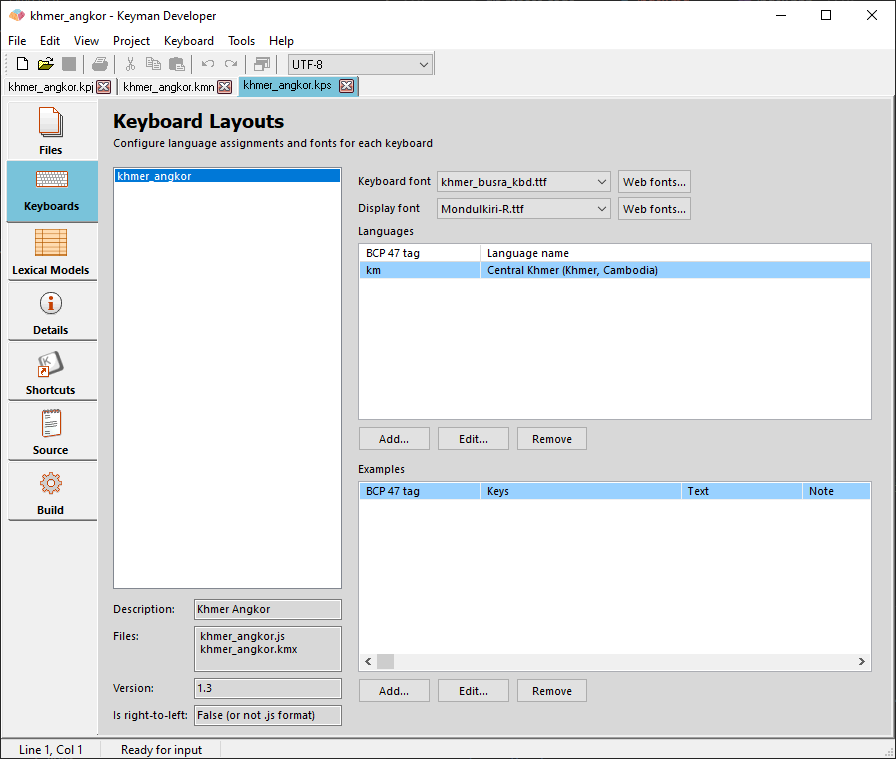
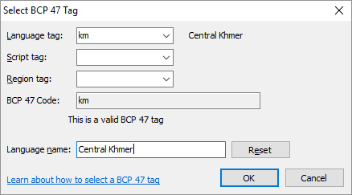
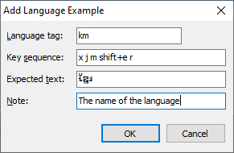
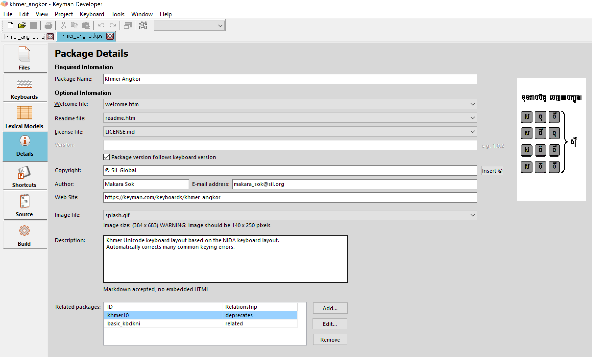
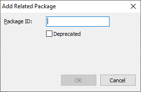
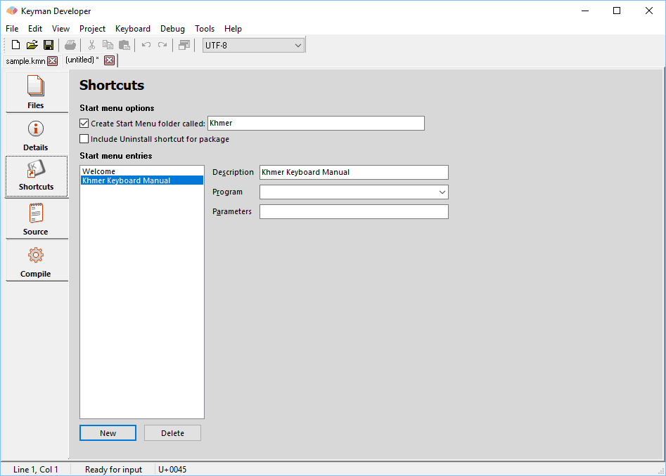
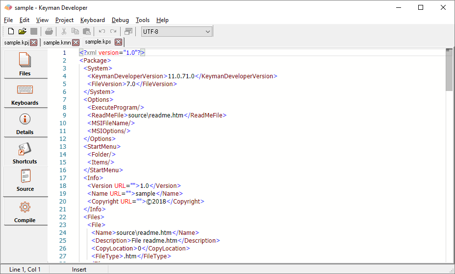
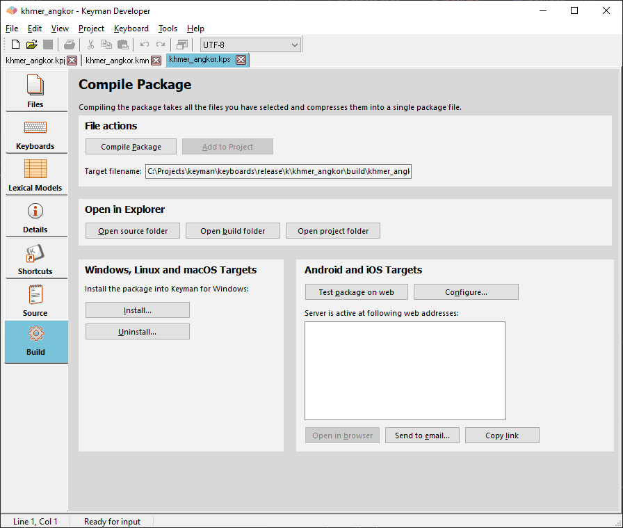

The Package Editor allows you to edit a .kps package source file, which will be
compiled into a .kmp package file. These files contain a set of keyboards,
documentation, fonts, and other related files, which make distribution and
installation of a keyboard in Keyman simple.

## Files tab

Use the <kbd>Add...</kbd> button to select the files to be included in the package, such
as .kmx and .js keyboard files, documentation, and related fonts; but you can
include any type of file here as well.

If you add another .kmp package file, it will also be installed when this
package is installed, but will be managed separately and uninstalled separately.

## Keyboards tab

The Keyboards tab shows you some status information of keyboards you've added to
the package. There are also optional font dropdowns and a required "Languages"
section. The fields on the tab are:

**Description**

: The keyboard name (`&name` system store).

**Files**

: This shows the associated keyboard files (.kmx and .js files)

**Version**

: The keyboard version (`&keyboardversion` system store).

**Is right-to-left**

: Currently, this is only applicable to Android, iOS and Web (that is, .js
  format) keyboards. This reflects the checkbox in the [Details tab](./keyboard-editor#details-fields) of the Keyboard editor.

> ### Note
  **Is right-to-left** will only be true if the following occur:
  * "Keyboard is right-to-left" is checked in the Keyboard editor
  * The compiled .js keyboard is added to the package

**Keyboard font**

: When font files are added to the package, this dropdown tells the Keyman apps
  which font to use when rendering the On Screen Keyboard touch keyboard.
  Optional.

**Display font**

: When font files are added to the package, this dropdown tells the Keyman apps
  for iOS and Android which font to use in edit fields. It only applies within
  the Keyman app and apps that support this functionality. Optional.

**Web fonts**

: It is possible now to specify additional font filenames that will be made
  available to KeymanWeb, for example, providing fonts in WOFF or WOFF2 formats.
  [More on web fonts](select-web-fonts)

**Languages**

: Because the language information in the .kmn source is deprecated, the
  "Languages" section is required. Each language listed here is a [BCP 47 language tag](../reference/bcp-47). Use the **Add** button to
  bring up the "Select BCP 47 Tag" dialog. When Keyman installs the keyboard
  package, it will associate the keyboard with the language(s) you select here.
  Required.

  

**Examples**

: Examples allow you to provide short keystroke sequences to type sample text
  with your keyboard. This can be the easiest way for a new user to start using
  your keyboard, and is particularly helpful when your keyboard makes use of
  keying sequences that may not be immediately obvious.

  As the keying examples may vary by language, you should include the BCP 47 tag
  for each example, plus a short description (in English) of what the text is
  about.

  The key sequence must list each key combination, separated by space. The
  actual text for each key is reasonably arbitrary, to allow you to provide
  examples for touch keyboards as well as desktop keyboards. There are three
  special kinds of key strings:
  * Modifier keys may be specified with the `+` character, e.g. `shift+e` or `right-alt+k`. Use lower case keys. The suggested standard modifiers are: `shift`, `ctrl`, `alt`, `left-alt`, `right-alt`, `left-ctrl`, `right-ctrl`, and `option` (mac).
  * The <kbd>space</kbd> key itself may be specified with `space`.
  * To avoid confusion with modifier keys, the <kbd>+</kbd> key can be specified with `plus`.

  For example, the key sequence <kbd>x</kbd>, <kbd>j</kbd>, <kbd>m</kbd>, <kbd>Shift</kbd>+<kbd>e</kbd>, <kbd>r</kbd> may be specified as `x j m shift+e r` or `x j m E r`.

  

## Details tab

Enter the name of the package into the Package Name field; this will be
automatically filled from the name of the first keyboard you add to the package.

Select a HTML readme file if you have one to include in the package; this will
be displayed before the package is installed as information about the package.

Version numbers should be in the form `major.minor[.patch]`. Patch is optional
but is helpful for small bug fix releases. Each of the sections of the version
should be an integer. Keyman Desktop does integer comparisons on the version
number components, so, for example, version 2.04 is regarded as newer than
version 2.1. Alphabetic or date formats should be avoided as the installer for
the keyboard cannot determine which version is older reliably.

You can also tick the checkbox labelled "Package version follows keyboard
version" to have the package version automatically track the keyboard version.

The Copyright indicates the overall copyright of the package and all its
contents.

Fill in the individual or organisation who authored the package in the Author
field, and a contact email address into the E-mail address field. These fields
are optional.

A web site is encouraged and should be filled in the web site field, including
the initial "http://" or "https://".

A package can optionally include a 140x250 JPEG or PNG image file to be shown
during installation. This image file must be added to the Files list in step 1,
then selected from the list here.

### Related packages

If a keyboard package is intended to replace an existing keyboard, or if there
are related packages, then the identifiers for these packages should be listed
here.

There are two types of package relationships:

* Deprecation: if the package replaces an existing package, ensure that you
  select the 'Deprecated' check box. This information will be used on the Keyman
  website, both to help users select the most recent version of a keyboard, and
  also to offer upgrades to new packages for existing users of the package.

* Related: if the 'Deprecated' check box is not selected, then this the
  relationship information is used to provide links to the related packages on
  the Keyman website. For example, you may create two keyboards for the same
  language with different keying orders; then it would be appropriate to
  cross-reference them with this field.

## Shortcuts tab

You can optionally have the package create a Start Menu folder, and populate it
with shortcuts to the files in the package, and optionally also a shortcut for
uninstallation.

To add an entry, click New, and set the description, and choose a program or
document to load.

An uninstall shortcut is no longer recommended; uninstall should be managed by
the user in Keyman Configuration.

## Source tab

The source of the .kps file in XML format. All details from previous tabs can be
seen in the Source tab, and changes in either the Source tab or the other tabs
will be reflected immediately in the other.

## Compile tab

The final step is building the package. You must save the package file before
building, then choose Compile Package to build the package file. You can then
test the package to verify that it will install correctly with the Install
Package button.

Once you are satisfied with your package, you should consider submitting the
keyboard to the [Keyman Cloud Keyboards Repository](/developer/keyboards/).

## Package Installers

As of Keyman Developer 17, bundled executable package installers for Keyman for
Windows can be created using [kmc](kmc), but cannot be created within the IDE.