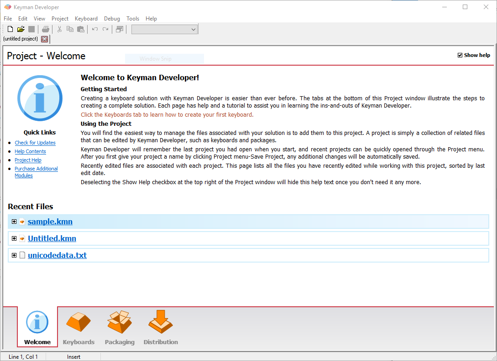
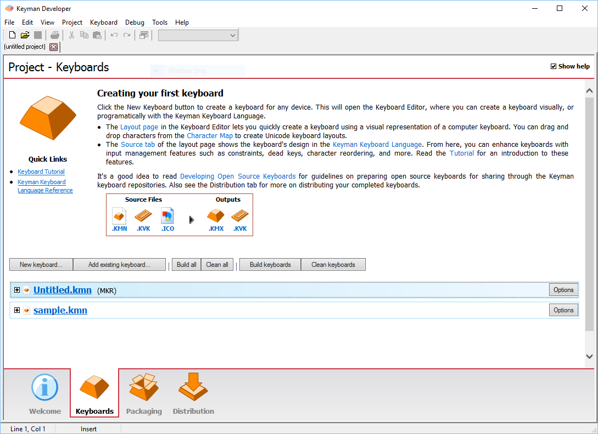
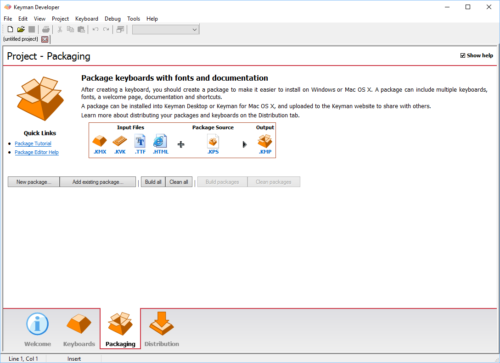
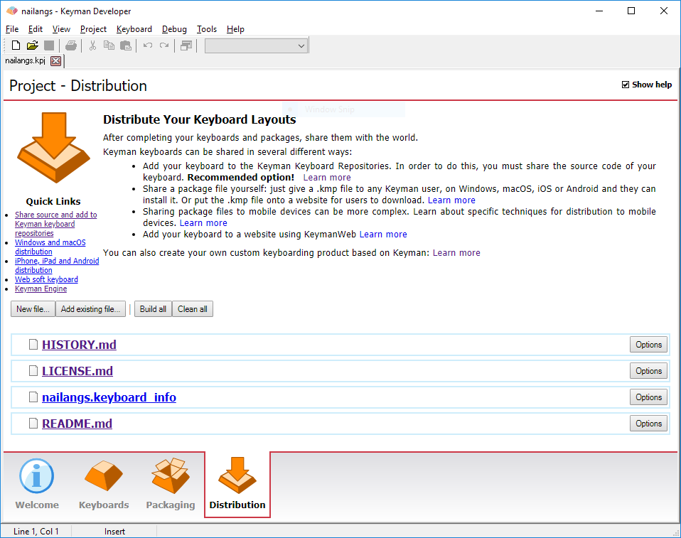

The Project allows you to manage all the files that you are working on in Keyman Developer, and guides you on the steps to creating a keyboard solution. Changes to the project are automatically saved.

You can open the Project window by pressing <kbd>Ctrl</kbd>+<kbd>Shift</kbd>+<kbd>P</kbd>, or selecting View, Project.

## Welcome

This tab lists all the files that you have recently worked on.

## Keyboards

This tab lists all the keyboard source files in your project.

## Packaging

This tab lists all the package source files in your project.

## Distribution

This tab lists all other files in your project, such as the
[.keyboard_info file used for uploading to the Keyboards repository](/developer/keyboards/).