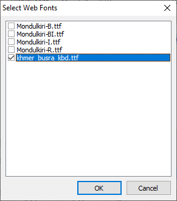

The Select Web Fonts dialog allows you to choose additional fonts that will be
made available as suggested fonts for KeymanWeb. These fonts should be included
in the package.

Even though the fonts are included in the package, KeymanWeb will source the
fonts from its own infrastructure, so they will need to be shared in the Keyman
content delivery network repository
[s.keyman.com](https://github.com/keymanapp/s.keyman.com).

Separate fonts can be specified for the On-Screen Keyboard and the recommended
Display font.

