# Introduction

Keyman Developer Server provides a web-based front-end for testing and sharing
keyboards, lexical models and packages.

The primary benefits of Keyman Developer Server are:

* Test keyboards in a browser on your computer, including simulation of mobile
  devices and touch keyboards
* Test lexical models in a browser on your computer
* Test keyboards, lexical models and packages on mobile devices
* Share keyboards, lexical models and packages to mobile devices and other users

Keyman Developer Server was added in Keyman Developer 15, and replaces the old web
Test feature.

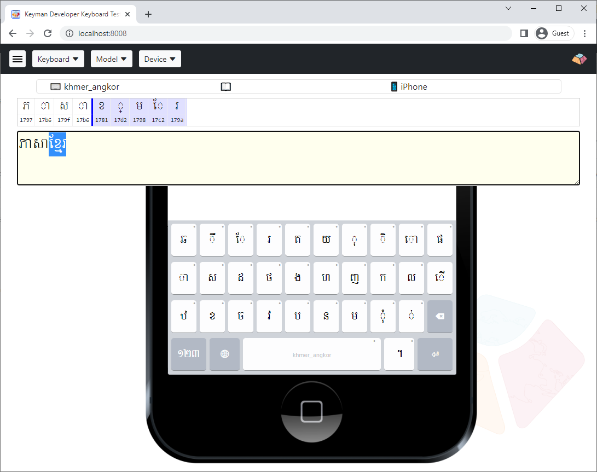

# Installation and Startup

## Windows

Keyman Developer Server is always installed as a part of Keyman Developer.

When you start Keyman Developer, Keyman Developer Server will start in the
background.

> **Note:** The first time Keyman Developer Server starts, you may be presented
with a warning from your firewall or security software about Node.js Javascript
Runtime running from the Keyman Developer folder. This is the Keyman Developer
Server host process, and you should choose to allow Keyman Developer Server to
communicate at least on your local private network, or as your circumstances
dictate.

By default, Keyman Developer Server will run when Keyman Developer is running,
and will shutdown when Keyman Developer is closed. However, you can also
configure Keyman Developer Server to stay running even after Keyman Developer is
closed.

An icon will be displayed in the system notification area in the Taskbar
(it may be hidden in the expansion area):

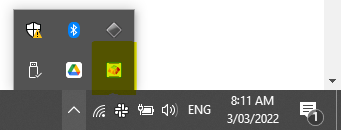

Clicking on the icon opens a menu:

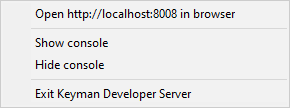

The following menu items are available:

**Open `http://localhost:8008` in browser**

: Loads Keyman Developer Server home page in your default browser

**Show console**, **Hide console**

: Controls the visibility of the Node console for Keyman Developer Server. You
  would only need to view the Node console if you were diagnosing issues with
  Keyman Developer Server

**Exit Keyman Developer Server**

: Shuts down the Server. The Server can be restarted by closing and re-opening
  Keyman Developer.

## Linux and macOS

Keyman Developer Server is included in the kmcomp.zip standalone distribution.
It requires nodeJS 16.0 or later, which should be installed according to your
platform's instructions.

On macOS, if you use Homebrew, you can install nodeJS in Terminal:

```shell
brew install node
```

You can download the latest kmcomp.zip with the following commands:

```shell
mkdir kmcomp
cd kmcomp
curl -L https://keyman.com/go/download/kmcomp -o kmcomp.zip
unzip kmcomp.zip
```

To start the server, from the kmcomp folder you created earlier, run the
following command:

```shell
cd server
npm run prod
```

You can stop the server at any time by pressing <kbd>Ctrl</kbd>+<kbd>C</kbd>
in the Terminal / shell.

# Using Keyman Developer Server

## Testing a Keyman keyboard in Keyman Developer Server

In Keyman Developer, open a keyboard project, and load the keyboard .kmn file.
In the Build tab, click **Compile keyboard**, then click **Test keyboard on
web**. Finally, click **Open in browser** to access the keyboard in your
local Keyman Developer Server instance.

You will be presented with the default page for Server.

You will need to select your keyboard from the **Keyboard** menu. The keyboard will
be presented and you can test it either by typing using your hardware keyboard,
or interacting with the On-Screen Keyboard.


When you make changes to your keyboard and recompile, the keyboard will be
reloaded instantly. There is no need to click the **Test keyboard on web**
button again.

Keyman Developer Server remembers the ten most recent keyboards that you have
been testing, even after exiting and restarting. This makes it easier to switch
between projects in Keyman Developer.

## Testing a lexical model in Keyman Developer Server

In Keyman Developer, open a lexical model project, and load the model .model.ts
file. In the Build tab, click **Compile model**, then click **Test lexical
model**. Finally, click **Open in browser** to access the model in your local
Keyman Developer Server instance.

You will be presented with the default page for Server.

You will need to select a keyboard that works with the model from the
**Keyboard** menu, and also the model you have just started testing from the
**Model** menu. You will have the best results if you select a mobile device to
test the model.

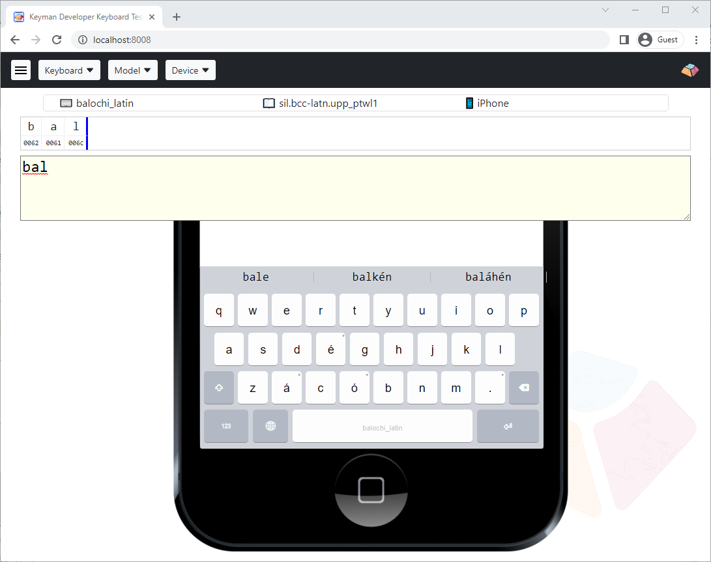

When you make changes to your model and recompile, the model will be reloaded
instantly. There is no need to click the **Test lexical model** button again.

Keyman Developer Server remembers the ten most recent lexical models that you
have been testing, even after exiting and restarting.

## Sharing a package to test from Keyman Developer

In Keyman Developer, open either a keyboard or a lexical mdoel project, and load
the .kps file. In the Build tab, click **Compile package**, then click **Test
package on web**. Finally, click **Open in browser** to access the package in
your local Keyman Developer Server instance.

The package will be available for install from the hamburger menu at the top
left of the banner. This is most useful when you access Server from another
device, as you can then easily install the package into Keyman on that device
without having to worry about copying files around manually.

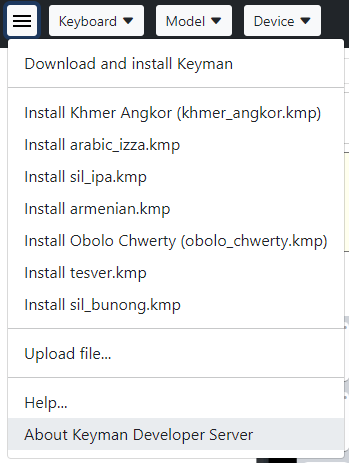

Keyman Developer Server remembers the ten most recent packages that you have
been testing, even after exiting and restarting.

## Keyman Developer Server interface


This describes the various elements of the Keyman Developer Server web interface.

### Banner


On desktop devices, the top banner of Server includes four menus. On a mobile
device, the Device menu will not be visible, as the keyboard view will always be
the touch keyboard view at the bottom of the screen.

### Status Bar

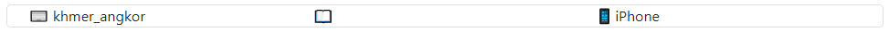

Below the banner, you will find a smaller status bar showing the currently
selected keyboard, model, and device.

### Character Grid

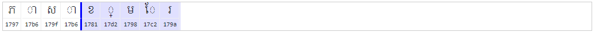

Under this is a character preview grid, which shows you the underlying Unicode
values of the characters in your text area. This character grid also shows the
current cursor position and highlighted text, so you can easily correlate the
shaped characters with their underlying representation in Unicode.

The example image above shows a Khmer keyboard with a sample string saying
"Khmer Language". Observe how the character preview grid shows the unshaped
underlying characters, how the order of characters stored in the text content
may differ from the presentation, and how diacritics and joined marks are
indicated with dotted circles.

### Text Area

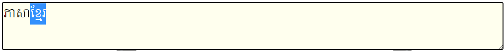

The text area is immediately below this. You can enter text into this text area
using your hardware keyboard or using the On-Screen Keyboard.

### On-Screen Keyboard

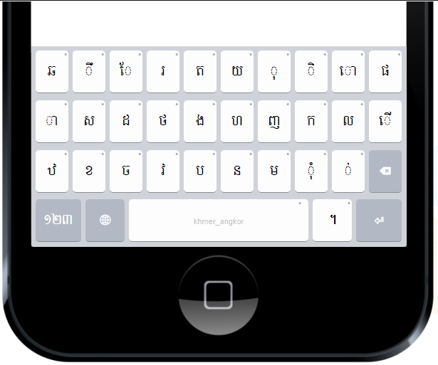

The On-Screen Keyboard, shown directly below, is fully interactive, including
support for longpress and other gestures on touch, using your mouse on a
desktop device. The layout of the On Screen Keyboard and the device frame are
controlled from the **Device** menu.

### Hamburger menu (three horizontal lines)


**Download and install Keyman**

: This is a shortcut to install Keyman for the current device. It detects
  the type of device you are viewing this page on, and provides a direct
  link to the install, whether that be a Windows executable, a Play Store
  link, an App Store link or other method.

**List of packages**

: A list of up to ten most recent packages that you have been testing in
  Keyman Developer. This will open the package in Keyman on the device, which
  is most useful when testing on a mobile device or sharing the package to
  other computers.

**Upload file...**

: Allows you to manually upload any compiled .js keyboard, compiled .model.js
  lexical model, compiled .kmp file, or .ttf font to be available for testing.
  This will be most useful when running Server on macOS or Linux, where
  integration with the Keyman Developer IDE is not available.

  You can also drag and drop these same files onto the page.

**Help...**

: Opens this help site.

**About Keyman Developer Server**

: Provides information about the version of Keyman Developer Server.

### Keyboard menu

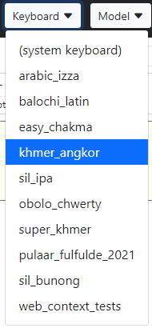

Lists up to ten keyboards that you have been testing most recently from Keyman
Developer. Select a keyboard to start testing it.

If you select **(system keyboard)**, this disables testing of Keyman keyboards.

### Model menu

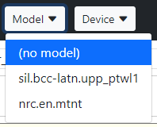

Lists up to ten lexical models that you have been testing most recently from
Keyman Developer. Select a model to start testing it. Note that the
model/keyboard correlation is controlled by you within this view -- language
association is not available in Keyman Developer Server.

While the desktop keyboard views will show predictions if a model is enabled,
this is not currently fully supported outside of Keyman Developer Server. You
will have better results selecting a touch device in the Device menu for testing
lexical models.

If you select **(no model)**, this hides the predictions banner.

### Device menu

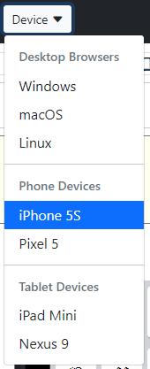

This function is available only from desktop / laptop computers. On mobile
phones and tablets, the Device menu is hidden and only the device's default
Keyman keyboard form factor is available.

When available, this allows you to simulate use of the devices shown, letting
you test the keyboard and/or model as you would see it and use it on that
device. The device selected changes the presentation of the keyboard, and is
reflected in the [`platform()` statement](/developer/language/reference/platform)
context as well.

The devices listed are representative of the various types of platforms that
Keyman supports, to allow testing on each of the available form factors.

## Making your Keyman Developer Server instance globally available with ngrok

One of the fiddliest parts of testing keyboards and models with mobile devices
is transferring the files to your phone or tablet. Keyman Developer Server will
make files available on your local network for access, but it can be difficult
to configure firewalls and network settings successfully.

To simplify testing, Keyman Developer Server integrates with a free tool called
[ngrok](https://ngrok.com) that provides a public URL to your instance of Keyman
Developer Server. This URL is dynamic and can change over time, and is only
available while Keyman Developer Server is running. This URL can be accessed
from any mobile device that is online, whether or not it is on your local
network. This means you can also quickly share keyboards, packages, and models
with other users, with a minimum of difficulty.

**Warning:** While the ngrok service is running, your computer will be sharing
your Keyman Developer Server instance to anyone in the world. The Server
instance has read-only access to the keyboards that you have loaded into it, but
you may wish to turn ngrok support on only when you need it.

ngrok does need a little bit of configuration. These steps will take you through
the process on Windows; on macOS and Linux, you will need to download and
configure ngrok manually.

1. In Keyman Developer, open **Tools | Options**, select **Server** tab, and
   click **Configure Server...**. You should be presented with a window similar
   to this:

    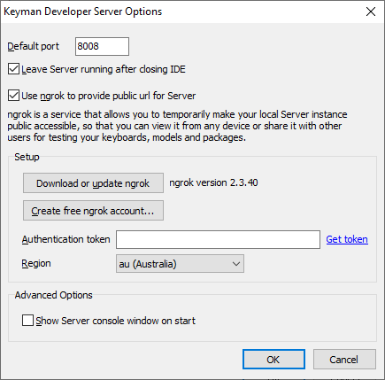

2. Tick the box **Use ngrok to provide public url for Server**
3. If ngrok is available, a version number will be shown to the right of the
   **Download or update ngrok** button. Otherwise, click this button to download
   the latest version.
4. You'll need a free ngrok account, so click the **Create free ngrok
   account...** button to open the ngrok website, and follow the steps there
   to finish the account creation process.
5. After creating the account, you should be presented with an authentication
   token. You can also access this by clicking the **Get token** link in the
   Keyman Developer Server Options dialog box. Paste this token into the
   **Authentication token** edit box.
6. Select the most appropriate region for your location, to minimize the latency
   (delay) when using the ngrok service.
7. Click **OK** to save changes, and start the ngrok service within Keyman
   Developer Server.

Once ngrok is configured, you should see an additional **Server** menu item in
Keyman Developer's **Tools** menu, with three items:

**Open `https://some-url.ngrok.io` in browser**

: Opens the public URL to your current Keyman Developer Server instance in the
  default browser on your computer.

**Copy URL to clipboard**

: Copies the public URL to the clipboard so you can share it via email, instant
  message, or other medium.

**Configure...**

: Opens the Keyman Developer Server Options dialog box.

# Configuring Keyman Developer Server

Keyman Developer Server has a number of configuration options. On Windows, using
Keyman Developer is the easiest way to manage these options. Open **Tools |
Options**, select **Server** tab, and click **Configure Server...**.


## Configuration Files

The configuration file `config.json` is stored in the following locations:
* Windows: `%appdata%\Keyman\Keyman Developer\Server\config.json`
* Linux: `~/.local/share/Keyman/Keyman Developer/Server/config.json`
* macOS: `~/Library/Preferences/Keyman/Keyman Developer/Server/config.json`

## Configuration settings

The value in parentheses is the name of the setting in `config.json`, where present.

* **Default port** (`port`): specifies the port that Server listens on (http).
  Defaults to `8008`.
* **Leave Server running after closing IDE**. This is off by default. If set,
  Keyman Developer Server will start with Keyman Developer, and run until the
  Windows session is finished by logging off or shutting down the computer. Keyman
  Developer Server can be manually closed from the system notification area icon.
* **ngrok Settings**
  * **Use ngrok to provide public url for Server** (`useNgrok`): Defaults to `false`.
    Set to `true` if you want to enable use of ngrok tunnels.
  * **Authentication token** (`ngrokToken`): the token provided by ngrok for setting
    up a tunnel.
  * **Region** (`ngrokRegion`): select the region in which you are located in order
    to minimize latency through the tunnel.
* **Show Server console window on start**. This is off by default, and would only
  normally be used for diagnostics or development of Keyman Developer itself.

# Related Topics

* [Keyboard Editor](keyboard-editor)
* [Model Editor](model-editor)
* [Package Editor](package-editor)
* [Options](options)
