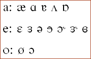

## Introduction

Whenever you want to do much more in a keyboard than simple character
substitution, you will generally need to make use of advanced features
such as **stores**, **deadkeys**, and **multiple groups**. The [tutorial](tutorial)
has already shown some basic usage of stores and deadkeys, but has not
covered other possibilities of their use. In this topic we will examine
a keyboard that demonstrates some other uses of stores and deadkeys, and
introduces the use of multiple groups for complex processing.

We recommend that you read the topics on
[groups](/developer/language/guide/groups),
[stores](/developer/language/guide/stores), and
[deadkeys](/developer/language/reference/deadkey) before continuing.

The keyboard we will examine is **IPAMenu.kmn** (found in the Keyman
Developer Samples folder), which contains the beginnings of a menu-based
keyboard for using the International Phonetic Alphabet (IPA). You will
need a Unicode font with IPA characters (such as **Gentium**) to
properly use this keyboard, but you should be able to follow the code
even without. For more information about the IPA, see [The International
Phonetic
Association](https://www.internationalphoneticassociation.org/).

Most of the IPA glyphs are derived from glyphs in the Latin alphabet,
used to represent differing sounds used in language. Because of this, it
seemed reasonable to place all glyphs derived from "a" on the "a" key,
and so on. We have implemented a few of the vowel symbols in this keyboard:




## Overview of the Keyboard

The basic operation of the keyboard is the displaying of a menu when a
key is pressed, followed by the output of a single character when the
user makes a selection from that menu with a number key.

The first thing to notice is the organisation of most of the input and
output into stores:

```keyman
store( choices ) '1234567890'
store( a_menu )  '[1æ 2a 3ɑ 4ɐ 5ʌ 6ɒ]'
store( e_menu )  '[1ɛ 2ɜ 3ə 4e 5ɘ 6ɚ 7ɝ 8ɞ]'
store( o_menu )  '[1o 2ø 3ɔ]'
store( a_chars ) 'æaɑɐʌɒ' dk(a_err) dk(a_err) dk(a_err) dk(a_err)
store( e_chars ) 'ɛɜəeɘɚɝɞ' dk(e_err) dk(e_err)
store( o_chars ) 'oøɔ' dk(o_err) dk(o_err) dk(o_err) dk(o_err) dk(o_err) dk(o_err) dk(o_err)
```

An important point to notice is the use of deadkeys in these stores:
we'll explain their purpose here later.

The next thing that stands out is that the file has six separate groups,
four of which handle keystrokes and two which manipulate context only:

```keyman
group( first )

group( main ) using keys

group( final )

group( a_group ) using keys

group( e_group ) using keys

group( o_group ) using keys
```

## Full source

The full keyboard source is shown below. Refer to this when following
the description after.

```keyman
c IPAMenu.kmn
c
c Copyright ©2002 Tavultesoft.
c
c Demonstrates simple use of multiple groups to create a menu-based
c system for entering IPA characters, based on an example created
c by Peter E. Hauer's.
c
c A font with the IPA unicode characters defined must be used with this
c keyboard, for example, Code2000 or Lucida Sans Unicode
c
c Note that the stores pertaining to each letter could be placed in the
c group for that letter; the location of stores in the keyboard source
c has no effect on the final keyboard.

Version 6.0
Name "IPA Menu Example"

c This keyboard should be independent of the user's
c system keyboard layout
store(&MnemonicLayout) '1'

c *******************************************************************
begin Unicode > use( first )

c keys used to choose menu items
store( choices ) '1234567890'

c menu stores
store( a_menu )  '[1æ 2a 3ɑ 4ɐ 5ʌ 6ɒ]'
store( e_menu )  '[1ɛ 2ɜ 3ə 4e 5ɘ 6ɚ 7ɝ 8ɞ]'
store( o_menu )  '[1o 2ø 3ɔ]'
c add more menu stores here

c character choice stores - error deadkeys are used to pad
c out the stores so they are the same length as the choices store
store( a_chars ) 'æaɑɐʌɒ' dk(a_err) dk(a_err) dk(a_err) dk(a_err)
store( e_chars ) 'ɛɜəeɘɚɝɞ' dk(e_err) dk(e_err)
store( o_chars ) 'oøɔ' dk(o_err) dk(o_err) dk(o_err) dk(o_err) dk(o_err) dk(o_err) dk(o_err)
c add more char stores here

c *******************************************************************
c first matches a menu in the context or passes processing to main
group( first )
   c match a menu on the context
   outs(a_menu)       > use(a_group)
   outs(e_menu)       > use(e_group)
   outs(o_menu)       > use(o_group)
   c add more menus here

   c no menu was in the context, so process keys normally
   nomatch            > use(main)

c *******************************************************************
c main outputs the menus, and handles any other normal key processing
group( main ) using keys
   c output a menu if appropriate
   + 'a'              > outs(a_menu)
   + 'e'              > outs(e_menu)
   + 'o'              > outs(o_menu)
   c add more menu keys here

c *******************************************************************
c final matches error markers and finishes processing
group( final )
   dk(a_err) > beep outs(a_menu)
   dk(e_err) > beep outs(e_menu)
   dk(o_err) > beep outs(o_menu)
   c add more error-marker handlers here

c *******************************************************************
c a_group handles the menu for a
group( a_group ) using keys
   + any(choices)     > index(a_chars, 1) use( final )  c output chosen character
   + [K_BKSP]         > nul                             c delete menu
   nomatch            > dk(a_err) use( final )          c invalid choice - error

c *******************************************************************
c e_group handles the menu for e
group( e_group ) using keys
   + any(choices)     > index(e_chars, 1) use( final )  c output chosen character
   + [K_BKSP]         > nul                             c delete menu
   nomatch            > dk(e_err) use( final )          c invalid choice - error

c *******************************************************************
c o_group handles the menu for o
group( o_group ) using keys
   + any(choices)     > index(o_chars, 1) use( final )  c output chosen character
   + [K_BKSP]         > nul                             c delete menu
   nomatch            > dk(o_err) use( final )          c invalid choice - error

c add more menu groups here

c End of file
```

## Primary Operation of the Keyboard

When a key is pressed, execution begins at the group indicated by the
`begin` statement, in this case the `first` group. Because this group
does not specify `using keys`, it is limited to context manipulation
only: the output of this rule is dependent only on what came before the
current keystroke, and becomes the context for any further groups that
are called from this one.

Let's suppose the <kbd>a</kbd> key has been pressed with no context. The `first` group will have nothing to match on, so the
`nomatch` rule fires and passes control to the `main` group. Here the
"a" key is matched, and the `a_menu` store is output, displaying the
menu of a-like characters.

Now the user is presented with a menu of options to choose from. Suppose
he types <kbd>1</kbd> Once again the `first` group gains
control first, but this time matches the first rule, with the `a_menu`
string on the context, so control is passed to the `a_menu` group to
handle the keystroke.

Here the <kbd>1</kbd> is matched as an entry in the `choices` store, and the corresponding character in the
`a_chars` store - in this case "æ" - is output. Finally, control goes
from here to the `final` group, which fails to match anything in the
context (which now includes the output from the previous group).

## Error Handling

One issue this keyboard has to deal with is if the user tries to select
an option that's not in the menu - when this happens, it should beep and
remain at the menu, so the user can try again. Also, if the user wants
to dismiss the menu, we should allow the use of Backspace to delete it -
this is simply done with a rule matching `[K_BKSP]` and outputting
`nul`.

There are two rules which handle the user selecting a nonexistent
option: if the current menu has fewer than 10 entries, the user can
press a number key indicating a menu entry that is not there - this
situation will be matched by the `any(choices)` rule. The other occasion
is if the user presses any other key which is not valid for selecting a
menu option. This is handled by the `nomatch` rule in the group. For
both these cases we want the output to be the same: a `beep`, and remain
at the menu. To do this we will use deadkeys as error flags, one for
each menu. By padding the `a_char`, `e_char` and `o_char` stores to 10
characters with these deadkeys, the output for this first situation will
be the error flag. Similarly, we can output these deadkeys in the
`nomatch` rules, to mark an error.

The actual error handling is now done with the `final` group, which
matches the error flags on the output and outputs the `beep` and the
appropriate menu again.

## Conclusion

Although this example went nowhere near the limits of what can be done
with multiple groups, it gave a demonstration of some of the ways
multiple groups can be made to interact for more powerful processing.
You should now have some understanding of the use of advanced features
in Keyman Developer, and be able to begin using them to improve your
keyboards.