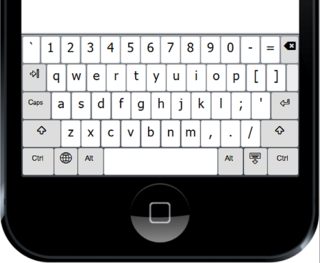
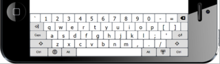
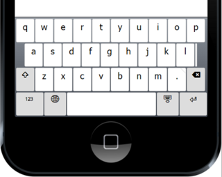
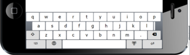
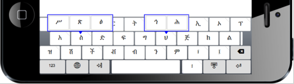
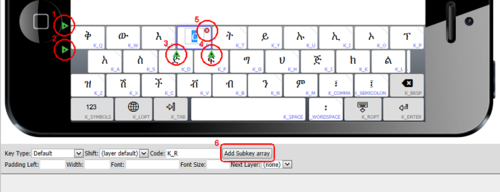

<div>
<style>
  /* Custom OSK font for key type */
  @font-face {
    font-family: SpecialOSK;
    font-display: block;
    src: url('https://s.keyman.com/kmw/engine/17.0.185/osk/keymanweb-osk.ttf');
  }

.special-osk {
text-align: center;
font-family: SpecialOSK;
}
</style>

</div>

This article will continue the guide to creating a touch keyboard layout. In
particular, we'll look in more detail at how keys are arranged, just what can be
specified for each key, and lastly, how this all looks in the JSON code used to
define the long press layout.

## Key and Key Layer Organization

There are two issues that are immediately apparent when considering key layout
on touch devices.

First, on smaller touch devices, such as phones, if we try to display the same
arrangement of keys that is used for a typical desktop keyboard, the keys are so
small that it is difficult to reliably select the wanted key. If used in
'portrait' view, key widths are too narrow for our 'fat fingers':



Or if in 'landscape' view, key heights are too small:



The situation is improved markedly if we limit the number of keys per row to ten
and have no more than four key rows:



and, in landscape view:



So which keys can be eliminated, and which keys must be on the base (default)
layer? This brings us to the second point. When using phones and other touch
layout devices rather than desktop keyboards, text entry is most often
single-handed, which makes it best to avoid using the 'shift' layer for entering
normal text. Secondary keyboard layers will, of course, still be usually needed
for uppercase, numerals and symbols, but will be used much less frequently.

Most desktop keyboards (for European languages, at least) are already laid out
with no more than ten letter (or digit) keys per row, with the remaining keys
being used for accented letters, punctuation and other non-letter input. So the
obvious choice is to move non-letter keys (and accented letters) either to a
secondary key layer, or to long press ('pop-up') keys. The GFF Amharic desktop
keyboard is fortunately also arranged with only ten letters per key row (other
keys being used for punctuation, etc.), as the many different characters in the
Amharic 'abugida' are generated by multi-letter sequences rather than being
displayed on separate keys. The Geez script does not have both upper-case and
lower-case forms, so those initial consonants that require use of the 'shift'
layer on the desktop keyboard have been added to the corresponding base-layer
key as long press keys:



Arrangement of punctuation and other non-letter keys is more flexible as mobile
users are generally familiar with using long press keys or a secondary key layer
for finding and entering digits and special characters. However, some
punctuation characters are used so frequently that they need to be on the base
layer. For the GFF Amharic keyboard, the most frequently used punctuation
characters can be output from the base layer using standard or long press keys.
The Geez word space character, in particular, is so frequently used that it was
considered useful to add it to the bottom key, adjacent to the space bar, as is
sometimes done for other scripts, such as Japanese, on desktop (physical)
keyboards.

## <a name="id488436" id="id488436"></a>Arranging keys with the layout editor

The Keyman Developer layout editor really makes it quite easy to try different
key layouts and choose what is best for your keyboard. The image below
highlights just how, for any selected key, using the clickable icons circled, a
key row can be added above (1) or below (2), a key added before (3) or after
(4), the selected key deleted (5), and how an array of long press keys
(sometimes called "subkeys") can be added (6).



## Key properties

For each visual key, the appearance and behaviour is determined by a number of
properties:

### Key code

Each key must be given an identifying key code which is unique to the key layer.
Key codes by and large correspond to the virtual key codes used when creating a
keyboard program for a desktop keyboard, and should start with `K_`, for keys
mapped to standard Keyman virtual key names, e.g. `K_HYPHEN`, and `T_` or `U_`
for user-defined names, e.g. `T_ZZZ`. If keyboard rules exist matching the key
code in context, then the output from the key will be determined by the
processing of those rules. It is usually best to include explicit rules to
manage the output from each key, but if no rules matching the key code are
included in the keyboard program, and the key code matches the pattern
`U_xxxx[_yyyy...]` (where `xxxx` and
`yyyy` are 4 to 6-digit hex strings), then the Unicode characters
`U+xxxx` and `U+yyyy` will be output. As of Keyman 15, you
can use more than one Unicode character value in the id (earlier versions
permitted only one). The key code is always required, and a default code will
usually be generated automatically by Keyman Developer.

- `K_xxxx` is used for a standard Keyman Desktop key name, e.g.
  `K_W`, `K_ENTER`. You cannot make up your own `K_xxxx` names.
  Many of the `K_` ids have overloaded output behaviour, for instance, if no
  rule is matched for `K_W`, Keyman will output 'w' when it is touched. The
  standard key names are listed in [Virtual Keys and Virtual Character
  Keys](/developer/language/guide/virtual-keys "Virtual Keys and Virtual
Character Keys"). Typically, you would use only the "common" virtual key
  codes.

- `T_xxxx` is used for any user defined names, e.g. `T_SCHWA`. If you wanted
  to use it, `T_ENTER` would also be valid. If no rule matches it, the key
  will have no output behaviour.

- `U_####[_####]` is used as a shortcut for a key that will output those
  Unicode values, if no rule matches it. This is similar to the overloaded
  behaviour for `K_` ids. Thus `####` must be valid Unicode characters.
  The square bracket characters `[` and `]` indicate an optional portion of the sequence
  and are not to be included in the shortcut. E.g.
  `U_0259` would generate a schwa if no rule matches. It is still valid to
  have a rule such as `+ [U_0259] > ...`

As noted above, some `K_xxxx` codes emit characters, if no rule is defined.
There are also some codes which have special functions:

<table class="display">
  <thead>
    <tr>
      <th>Identifier</th>
      <th>Meaning</th>
    </tr>
  </thead>
  <tbody>
    <tr>
      <td markdown="1">`K_ENTER`</td>
      <td>Submit a form, or add a new line (multi-line); the key action may vary depending on the situation.</td>
    </tr>
    <tr>
      <td markdown="1">`K_BKSP`</td>
      <td>Delete back a single character. This key, if held down, will repeat. It is the only key code which triggers
        repeat behavior.</td>
    </tr>
    <tr>
      <td markdown="1">`K_LOPT`</td>
      <td>Open the language menu (aka Globe key).</td>
    </tr>
    <tr>
      <td markdown="1">`K_ROPT`</td>
      <td>Hide the on screen keyboard.</td>
    </tr>
    <tr>
      <td markdown="1">`K_TAB`, `K_TABBACK`, `K_TABFWD`</td>
      <td markdown="1">Move to next or previous element in a form. Note that these key functions are normally
        implemented outside the touch layout, so should not typically be used. `K_TAB` will go to previous
        element if used with the `shift` modifier.</td>
    </tr>
  </tbody>
</table>

Any key can be used to switch keyboard layers (see
[`nextlayer`](#toc-nextlayer)), but the following layer-switching key codes have
been added for switching to some commonly used secondary layers. Note that these
keys have no specific meaning; you must still set the `nextlayer` property on
the key.

<table class="display">
  <thead>
    <tr>
      <th>Identifier</th>
      <th>Meaning</th>
    </tr>
  </thead>
  <tbody>
    <tr>
      <td markdown="1">`K_NUMERALS`</td>
      <td>Switch to a numeric layer</td>
    </tr>
    <tr>
      <td markdown="1">`K_SYMBOLS`</td>
      <td>Switch to a symbol layer</td>
    </tr>
    <tr>
      <td markdown="1">`K_CURRENCIES`</td>
      <td>Switch to a currency layer</td>
    </tr>
    <tr>
      <td markdown="1">`K_SHIFTED`</td>
      <td>Switch to a shift layer</td>
    </tr>
    <tr>
      <td markdown="1">`K_ALTGR`</td>
      <td>Switch to a right-alt layer (desktop compatibility)</td>
    </tr>
  </tbody>
</table>

### Key text

The key text is simply the character (or characters) that you want to appear on
the key cap. This will usually be the same as the characters generated when the
key is touched, unless contextual rules are used to generate output according to
a multi-key sequence, as will be true for the GFF Amharic keyboard. Unicode
characters can be specified either as a string using a target font or using the
standard hex notation `\uxxxx`. This may be sometimes more convenient, for
example, for characters from an uninstalled font, or for diacritic characters
that do not render well alone.

A number of special text labels are recognized as identifying special purpose
keys, such as Shift, Backspace, Enter, etc., for which icons are more
appropriately used than a text label. A special font including these icons is
included with Keyman and automatically embedded and used in any web page using
Keyman. The list of icons in the font may be extended in future. See
the list of special characters in the
[.keyman-touch-layout reference](../../reference/file-types/keyman-touch-layout).

### Key type

The general appearance of each key is determined by the key type, which is
selected (in Keyman Developer) from a drop-down list. While generally behavior
is not impacted by the key type, Spacer keys cannot be selected.

<table class="display">
  <thead>
    <tr>
      <th>Key Type</th>
      <th>Value</th>
      <th>Meaning</th>
    </tr>
  </thead>
  <tbody>
    <tr>
      <td>Default</td>
      <td markdown="1">`0`</td>
      <td>Any normal key that emits a character</td>
    </tr>
    <tr>
      <td>Special</td>
      <td markdown="1">`1`</td>
      <td>The frame keys such as Shift, Enter, BkSp.</td>
    </tr>
    <tr>
      <td>Special (active)</td>
      <td markdown="1">`2`</td>
      <td>A frame key which is currently active, such as the Shift key on the shift layer.</td>
    </tr>
    <tr>
      <td>Deadkey</td>
      <td markdown="1">`8`</td>
      <td>Does not impact behavior, but colors the key differently to indicate it has a special function, such as a
        desktop-style deadkey.</td>
    </tr>
    <tr>
      <td>Blank</td>
      <td markdown="1">`9`</td>
      <td>A blank key, which may be used to maintain a layout shape. Usually colored differently. Does not impact
        behavior.</td>
    </tr>
    <tr>
      <td>Spacer</td>
      <td markdown="1">`10`</td>
      <td>Does not render the key, but leaves a same-sized gap in its place. The key cannot be selected.</td>
    </tr>
  </tbody>
</table>

The colour, shading and borders of each key type is actually set by a style
sheet which can be customized by the page developer.

### font-family

If a different font is required for a particular key text, the `font-family`
name can be specified. The font used to display icons for the special keys (as
mentioned above) does not need to be specified, as it will be automatically
applied to a key that uses any of the special key text labels.

### font-size

If a particular key cap text requires a different font size from the default for
the layout, it should be specified in em units. This can be helpful if a the key
text is either an unusually large character or, alternatively, a word or string
of several characters that would not normally fit on the key.

### width

The layout is scaled to fit the widest row of keys in the device width, assuming
a default key width of 100 units. Keys that are to be wider or narrower than the
default width should have width specified as a percentage of the default width.
For any key row that is narrower than the widest row, the width of the last key
in the row will be automatically increased to align the right hand side of the
key with the key with the right edge of the keyboard. However, where this is not
wanted, a "spacer" key can be inserted to leave a visible space instead. As
shown in the above layouts, where the spacer key appears on the designer screen
as a narrow key, but will not be visible in actual use.

### pad

Padding to the left of each key can be adjusted, and specified as a percentage
of the default key width. If not specified, a standard padding of 5% of the key
width is used between adjacent keys.

### layer

To simplify correspondence with desktop keyboards and avoid the need for using a
separate keyboard mapping program, touch layout keys can specify a desktop
keyboard layer that the keystroke should be interpreted as coming from. Layer
names of `shift`, `ctrl`, `alt`, `ctrlshift`, `altshift`, `ctrlalt` and
`ctrlaltshift` can be used to simulate use of the appropriate modifier keys when
processing rules.

### nextlayer

The virtual keys `K_SHIFT`, `K_CONTROL`, `K_MENU`, etc. are normally used to
switch to another key layer, which is implied by the key code. The left and
right variants of those key codes, and also additional layer-switching keys
mentioned above (`K_NUMERALS`, `K_SYMBOLS`, `K_CURRENCIES`, `K_ALTGR`) can also
be used to automatically switch to the appropriate key layer instead of
outputting a character. However, it is sometimes useful for a key to output a
character first, then switch to a new layer, for example, switching back to the
default keyboard layer after a punctuation key on a secondary layer had been
used. Specifying the `nextlayer` for a key allows a different key layer to be
selected automatically following the output of the key. Of course, that can be
manually overridden by switching to a different layer if preferred.

Another way the `nextlayer` property can be used is for a non-standard layer
switching key. So, for example, for the GFF Amharic keyboard phone layout,
switching back to the base layer uses a `T_ALPHA` key code, in which `nextlayer`
is set as default. In this case, it is also necessary to add a rule to the
keyboard program:

```keyman
+ [T_ALPHA] > nul
```

to ensure that the key's scan code is ignored by the keyboard mapping.

When a key in a touch layout definition includes a **Next Layer** control, this
takes precedence over setting layer via the
[`layer`](/developer/language/reference/layer) store (as the **Next Layer**
control is applied once the rule has finished processing).

### subkey

Arrays of longpress 'subkeys' or pop-up keys can be defined for any key, and
will appear momentarily after the key is touched if not immediately released.
This provides a major advantage over physical desktop keyboards in that many
more keys can be made available from a single layer, without cluttering up the
basic appearance of the layout. For the GFF Amharic keyboard, we have already
noted how such subkey arrays are used to manage the extra keys that, on the
desktop keyboard, would appear in the shift layer. But they are also used to
provide another way to enter the two different types of each syllable-initial
vowels (glottal or pharyngeal), as a visual alternative to pressing the key
twice.

The same properties that are defined for standard keys can also be specified for
each subkey except that the width of each key in a subkey array will always be
the same as the width of the key that causes the subkeys to be shown, and key
spacing always uses the default padding value.

The GFF Amharic keyboard, like many others, is mnemonic, so it is useful to also
display the standard key cap letter that would appear on the key of a desktop
keyboard. This is enabled globally in the On-Screen layout editor and applies to
both the On-Screen keyboard and touch layouts.

## Representing (and editing) the visual layout with JSON code

In case you are wondering, 'Why do I need to know that?', the reason is that,
just as with keyboard mapping code, it is sometimes easier to edit a text
specification than to use the GUI layout design tool. Keyman Developer switches
seamlessly between the visual layout tool and the code editor, unless, of
course, careless editing of the code results in invalid JSON syntax!

The GFF Amharic phone layout code starts as:

```javascript
  {
    "phone": {
      "font": "Tahoma",
      "layer": [{
        "id": "default",
        "row": [{
          "id": 1,
          "key": [{
              "id": "K_Q",
              "text": "ቅ",
              "pad": "0"
            }, {
              "id": "K_W",
              "text": "ው"
            },

  . . .
```

As long as standard JSON syntax is remembered - nested braces {…}, quoted
strings "…" for both element names and values, element or object arrays in
square brackets […], and no trailing comma after the last element in an array -
it is quite easy to understand a layout, which will usually comprise a list of
two separate JSON objects for tablet and phone.

Now you're ready to create a great touch layout for your own Keyman keyboard!

Other articles on developing touch layouts:

- [Creating a touch keyboard layout for Amharic - part 1](creating-a-touch-keyboard-layout-for-amharic)
- [How to test your keyboard layout — touch and desktop](../test/keyboard-touch-and-desktop)

You can distribute your keyboard to other users by following the instructions in
this article:

- [Distribute keyboards to Keyman applications](../distribute/packages)
