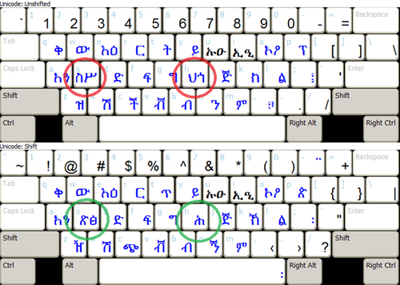

This article describes the approach taken and some of the issues encountered when adapting the existing GFF‑AMH‑7 Amharic keyboard for easier use on phone and tablet touch screen devices.

A widely used Keyman Desktop phonetic keyboard for Amharic (developed by Geez Frontier Foundation) was also compiled and made available for use with KeymanWeb. When used with web browsers on desktop computers, the behaviour of the keyboard was identical to use with Keyman Desktop, but use of the same Amharic keyboard on smart phones or other touch screen devices revealed a number of weaknesses in the layout.

### Background

The desktop layout has a default layer and a shift layer which are fairly similar:

Several keycaps have more than one Geez script letter, indicating that pressing the key twice changes the character output. Geez script is better understood as an Abugida, rather than an alphabet, since each consonant-vowel syllable is a modification of the original letter rather than having separate letters for consonant and vowel. So when entering Amharic, the form of a consonant changes from the default syllable form to the appropriate syllable character for the consonant and vowel pressed. However, as each vowel can also occur in stand-alone syllables as either pharyngeal or glottal forms, the two separate syllables for each vowel are shown on the "a", "e", "i", "o" and "u" keys.

But what about the extra characters on the "s" and "h" keys? Amharic (like most Semitic languages) is rich in fricative sounds, and Geez has four separate, distinct phonemes that are roughly similar to the English
"s", and three similar to "h". The desktop layout handles this by using
repeated keystrokes in combination with shift to select the alternate
consonants (before typing the appropriate vowel). That works for a
desktop keyboard, but not for a touch screen device, for which it is
often impractical to hold a shift key while touching another key.

Small format touch-screen devices such as phones have a further
difficulty in that if they display the full number of key rows and keys
in each row that appear in the desktop layout, the keys are too small
for convenient use.

On the other hand, touch screen devices offer one very significant
advantage over layouts based on a physical keyboard - it is quite easy
to configure dynamic touch screen layouts to display contextually
appropriate character alternates in separate key windows as each key is
touched.

### Design goals

With the above background, the following design goals were set for
developing a touch screen layout for Amharic:
-   Maintain the same basic phonetic layout functionality that users are familiar with.
-   Instead of having "default" and "shift" layers, design the layout so that all alphabetic text and frequently used punctuation can be entered from a single layer, moving less commonly used punctuation and symbols to the second "symbol" layer.
-   Use a dynamic window rather than the shift key to select the initial "s" or "h" consonant for a syllable.
-   Use a separate key (adjacent to the space bar) for the Ethiopic word-space character, instead of requiring shift + space to be pressed.
-   For tablet devices, increase key size slightly by removing most non-letter keys from each row, moving them either to dynamic ("pop-up") key windows, or to the symbol layer.
-   For phones and other small-format devices, further increase the key size by not displaying the digits in the default (alphabetic) layer, and moving many of the less commonly used characters to dynamic windows, reducing the number of key rows by one for each layer.

### Implementation

Achieving the design goals required making a number of decisions for
each format (tablet and phone), in particular:

-   Which keys can be removed from the default layer?
-   Which keys can be removed from the symbol layer?
-   Which "pop-up" keys should be grouped with each base character?

Keyman Developer 17's Touch Layout editor greatly simplifies the process
of developing the JSON layout file that specifies the touch layout for
each device, making it easy to move keys around, create pop-up key
arrays, and adjust key widths, labels and other parameters. While the
graphical interface does not allow moving entire key rows between layers
or device types, that is easily managed using the code window.

To keep a keyboard compatible with the desktop version, it is important
to use the same key identifiers and "shift states". So, no matter
whether a particular character occurs in a visible row or in a pop-up
array, it should usually use the same code as on the original desktop
layout keyboard.

Where a key did not occur in the original layout and does not correspond
to a desktop layout key, identifiers will usually be something like
T\_&lt;name&gt; where &lt;name&gt; will typically be a Unicode character
name, or an obvious contraction of it. Note that this is just a rule of
thumb and key identifiers can be anything that makes sense. Such keys
are distinct from the K\_&lt;name&gt; identifiers that are associated
with physical keys, and should normally have a mapping rule added
explicitly to the mapping program. If no rule is added, output will
default to the keycap text, but this is not recommended.

All key "rotations" - pressing the same key repeatedly to select from
alternate output characters - in the original desktop keyboard program
are still supported, but have been supplemented by pop-up key arrays,
allowing a user to visually select the wanted character instead of
stepping through alternates. Similarly, Ethiopian numerals can be
selected from a pop-up key array attached to each numeral key, as well
as being output by pressing the single quote key before a digit key.

The final tablet default keyboard layer, as displayed in the Touch
Layout editor in the previous release of Keyman Developer 10, now appears
as:

Here the editor is shown with the "s" key selected, displaying the
pop-up key array with the four different Geez characters that can be
produced, each of which will combine as necessary with any subsequently
typed vowel.

For the small format (e.g. iPhone) layout, the two keyboard layers are:

For these layouts, the row length has been reduced to the minimum number
of ten keys, moving backspace to another row. The numerals only appear
on the second layer, as is usual with phone layouts. All less-frequently
used keys are now available only in pop-up key windows.

### Summary

With these principles guiding all the changes made, the Amharic keyboard
now adapts to various device form factors, making use of device-specific
usability factors, while retaining the same conceptual input model as
the original keyboard. This means that users can use the keyboard layout
on different devices with a minimum of difficulty. These methods should
be applicable to other keyboard layouts.

Other articles on developing touch layouts:

-   [Creating a touch keyboard layout for Amharic - the nitty gritty](creating-a-touch-keyboard-layout-for-amharic-the-nitty-gritty)
-   [How to test your keyboard layout — touch and desktop](../test/keyboard-touch-and-desktop)

You can distribute your keyboard to other users by following the
instructions in this article:

-   [Distribute keyboards to Keyman applications](../distribute/packages)