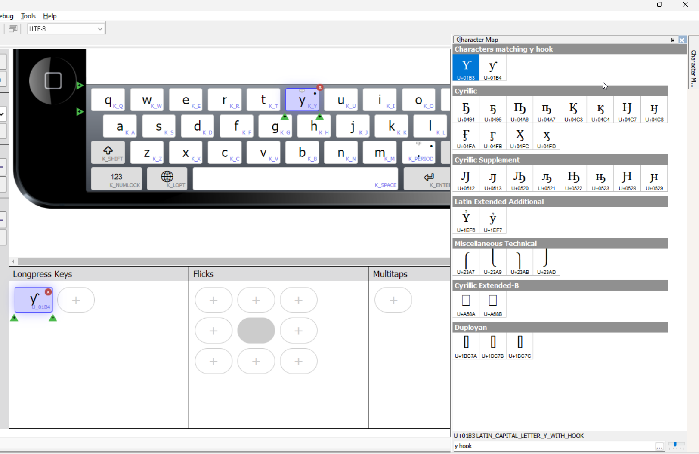

## Setting up your Keyman project

This is a useful convention for keeping track of your files:

1.  Create a folder on your hard drive for all your Keyman developer
    files
2.  In that folder, create a folder for this project, named after the
    language. Use all lowercase letters for compatibility with other
    platforms.
3.  Now create a project in Keyman Developer with the same name as the
    new folder, and save it inside the new folder

Now you will be able to use this project to organize and create any
files for desktop, mobile, web or other. It also facilitates uploading
the files to the Keyman website later on.

## Add touch to an existing keyboard or create a new keyboard?

You can add a mobile touchscreen keyboard to an existing desktop
keyboard, or you can create a new touchscreen keyboard from scratch. You
should be aware that there will be cross-over between mobile and desktop
keyboards. (In Keyman terms, "desktop" includes laptop computers or any
device with a physical keyboard). Your mobile device can have an
external keyboard, which will use the desktop Keyman keyboard. So the
Keyman strategy is to always bundle touch keyboards with desktop
keyboards to make them work on multiple platforms.

If creating from scratch, you click the New icon in the Keyman Developer
toolbar (or select File &gt; New from the menu), and specify the file
name for your keyboard. We recommend a name using only lowercase
letters, numbers and underscore. I’ll choose “mobile_fulfulde.kmn” .


## Adding the required metadata

After creating the file, Keyman Developer will ask you to name the
keyboard. This name can include spaces and upper case letters if
desired. I’ll name this one “Fulfulde for Mobile”.


The first thing you need to do is to tell Keyman Developer this keyboard
will include some kind of mobile device.  You do this in the Targets
list just below the keyboard name. I’ll select “mobile ” in the list,
(towards the end). You see in the picture above that Keyman Developer
checked the “windows” box by default, I can uncheck that or leave it
checked if I am going to add a Windows keyboard to this set.


This will include all mobile devices, both Android and iOS, both phones
and tablets. It is possible if needed to select Android only or iOS only
if needed, and to develop a different keyboard layout for tablets than
for phones, but for this example, with only a few characters needed to
be added to the default keyboards, there is no need for that kind of
complexity.

(If you are adding a mobile layout to an existing keyboard file, you
would open that file in Keyman Developer, go to the Targets box and
check “mobile” or whatever mobile targets you wanted to specify, then
follow along from here).

## Adding the touch optimized feature

The next step is to add the touch-optimised feature to our keyboard
setup. If you scroll to the bottom of the details tab, there is the list
of features to add. I’ll click the Add button and choose “touch
optimised keyboard.”


Keyman developer asks me to choose one of three templates for the mobile
layout.


The “template-latin” layout includes many accented characters, like the
default keyboards for Android and iOS do. The “template-basic” layout
has no extra characters, and the template-traditional has a few extra
characters (mostly punctuation symbols if you long-press period or full
stop). For this example, I’ll choose “template-basic” because accented
characters are not needed for Fulfulde. But if I knew that many eventual
users might want to be able to type French or other European languages
as well as Fulfulde, and wouldn’t like to have to switch the keyboard to
do so, I could choose “template-latin”.

## Defining one or several touch layouts

I select the template and click OK. Keyman Developer now adds a new tab
in the left column, the Touch Layout tab.


That is where we need to go now to add characters to our touch layout.
But before doing that, there is one important thing to take note of in
the touch layout. By default, Keyman Developer has created a layout for
phones and another layout for tablets. They all start out the same, but
as I add characters, I will have to make sure I add all the characters
to both layouts, or I’ll discover that my keyboard does not work for all
device sizes.

In the image, you see in the Platform box that Keyman Developer is currently showing the
tablet layout. This box is where I’d choose which layout I’d design in.

But I’m going to make this keyboard simple, and just have one layout for
both tablets and phones. So in the platform box, I am going to click
the “minus” button, to delete the tablet layout. When there is only one
mobile layout, Keyman Developer will compile that layout for all mobile
devices. (I could also have chosen to delete the phone layout and done
my layout design in the tablet layout).


## Adding longpress characters

Now I can start adding characters. I’ll click on the “y” key in the
layout, then I’ll look at the “longpress keys” area at the lower
left.


I click that, and Keyman Developer adds a new key below the keyboard
layout.


I'm going to use this key for the y with hook. I click inside it to make it active, then I’ll go look for my y
with hook character in the character map to the right. If I type “y
hook” in the search box, Keyman Developer shows the character I’m
looking for.


If I double click on the lower case y with hook, that copies the character
to the keycap box of my new key. (I could also click and drag the character from the character map to the key).



## New key info

There are several important pieces of information that got copied over. If we
look at the properties of the new key to the right, we see that this new key has
the “text” ƴ (what appears on the keycap), the “Unicode value” U+01B4 and the
“ID” U_01B4. All of these were copied from the character map.

NOTE: If you copy one character from the character map to a new key, then
realize you copied the wrong character, dragging a second character may not
replace all the needed information into the key. If a key has a character in it
already, it works better to hold <kbd>Ctrl</kbd> as you drag the new character
into it.

I could add the other three characters; hook b, hook d, and eng, as longpress
characters as well. I could  select the regular letter I want to longpress,
click plus in the longpress keys area and copy the needed character. Here for
example is the b with hook:


After I have added my four lowercase characters as longpress keys, the keyboard
looks like this.  Even when I don't have that letter selected, I can see which
keys have longpress keys by the dot beside the letter.


[See the Keyman Language guide on virtual keys](../../../../language/guide/virtual-keys#toc-virtual-keys-and-touch-layouts)

## Adding uppercase characters

I could do two different things for the upper case letters. I could add them as
longpress keys beside their lowercase equivalents, by  pressing the plus key
again to add a second longpress character to each letter.

This would mean users would not have to press Shift to be able to type the upper
case hook y. But since a user needs to press Shift for all the regular Latin
upper case letters, it might make more sense to put the uppercase letters into
the Shift layer.

I can change to the shift layer by finding the layer box at lower left, and
choosing `shift` instead of `default`.


Now I see the upper case letters on the keyboard, and I can add longpress
characters  to these in the same way I did on the default layer. I click the
letter, then click `+` to add a key, then copy the character info from the
character map. Adding my upper case y hook to Y would look like this:


(If I had clicked on the green triangle to the left of my first key, the
new key would be added to the left of that key).

For this new key, I go through the same steps. I click in the empty box
on the new key, then double click the upper case y with hook in the
character map to put that in the keycap. I also change the code of this
new key to “U_01B3”


## Another option for upper case characters

I might also add the upper case character to a longpress character on
the upper-case Y key, because some users will press the Shift key then
look for the letter to type. To do this, I change the layer at the top
of the tablet layout to "shift" from "default".


Now I click the Y key, and add a longpress character, then add the upper
case y with hook to the keycap and add the keycode as shown before.


You can design your keyboard either way, with the upper case characters
in the same longpress row as the lower case, or in a longpress row off
of the shift layer. The rest of this tutorial shows the upper case
characters in the same row as the lower case, but I don't mean to
present this as the best way. If you do put upper case characters in the
shift layer, you'll have to remember to change the layer back to
"default" when you want to add a lower case letter, then back to "shift"
when adding an upper case letter. You could put the upper case
characters in both places, if you think that best.

Now I’ll add the two d hook characters as a longpress popup for the d
key. I click the d key in the layout, click “Add longpress popup”, add
the lower case hook d to the keycap and change the code to “U_0257”;
then click the plus sign to add a second key, add the upper case hook D
to the keycap and change its code to “U_018A”. The end result should
look like this:


I’ll do the similar step to add two characters as a longpress popup for
“b”


And two characters as a longpress popup for “n”. (Tip, to search for ŋ
in the character map, type “eng”).


When no keys are selected in the keyboard layout, I can still see which
ones I have set up longpress popups for, because Keyman Developer shows
a faint gray line at the top right corner of the key. So you should have
a faint diagonal line on your y, d, b and n keys.


## Replacing the Unicode and Code automatically

1.  Hold the <kbd>Ctrl</kbd> key while dragging and
    dropping a character from the Character Map to the touch layout
    editor, and it will replace the Code as well as the character.
2.  Hold the <kbd>Shift</kbd> key while dropping, and it
    will only add the character to the key.
3.  Finally, hold
    <kbd>Ctrl</kbd>+<kbd>Shift</kbd>, this
    will add the character to the key AND update the Code to match the
    full set of characters represented on the key.

## Compiling your keyboard

Now click Save to save your work, and compile the keyboard. (Keyboard
&gt; Compile Keyboard, or press F7). Hopefully you’ll see it compiled
with no error messages:


If you see a warning like:

```
Warning: line 0  warning 2092: Key " T_new_579" on layer "default", platform "phone", is a custom key but has no corresponding rule in the source.
```

This shows you forgot to enter the correct keycode for a new key you
added. Double check your longpress popup keys for one with a “T_new_NNN”
code, and add in the desired “U_NNNN” code.

You might also see a message like

```
Error: line 0  error 405A: Key " U+0181" on "phone", layer "default" has an invalid identifier.
```

This shows you attempted to change the keycode but mistyped the code.
I’ve gotten this more than once, because I am used to typing `U+0181`to
refer to a Unicode value, but the correct syntax for a keycode in Keyman
Developer is `U_0181`

# Testing your keyboard

Other Keyman help pages describe how you can test your keyboard:

-   [On a virtual device in the Chrome web browser on your
    computer](../../test/keyboard-touch-mobile-emulator)
-   [On your own device accessing the keyboard over the
    network](../../test/keyboard-touch-and-desktop)

If your device cannot connect to your computer on the local network (for
instance if your computer is on a wired office network and your device
is on the wireless office network), the above technique for sharing may
not work. You can put your keyboard in a package and share it over the
Internet with your device, as described below.

# Packaging and distributing your keyboard

Another Keyman help file describes [how to build a package
file.](../../distribute/tutorial)

## BCP 47 tags for Fulfulde

[Step 3](../../distribute/tutorial/step-3) of the package building
tutorial describes adding the BCP 47 language tag to your package. When
I came to the step of adding a tag for Fulfulde, I had to do some
research. I naively thought "Fulfulde" was a clear enough label for the
language. It is not, since it is a language chain rather than one
language. The BCP 47 tag in many cases is the same as the [SIL
Ethnologue code](https://www.ethnologue.com), so that is where I had to
go to find the tags I needed. In the end I added four tags for four
Fulfulde languages:


I also added the script designator `Latn` for Latin script. This is
recommended for Windows, which sometimes fails to install the desktop
keyboard if there is not a script designator on the BCP 47 tag. We
recommend that you always put in the script tag unless there is a
specific reason not to.

Some languages have only two letters in their BCP 47 tag. For instance,
the Hausa language has an Ethnologue code `hau` but the BCP 47 tag is
`ha`. Keyman Developer knows about this, and will change the tag to `ha`
if I put in the Ethnologue tag.

# Next steps

The two following articles on Amharic describe a more complex
touchscreen example where quite frequently two keys are pressed to get
one distinct character. (Amharic is a Abugida or syllabary script, where
one character can represent a consonant and following vowel).

-   [Creating a touch keyboard layout for Amharic - part
    1](../creating-a-touch-keyboard-layout-for-amharic)
-   [Creating a touch keyboard layout for Amharic - part
    2](../creating-a-touch-keyboard-layout-for-amharic-the-nitty-gritty)