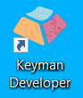

[Next: Part 1 - Creating a Keyboard Project >](01-creating-keyboard-project)

## Step-by-Step

The Step-by-Step tutorial starts with an introduction to the Keyman Developer program and instructions on installing it. Then use the link to advance to the next topic and complete the Step-by-Step section there. Continue on through all the topics, completing the Step-by-Step section and moving on to the next topic by using the link at the end of each Step-by-Step section.

If you encounter unfamiliar terms, please consult the [glossary](glossary).

### Introducing Keyman Developer

Keyman Developer is a powerful tool you can use to create custom keyboards optimized to type in any language you choose. Keyboard authors can distribute their work for desktop, web, tablet and phone, enabling global communities to quickly benefit from keyboards made for their own language.

Keyboards created with Keyman Developer can be used on Windows, macOS, Linux, iOS, Android, and the web.

This tutorial focuses on the Keyman Developer IDE (integrated development environment).
Currently this software is Windows-only, although the command line tools it uses can run on other platforms (such as Linux and macOS).

### Installing Keyman Developer

Keyman Developer is completely free to download and use. You can download it from [https://keyman.com/developer/download](https://keyman.com/developer/download).

On the downloads page, just click the big green “Download Now” button to get the latest version of Keyman. Once you have it, run the `keymandeveloper.exe` file you’ve received. The numbers following “keymandeveloper” indicate which version of Keyman Developer you are installing.

After installing Keyman Developer, you should be able to run it on your computer and begin creating projects immediately.

Note that Keyman Developer is a separate app from Keyman, which is the app that lets you use any keyboard created with Keyman Developer.
In order to use the keyboard you create with Keyman Developer, you'll need to have the Keyman app installed on your computer or device.
Keyman is available on the following platforms: Windows, macOS, Linux, iOS, Android, and the web.

The icons for Keyman Developer  and Keyman  are similar but slightly different.

To continue the Step-by-Step tutorial move to the next page: [Part 1 - Creating a Keyboard Project](01-creating-keyboard-project)

---

## Engaging with the Keyman Community and Resources

Keyman Developer also has an active community and documentation for each major release of the app. If you need any additional help, be sure to visit the following resources for information:

### Keyman Community Forum

Ask questions and talk with other keyboard authors on the [Keyman Community Forum](https://community.software.sil.org/c/keyman/19)

### Keyman online help

[Keyman Developer Language Documentation](https://help.keyman.com/developer/language/guide/)

Reference for the general structure of the Keyman language.

[Keyman Developer Language Reference](https://help.keyman.com/developer/language/reference/)

Reference for keywords and other components of the Keyman language.

[Keyman Developer Training Videos](https://help.keyman.com/developer/videos)

Videos from past Keyman Developer workshops hosted by the team.

### Keyman Blog

Read up on Keyman’s latest releases and patch notes on the [Keyman Blog](https://blog.keyman.com/).

### Keyman GitHub repositories

Keyman uses a number of [Github](https://github.com/keymanapp) repositories to store source code, keyboards, lexical models and documentation.
There is also a mechanism for reporting problems. [Keyman Bug Reports](https://github.com/keymanapp/keyman/issues)

Report Keyman software bugs and issues here. NOTE: NOT for help and support questions. The Keyman community forum is the best place to ask for help with development. Think you’ve found a Keyman bug or a problem with a specific keyboard? Describe what you’ve found on the Keyman community forum and ask whether to report a bug.

[Next: Part 1 - Creating a Keyboard Project >](01-creating-keyboard-project)

