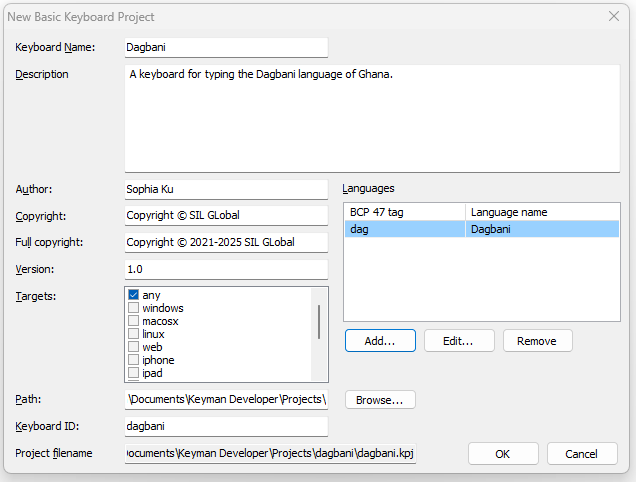

Part 1 of the [Keyman Developer Walkthrough](../walkthrough).

[< Back: Introduction](00-introduction)

[Next: Part 2 - Designing a Desktop Layout >](02-designing-desktop-layout)

## Step-by-Step

For the Dagbani keyboard, the keyboard planning has been done for you. Follow these steps to create the Dagbani keyboard project:

- Open Keyman Developer and select `New Project` from the `Project` menu.
- The `Keyman Keyboard` option is selected by default. Click `OK`.
- A new dialog should pop up with fields for you to fill out:

- For the Keyboard Name field, enter **Dagbani** (which will also fill in the Keyboard ID field).
- For the Description field, enter **A keyboard for typing the Dagbani language of Ghana.**
- For the Author field, you can put in your own name. Note that the Copyright and Full copyright fields are initialized. Since the copyright really belongs to SIL Global, we’ll change those fields for this tutorial. (When you create a real keyboard project, follow the advice in the [Author, Copyright and Full Copyright](#toc-author-copyright-and-full-copyright) section below.)
- In the Copyright field enter **Copyright © SIL Global**
- In the Full Copyright field enter **Copyright © 2021-2025 SIL Global** . (The date range goes from the first year that the keyboard was written to the current year. A new keyboard usually just lists a single year.)
- The Version field defaults to **1.0** and you can accept that default version number.
- The Target field defaults to **any** (meaning “any and all” of the listed target platforms). This is what will be used for the Dagbani keyboard.
- The Path field defaults to “Keyman Developer\Projects\” in the user’s “Documents” folder.
- The Keyboard ID field was initialized to **dagbani** based on the Keyboard Name entered earlier. We will keep this value. The Project filename of …**Documents\Keyman Developer\Projects\dagbani\dagbani.kpj** is displayed for information. It is the Path field plus the keyboard’s project folder (which uses the Keyboard ID field as its name) plus the keyboard project file (which uses the Keyboard ID field as the name with the .kpj file type).
- Select the `Add` button to add a BCP 47 language tag for the language. In the dialog that comes up, enter **dag** in the `Language tag` field and verify that the Language name field shows as **Dagbani**.
- Select `OK` to close the `Select BCP 47 tag` dialog.
- Select `OK` to close the `New Basic Keyboard Project` dialog.

To continue the Step-by-Step tutorial move to the next page: [Part 2 - Designing a Desktop Layout](02-designing-desktop-layout)

---

## Planning a Keyboard

The first step is identifying the language or languages your keyboard will cover. Some keyboards support multiple different languages within the same region. This approach, however, has some significant drawbacks:

- it is difficult to optimize a keyboard for multiple languages since a rarely used character for one language may be a common character for another.
- it is harder for users to find the keyboard since the name of the keyboard may not relate to the particular language they are researching.
- a separate lexical model (for predictive text) is needed for each language, so having a keyboard that handles multiple languages may make installation of a lexical model harder.

Furthermore, having a keyboard specifically designed for a single language may help with community acceptance.

If you do need to provide keyboard support for a number of languages in a region, consider planning the keyboards together, so that you can make them as similar as possible, but then make a separate keyboard for each language.

Once you have figured out what language your keyboard will support, you will need to familiarize yourself with which characters (including punctuation) are used to write it. You will need to determine what key or key combinations are needed to produce these characters. There may be major benefits in keeping as close as possible to the standard layout for a language of wider communication. On the other hand, repurposing a key from the standard layout may make it easier to type the target language.

## Understanding User Needs

Once you understand what is needed to support the language, you should seek to understand the needs of its speakers.
A few good questions to start with are:

- Who will use this keyboard?
- What devices will they use it on?
- What are the most important keys on the keyboard?
- What have people been using to type instead?

Understanding the users is the key to designing an effective keyboard. Is it intended for fluent or basic speakers of the language? Are the users familiar with common keyboards already? Have they already learned a certain keyboard format or style of typing? (If you plan to be the primary user of this keyboard, think about how others may want to use it if it turns into a more valuable tool than you anticipated.)

Be sure to look for keyboards that may exist for the language(s) you want to support before beginning work. Although they may not be perfect solutions, if there is a keyboard that your language’s speakers already have and are familiar with, building on its foundation can significantly save time. You might discover a keyboard that already does exactly what you need!

Once you’ve planned the basic premise of your keyboard, you can open Keyman Developer and start filling out your project info.

## Creating a Keyboard Project

Open Keyman Developer and select `New Project` from the `Project` menu.

The `Keyman Keyboard` option is selected by default. Click `OK`. A new dialogue should pop up with fields for you to fill out.

The information that you enter will initialize several files in your keyboard project.
Making sure that the information is correct at the beginning will avoid having to correct your files later.

### Keyboard Name and Keyboard ID

This is the name of your keyboard project.

Make sure to name your keyboards intuitively. A good standard starts with the name of the language or language group you are developing for, followed by any necessary identifiers such as `Phonetic`, `Mnemonic`, `Latin`, `QWERTY`, etc. in case there are multiple keyboards available for the same language.
Do not use the word “keyboard” in the name. Adding “keyboard” to the keyboard name is redundant and will not help people find it. Similarly, don’t include “Unicode” in the name.

If you decide to change the name of the keyboard, you’ll need to change it in a number of files: `HISTORY.md`, `README.md`, `readme.htm`, and `welcome.htm`, as well as the `.kmn` and `.kps` files.

Note that the `Keyboard ID` (near the bottom of the dialog) fills in automatically with the name you choose, but formatted like `keyboard_name` (changing uppercase characters to lowercase, and non-English characters and spaces to underscore).
You can modify the value in this field, though you are limited to the characters a-z, the numbers 0-9 and underscore.
This value will be used as the base filename of many of your Keyman files.

If you decide to change the keyboard ID, you’ll need to change most of the files in the project.
This is best done using Keyman Developer’s `Clone local project` feature.

- From the `Project` menu, select `New Project` then `Clone local project`.
- Use the `Browse` button to navigate to the `.kpj` file of your existing project.
- Specify a new `project ID` (and adjust `Destination path` if desired), then select `OK`.

### Description

This brief description of your keyboard is included in all of your information files.
Try to keep this short but informative, as this is what people will see when searching for your keyboard.
It may be useful to include alternate language names, the script (Latin, Devanagari, etc)
if the language is written in more than one script, the region where it is used, or other details about the keyboard.

### Author, Copyright, and Full Copyright

Enter your name in the `Author` field.
Note that the `Copyright` and `Full Copyright` fields will automatically populate with your name as well.
If you are developing keyboards that will be copyrighted by an organization, make sure to edit the Copyright fields accordingly.
The Full Copyright field has the date as well as the copyright holder.

The name used in the Copyright fields must be the real name of an individual or of an organization.
Copyright cannot be assigned to a pseudonym.

### Languages

This table displays the [BCP 47](https://help.keyman.com/developer/current-version/reference/bcp-47) tag (or tags) associated with your keyboard.
A BCP 47 tag identifies a language and will help users find your keyboard when they search for their language.
If you don’t know what your language’s tag is, you can search for its name and find the corresponding tag in the [IANA Language Subtag Registry](https://www.iana.org/assignments/language-subtag-registry/language-subtag-registry), which contains all existing BCP 47 tags, the [Glottolog](https://glottolog.org/glottolog/language) (under the ISO-639-3 column), or the [SIL Ethnologue](https://www.ethnologue.com/).

The SIL Ethnologue is the most user-friendly option of the three, if you are unfamiliar with language tags.

In addition to your basic BCP 47 tag, you can add
[Script](https://help.keyman.com/developer/current-version/reference/bcp-47#toc-the-script-subtag) and
[Region](https://help.keyman.com/developer/current-version/reference/bcp-47#toc-the-region-subtag) subtags.
However, you should always use the simplest possible BCP 47 tag to identify your language.
Only add Script and Region tags if your keyboard is for a script or region that differs from the most commonly used form of the language.

### Version

The keyboard version number allows Keyman to tell which of two copies of a keyboard is newer. This allows Keyman to offer users updated versions of keyboards.

The version number consists of two or three integer numbers separated by periods. Don’t use more than three numbers. Don’t use leading zeros. If the third number is absent, it is considered to be zero. Version numbers are compared number by number, so `2.51` is a higher version number than `2.6.1` (since 51 is greater than 6).

New keyboards usually start with version `1.0` (which is equivalent to `1.0.0`).
Generally the first number is incremented for major changes to the keyboard,
the second for minor changes, and the third for corrections or bug fixes.
But the most important point is that the new version number be greater than the existing one (as noted above).

The version number appears in the `HISTORY.md` file and the `.kmn` file.
It should be updated in both places whenever you distribute a new version of the keyboard.

### Targets

This is where you choose which platforms that your keyboard will be supported on.
As you can see, Keyman offers support for a wide variety of platforms.
Although you can pick and choose what formats you wish to develop for, `any` is the best option, because it will automatically generate files to support all formats that Keyman offers.
If you select `any`, you do not need to (and should not) choose any other options.

It is best practice to support as many devices as possible when creating your keyboard, because it is hard to predict who will use your keyboard in the future. By making your keyboard as accessible as possible, you can help even more people.

If you decide not to include a touch layout, untick the `any` option and select `desktop` and `web` which will allow the keyboard to be used on a web page as well as on Linux, macOS and Windows (the three `desktop` platforms). If you later add a touch layout, you can reverse this process and go back to selecting just `any`.

### Path

This is location on your computer where your keyboard project and all associated files will be stored.
By default, your projects will be stored in a folder with the same name as the `Keyboard ID` value
and that folder will be placed under the keyboard author's `Documents\Keyman Developer\Projects\` folder.

It’s a good idea to let Keyman handle naming your files, since it uses good naming convention and will make things easier to find in the future. However, if you need to place the project somewhere else, you can click the `Browse...` button beside this field and navigate to the desired folder.

Once you have filled out all of the fields,
Keyman Developer will create your project and open it in a new window with your project’s `.kpj` (Keyman project) file displayed.
You can read more about the `.kpj` file type in the [official Keyman documentation](https://help.keyman.com/developer/current-version/reference/file-types/kpj).

## Basing a new Keyboard Project on an existing one

Keyman has a well-maintained [Github repository](https://github.com/keymanapp/keyboards) for keyboards that have been published by the team or community members.
You can download a keyboard from the repository and use it as the basis for your own project.
The easiest way to do this is with the `Clone project from Keyman Cloud` feature of Keyman Developer (version 18 and later).

Open Keyman Developer and navigate to `Project` > `New Project` in the top menu bar.

Select the `Clone project from Keyman Cloud` option, then `OK`. A new dialog appears where you can:

- search for a keyboard (by keyboard name, language, script, country, BCP 47 tag)
- select a keyboard from the search results
- specify a New project ID
- optionally move external files into the new project folder
- optionally navigate to a different destination folder

When ready, select `OK` to download the files, adjust the filenames and open the new project in Keyman Developer.

## Conclusion

Now that you have your project set up, continue to the next section of the tutorial to start developing your first keyboard layout.

[< Back: Introduction](00-introduction)

[Next: Part 2 - Designing a Desktop Layout >](02-designing-desktop-layout)