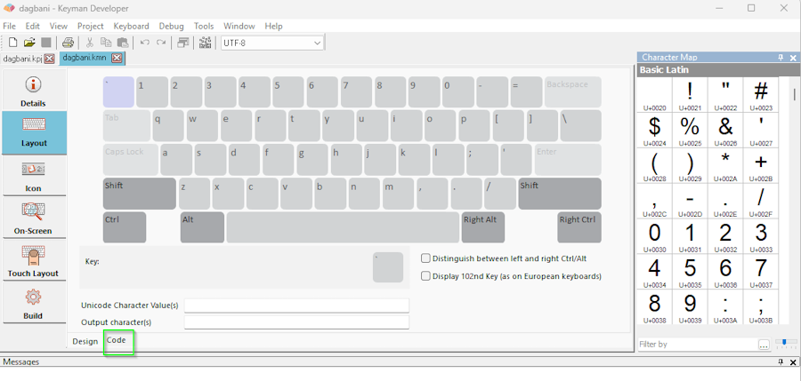

Part 3 of the [Keyman Developer Walkthrough](../walkthrough).

[< Back: Part 2 - Designing a Desktop Layout](02-designing-desktop-layout)

[Next: Part 4 - Using the Debugger >](04-using-debugger)

## Step-by-Step

On the “Creating a Keyboard Project” page, the **dagbani** keyboard project was created.
Keyman Developer displays a tab for the project file `dagbani.kpj` (just below the menu and toolbar).
There are tabs across the bottom for different steps in the process.


- Click on the `Keyboards` tab at the bottom of the Keyman Developer window.
- Then click on the `dagbani.kmn` filename. This will open the dagbani.kmn file (as a second tab along the top, just below the menu and the toolbar) and display a set of tabs along the left side of the Keyman Developer window. Initially the `Details` tab is displayed and you can see some of the items you entered when creating the project.
- Click on the `Layout` tab from the set of tabs on the left.
- By default the `Design` view is shown and you can use the Character Map to assign characters to various keys:



- For this tutorial, however, we’re going to use the `Code` view. At the bottom of the Layout pane, click on the `Code` tab and the Keyman code is displayed:

```keyman
store(&VERSION) '10.0'
store(&NAME) 'Dagbani'
store(&COPYRIGHT) 'Copyright © SIL Global'
store(&KEYBOARDVERSION) '1.0'
store(&TARGETS) 'any'
store(&BITMAP) 'dagbani.ico'
store(&VISUALKEYBOARD) 'dagbani.kvks'
store(&LAYOUTFILE) 'dagbani.keyman-touch-layout'

begin Unicode > use(main)

group(main) using keys
```

- Choose one of the following two options (which produce equivalent results). You can type the lines or copy and paste from the tutorial. The first option lists a separate rule for each character. This may make it easier to understand what the rules do. The second option makes use of features in the Keyman language that allow more compact rules to be written.
- Option 1: Add the following lines after the `group(main) using keys` line. Each line has the code to generate one character based on “;” and a base key.

```keyman
";" + "e" > "ɛ"
";" + "E" > "Ɛ"
";" + "o" > "ɔ"
";" + "O" > "Ɔ"
";" + "n" > "ŋ"
";" + "N" > "Ŋ"
";" + "g" > "ɣ"
";" + "G" > "Ɣ"
";" + "z" > "ʒ"
";" + "Z" > "Ʒ"
```

- Option 2: Add the following lines after the `group(main) using keys` line. The base keys are placed in one `store` (storage area) and the characters to produce are placed in a second store. The third line has a single rule that does the equivalent of the ten rules listed above.

```keyman
store(basekey) "eongzEONGZ"
store(output_char) "ɛɔŋɣʒƐƆŊƔƷ"
";" + any(basekey) > index(output_char,2)
```

- Select the `Icon` tab on the left side of the window. This icon is displayed by the operating system when the keyboard is active. By default Keyman Developer creates a short abbreviation of the keyboard name (”DAG” in this case). You can use the color palette at the right to select different colors and click on squares in the grid to change their color. For this tutorial we will accept the default.
- Select the `On-Screen` tab on the left. This is the keyboard image that is displayed when the uses asks for help. As you can see it’s currently blank, which is not so helpful.
- Tick the `Auto-fill from underlying layout` checkbox at the bottom of the keyboard display.
- Then select the `Fill from layout` button at the top. Keyman Developer fills in the keyboard. Since we didn’t modify any keys, the display shows up as a normal QWERTY keyboard. This is still useful, since the on-screen keyboard can also be used to enter text and typing on a blank keyboard is difficult!
- Select the `Build` tab on the left, then the `Compile Keyboard` button. (Alternatively you can use the `Keyboard` menu, `Compile Keyboard` menu item to compile the keyboard. Or you can use the <kbd>F7</kbd> function key as a shortcut.)
- You should see messages at the bottom indicating `dagbani.kmn built successfully`. If this is not the case, you’ll need to examine the error messages to see what the error is and correct it.

To continue the Step-by-Step tutorial move to the next page: [Part 4 - Using the Debugger](04-using-debugger)

---

## Using the Visual Editor

At the end of the [Designing a Desktop Layout](02-designing-desktop-layout) topic, an alternative Dagbani keyboard design was mentioned.
In that approach, typing the
<kbd>[</kbd> <kbd>{</kbd> <kbd>]</kbd> <kbd>}</kbd> <kbd>-</kbd> <kbd>_</kbd> <kbd>=</kbd> <kbd>+</kbd> <kbd>\</kbd> <kbd>|</kbd>
keys would produce `ɛ Ɛ ɔ Ɔ ŋ Ŋ ɣ Ɣ ʒ Ʒ`, respectively.

If you wanted to implement such a design, Keyman Developer's Visual Editor would be very useful.
When the `Layout` tab is selected on the left, Keyman Developer starts off in `Design` mode, displaying the keyboard.
If the Character Map is not displayed on the right-hand side of the window,
you can use the `View` menu and the `Character Map` menu item to show or hide it.
(<kbd>Shift</kbd>+<kbd>Ctrl</kbd>+<kbd>C</kbd> is a keyboard shortcut to accomplish the same thing.)


To assign the `ɛ` character to the `[` key, locate the desired character in the Character Map and drag it to the desired key.
If you click on that key, you’ll see it change color and the information about it will be displayed below the keyboard layout.


This shows:

- `[` the default value from the QWERTY layout
- `ɛ` the value displayed on this key for the On-screen Keyboard (OSK)
- `U+025B` the Unicode value that the key will produce
- `ɛ` the character that the key will produce (the equivalent of the Unicode value)

The last two of these values are linked. If you change one, the other will change. Most of the time the second and fourth items will be the same, but sometimes it might be helpful to display something different than what is actually produced. If, for example, the character being produced is not visible, such as a no-break space or a right-to-left mark, it might be helpful to display `NBSP` or `RTL` or some symbol to remind the user what the key produces.

Clicking on the `Code` tab at the bottom of the window displays the code equivalent of the work in the visual editor:

```keyman
group(main) using keys
+ [K_LBRKT] > 'ɛ'
```

Note that `[K_LBRKT]` is how Keyman Developer refers to the left square bracket key (the key just to the right of the “P” key on a QWERTY keyboard).
It also accepts `'['` or `"["` as equivalent ways to refer to that key.

If you were to continue this example, you would drag the `ɔ` character to the `]` key and repeat the process for the other three lower case characters. Then you would click on one of the two “Shift” keys and repeat the process for the five upper case characters.

## Understanding Keyman Code

Keyman’s Visual Editor (the `Design` tab) is helpful in assigning characters to keys in a consistent manner. For a simple keyboard, it may be all that you need. It’s likely, however, that you’ll need to use the `Code` tab to provide the logic needed for your keyboard.

When you begin an new project (using the “Project” menu, “New Project” menu item), Keyman Developer initializes your `.kmn` file.
With the `Layout` tab on the left selected, you will see two small tabs at the bottom of the window: the `Design` tab and the `Code` tab.
When you switch to the `Code` tab, you should see something like the following. (This example is from the Step-by-Step tutorial.)

```keyman
store(&VERSION) '10.0'
store(&NAME) 'Dagbani'
store(&COPYRIGHT) 'Copyright © SIL Global'
store(&KEYBOARDVERSION) '1.0'
store(&TARGETS) 'any'
store(&BITMAP) 'dagbani.ico'
store(&VISUALKEYBOARD) 'dagbani.kvks'
store(&LAYOUTFILE) 'dagbani.keyman-touch-layout'

begin Unicode > use(main)

group(main) using keys
```

The `store()` statements at the top are called the “header” of your file.
This is where the important information about your keyboard is stored.

A summary of the elements of the Keyman header can be found in part of [another tutorial](https://help.keyman.com/developer/18.0/guides/develop/tutorial/step-3) and detailed information is in the official Keyman documentation:

- [&version](https://help.keyman.com/developer/language/reference/version)
- [&name](https://help.keyman.com/developer/language/reference/name)
- [&copyright](https://help.keyman.com/developer/language/reference/copyright)
- [&keyboardversion](https://help.keyman.com/developer/language/reference/keyboardversion)
- [&targets](https://help.keyman.com/developer/language/reference/targets)
- [&bitmap](https://help.keyman.com/developer/language/reference/bitmap)
- [&visualkeyboard](https://help.keyman.com/developer/language/reference/visualkeyboard)
- [&layoutfile](https://help.keyman.com/developer/language/reference/layoutfile)
- [&mnemoniclayout](https://help.keyman.com/developer/language/reference/mnemoniclayout)


## Writing Keyman Rules

The body of your code begins after the header. This is where the bulk of your keyboard’s functionality will be.

```keyman
begin Unicode > use (main)
```

The preceeding line tells Keyman

- to use Unicode encoding when typing characters, and
- to look for the rules determining what characters should be produced in `group(main)` .

```keyman
group(main) using keys
```

is the default group for defining keyboard rules. This is where we will write code to implement the keystrokes you decided to use.

For more advanced uses of the `begin` rule, like defining different rulesets based on typing context, see the [official Keyman documentation](https://help.keyman.com/developer/language/reference/begin).


There are a few key terms that you must know when writing rules:

**Context**

The context specifies the conditions that will trigger a rule.
If the character(s) to the left of the cursor match the context of a rule, the rule will be processed by Keyman.

**Key**

The key specifies which keystroke the rule will act upon.
For more information on keys and keystrokes, read the [official Keyman documentation](https://help.keyman.com/developer/language/guide/virtual-keys).

**Output**

The output determines which characters are produced by a rule. When a rule is processed, Keyman will replace the context with the output.

The Context (which may be empty) is separated from the Key by “+”.

The Key is separated from the Output by “>”.

You can include comments in your Keyman code by typing a plain `c` followed by a space then any text you like afterwards. (If you want the letter “c”, you must surround in in quotes like `"c"`.) This is a good way to document your code and make things easier to read later, both for yourself and others. Comments can be made at the end of a line (with a space before the `c` as well as after) or be on their own line. Any text that follows the `c` through the end of the line will be ignored when the keyboard is compiled.

Writing rules in Keyman is very straightforward for simple key substitutions. Suppose we want circumflex plus “a” to produce the character “â”. The Keyman code is actually very similar:

`"^" + "a" > "â"`

In this example, the **context** is `^`, the **key** is `a`, and the **output** is `â`.
Whenever Keyman finds the context (`^`) to the left of the cursor and the current keystroke is `a`, it will replace the context (and the typed character) with `â`.

Characters written into Keyman code should always be surrounded by single quotes (`' '`) or double quotes (`" "`).
Either pair will work (as long as they match).
It is also possible to use the Unicode values of characters directly in the code.
These are never written with quotes around them.

The previous line of code, when rewritten to use Unicode values, looks like this:

```keyman
U+005E + U+0061 > U+00E2
```

While less readable to a human, using Unicode values for uncommon or easily confused characters is often a good idea.

It's possible to use a comment to provide both the Unicode value and the character itself, for example rewriting the above line as:

```keyman
"^" + "a" > U+00E2 c â
```

At a glance, this tells you that a circumflex (`^`) combined with `a` will produce the Unicode character `â` (whose value is U+00E2).
Including a comment at the end of each rule that shows the output character will make reviewing your code significantly easier while still being extremely clear about which characters are used.

Below is an example of useful comments in the SIL EL Ethiopic Latin keyboard explaining a set of rules and each rule’s output:


Some Keyman rules have no context, that is, a context that is empty. The following line:

```keyman
+ "e" > U+025B c ɛ
```

is an example of the most basic rule possible. You may have noticed lines like these in your code after using the `Design` tab to edit your keyboard.

Note that rules created when using the `Design` tab use [virtual key codes](/developer/language/guide/virtual-keys#common-virtual-key-codes) rather than the corresponding characters.
This does not matter unless you are writing a [mnemonic layout](https://help.keyman.com/developer/language/reference/mnemoniclayout) keyboard. Keyman keyboards are positional by default, so unless you specify a mnemonic layout in your header, the following two lines of code will produce the same output:

```keyman
+ "e"   > U+025B
+ [K_E] > U+025B
```

### Stores

Stores can be used to write concise rules that apply to a set of characters.
For example, in the following code, the store called `basekeys` contains the keys for five vowels.
A second group called `vowels_acute` contains the same five vowels (in corresponding order) with an acute accent.
And the single rule combines the apostrophe with a base vowel to produce a vowel with an acute accent.

```keyman
store(basekeys) "aeiou"
store(vowels_acute) "áéíóú"
"'" + any(basekeys) > index(vowels_acute,2)
```

Thus the code above is equivalent to the following five rules:

```keyman
"'" + "a" > "á"
"'" + "e" > "é"
"'" + "i" > "í"
"'" + "o" > "ó"
"'" + "u" > "ú"
```

You can read more about the `store`, `index` and `any` keywords in the [Keyman language documentation](https://help.keyman.com/developer/language/reference/).

### Deadkeys

At the end of the previous topic, an example was given of using the “;” key as a “deadkey”. Typing the deadkey produces no output, but it potentially changes the output of the following key. Changing the first two rules from the Step-by-Step example to treat the “;” as a deadkey, would result in:

```keyman
+ ";" > dk(1)      c Define ";" as a deadkey
dk(1) + "e" > "ɛ"  c deadkey followed by "e" produces "ɛ"
dk(1) + "E" > "Ɛ"  c deadkey followed by "E" produces "Ɛ"
```

If you follow the instructions for the Debugger, you’ll find that the keystroke log is the same, but in the right-hand side of the display, the “;” is replaced by an indication of the deadkey.

### Groups

Groups can be used in several ways to make your code simpler and more efficient. There are two types of groups:

- groups that process only the context
- groups that process the context and the keystrokes

You can read more about their uses in the [Keyman documentation](/developer/language/guide/groups).

## Creating an On-Screen Keyboard Layout

An on-screen keyboard (OSK) is a graphic representation of the desktop layout. It is displayed on the computer screen to show where keys are located. In can also be used to input text by clicking on the keys.

Select the `On-Screen` tab on the left to display the layout (one layer at a time).
You can manually create the OSK by clicking on a key and typing the character that should be displayed there.

It is also possible to create an on-screen layout automatically based on what you have designed and coded on the Layout tab.
(If you have manually created your on-screen layout information, you should be aware that the following automatic process will overwrite what you have created.)

- Any key that you don’t reassign will have the function of the US English keyboard. If you are relying on this in your keyboard, you should tick the `Auto-fill underlying layout` box below the keyboard image.
- Select the `Fill from layout` button above the keyboard image
- Check the results.

## Exporting an On-Screen Keyboard Layout

One way to document a keyboard layout is to use images of the keyboard showing the different layers: default layer, Shift layer, Right-Alt layer, etc.
Keyman Developer provides a way to export such images from the `On-Screen` tab.

Once you have the layout (created either manually or automatically), you can use the `Export` button.
Then complete the information needed:

- Navigate to the folder where you want to create the files
- Supply a base filename
- For the `Save as type` field, select `Image (*.png)`
- Select `Save`
- In the `Output Bitmap Parameters` dialog, select `One file per shift state`, `Output Unicode keyboards`, and adjust the width of the image as needed, then select `OK`. Keyman Developer will create one or more files using the base filename plus letters to indicate the shift state plus `.png`. You can reference these files in your welcome.htm file.

[< Back: Part 2 - Designing a Desktop Layout](02-designing-desktop-layout)

[Next: Part 4 - Using the Debugger >](04-using-debugger)