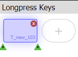
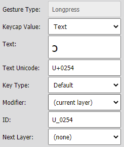
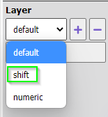

Part 6 of the [Keyman Developer Walkthrough](../walkthrough).

[← Back: Part 5 - Designing a Touch Keyboard](05-designing-touch-layout)

[Next: Part 7 - Writing Keyboard Documentation Files →](07-writing-keyboard-documentation)

## Step-by-Step

- Click on the `Touch Layout` tab on the left. The touch layout is shown, with the `q` key selected and details about the selected key shown on the right. Farther to the right is the Character Map which will be used in a later step. If the Character Map is not displayed, use the `View` menu, `Character Map` menu item to turn on the display.

- Click on the `e` key to select it and display its information.
- Click on the `+` button in the `Longpress Keys` section. A new key is added (and the `+` button moved). The new key is given an arbitrary ID (`T_new_103` in this example).

- Note that information about this key is placed to the right.

- We’ve added this longpress key to the `e` key. Now we want to make it (1) display `ɛ` so users will see what the key will produce and (2) change the ID so that activating this longpress key will generate `ɛ`. Find the `ɛ` character in the Character Map and drag it to the `Text` field. This will put `ɛ` in the `Text` field, `U+025B` in the `Text Unicode` field and `U_025B` in the `ID` field.

Note: To find the `ɛ` character in the Character Map, you can use the scroll bar on the right to scroll down to `U+025B`. Alternatively, you can type `25B` in the `Filter by` field at the bottom of the character map.

- Click on the `o` key in the keyboard layout. This will select the `o` key and display its information.
- Click on the `+` button in the `Longpress Keys` section. A new key is added (and the `+` button moved). The new key is given an arbitrary ID (`T_new_104` in this example). In addition, information about this key is placed to the right.
- We’ve added this longpress key to the `o` key. Now we want to make it (1) display `ɔ` and (2) change the ID. We could use the same procedure as in the previous steps, but this time we’ll use a different method. Click in the `Text Unicode` field and type `U+0254` (this will also place `ɔ` in the `Text`, but will not change the `ID` field).
- Click in the `ID` field and replace the generated ID (`T_new_104` in this example) with `U_0254`. (Note that the ID uses an underscore rather than a plus sign.)

- Add three longpress keys using one of the above methods:
  - on the `n` key, add a longpress key for `ŋ` = U+014B
  - on the `g` key, add a longpress key for `ɣ` = U+0263
  - on the `z` key, add a longpress key for `ʒ` = U+0292
- You've made these five changes on the `default` layer. Now we need to switch to the `shift` layer. Select the drop-down menu under the `Layer` heading and select `shift`.

- With the capital letters displayed on the keyboard, add five longpress keys using one of the above methods:
  - on the `E` key, add a longpress key for `Ɛ` = U+0190
  - on the `O` key, add a longpress key for `Ɔ` = U+0186
  - on the `N` key, add a longpress key for `Ŋ` = U+014A
  - on the `G` key, add a longpress key for `Ɣ` = U+0194
  - on the `Z` key, add a longpress key for `Ʒ` = U+01B7
- Select the `Build` tab on the left and then the `Compile Keyboard` button. You should see a `dagbani.kmn built successfully` message. If you don’t, examine the error messages to see where the problem lies.

### Testing the touch layout

Keyman Developer provides a way to test your keyboard in a web browser.
- On the Build tab, you can select `Test Keyboard on web` followed by `Open in browser`.
- Select the `Keyboard` drop-down menu, then select the `dagbani` keyboard. You should have a display that looks like:

- The display defaults to the Windows keyboard. You can type on the computer keyboard or use your mouse to click on the keys. Enter <kbd>;</kbd> <kbd>e</kbd> <kbd>;</kbd> <kbd>o</kbd> <kbd>;</kbd> <kbd>g</kbd> <kbd>;</kbd> <kbd>z</kbd> <kbd>;</kbd> <kbd>n</kbd> and you should have the following result.

- Select the `Device` drop-down menu and select `iPhone 5S`. The display will change to show a simulated phone screen with your touch layout. You can use your mouse to click on the keys. To access the longpress keys, click and hold, then slide the mouse to select the letter on the longpress key. Try this with the five longpress keys on `e` `o` `g` `z` and `n`. (There’s a dot in the upper right corner of the key to indicate the presence of at least one longpress key.) The period (full stop) also has a longpress menu that allows various punctuation characters to be entered.

- If you click on the `Shift` key, the display changes to the `shift` layer and you can enter characters from that layer.
- When you are finished testing, you can close the browser tab.

To continue the Step-by-Step tutorial move to the next page: [Part 7 - Writing Keyboard Documentation Files](07-writing-keyboard-documentation)

---

## Configuring a Touch Layout

There are a number of items to the left of the keyboard layout that allow you to configure the touch layout and select what portions to display. If you have done the Step-by-Step tutorial for this page, you’ve seen how to choose a different layer from the drop-down menu under the “Layer” heading.

### Template and Import from On Screen buttons

When you are initially creating a touch layout, it may be helpful to start from the On-screen Keyboard you created for the desktop layout and/or from a template. Since using these buttons overwrites the existing touch layout, you’ll only want to use them at the beginning of your touch layout work.

- `Import from On Screen` will create a `tablet` layout with `default` and `shift` layers from the On Screen keyboard for the `desktop` layout.
- `Template`, then `template-basic` will distribute the keys for a `phone` layout with `default`, `shift` and `numeric` layers.
- `Template`, then `template-latin` will rearrange the keys for a `phone` layout with `default`, `shift`, `numeric` and `symbol` layers. It includes longpress keys for accented Latin characters. An identical `tablet` layout is also created. See the note under `Choosing the Platform` below.
- `Template`, then `template-traditional` will distribute the keys for a `phone` layout with `default`, `shift` and `numeric` layers, but also make a `tablet` layout based on the desktop one.

### View Options

By default the list of modifier-based layers is limited to the most commonly used desktop layers
(`default`, `shift`, `rightalt`, `rightalt-shift`, `caps`).
Selecting this option will extend that list to include layer names like `rightctrl-rightalt-shift`.
It doesn’t add these layers to the layout, but merely adds them to the list of predefined names that you could choose to use.
It’s likely you will never want to choose this option.

You can always choose the `(custom)` option and enter any valid name (limited to A-Z, a-z, 0-9, underscore and hyphen).

### Choosing the Platform

 Options are “phone”, “tablet”, “desktop”

- A “phone” layout typically has four rows (counting the row with the space bar) with ten or eleven keys per row. A “tablet” layout typically has five rows with thirteen or fourteen keys per row
- Don’t include both a “phone” layout and a “tablet” layout unless those layouts are different. Keyman will use a “phone” layout on a tablet if no “tablet” layout exists and use a “tablet” layout on a phone if no “phone” layout exists. Thus it is twice the work (or more) to maintain identical “phone” and “tablet” layouts.
- The “desktop” layout option is not currently used. It is intended for Windows touch screens but currently Windows does not make it feasible to support custom touch keyboards.

### Adjusting Keyboard Layers

A keyboard layout generally includes multiple layers. (See description of [Keyboard Layer](glossary) in the glossary.) The Touch Layout editor displays one layer at a time. The “default” layer is the layer that is presented when no key (such as Shift) has been used to activate another layer.

In the Touch Layout editor you switch layers using the drop-down menu described below. In addition, you need to make sure that each of the layer activation keys specifies in the “Next Layer” field which layer is to be activated. For example, on the default layer, the Shift key has “shift” in the “Next Layer” field, and on the shift layer, the Shift key has “default” in the “Next Layer” field.

Under the “Layer” heading you can:

- choose an existing layer from the drop-down menu to display that layer
- choose the “+” button to add a new layer (either choosing a name from the “Modifier-based layer” list, or choosing “(custom)” from that list and entering a name in the “Name” field)
- choose the “-” button to delete the layer whose name is displayed
- choose the “Edit” button to change the name of the current layer

## Longpress, Flicks and Multitap Gestures

If you completed the Step-by-Step tutorial for this topic, you added longpress keys to certain base keys in the touch layout by clicking on the “+” button in the “Longpress” section and supplying the needed information to define the longpress key.

Similarly, if you wish to add a flick gesture, choose one of the eight “+” buttons in the “Flicks” section — the one that corresponds to the direction that you want to assign for this flick gesture — and click on it. Then supply the needed information to define that flick gesture.

A multitap gesture is defined in a similar way. Click on the “+” button in the “Multitap” section and add the information to define the multitap key. The base key will respond as normal for a single tap, the first multitap key listed will respond to a double tap, the second multitap key to a triple tap, etc.

Use care when combining different kinds of gestures as some of them may conflict.

- Don’t use too many keys in a longpress menu
- Don’t use too many flicks. For example, NE, N, and NW flicks are easily confused
- When using north-flicks and longpress, be aware that the north-flick shortcut for the default longpress will be blocked
- Don’t assign too many multitap keys to the same base key

## Reference

See [https://help.keyman.com/developer/current-version/context/keyboard-editor#toc-touch-layout-tab](https://help.keyman.com/developer/current-version/context/keyboard-editor#toc-touch-layout-tab) for more details.

## Testing Touch Keyboards

See the end of the Step-by-Step section above for a description of how to use Keyman Developer to test your touch layout in a browser window. It’s also possible to transfer the .kmp file to a touch device and install the keyboard there for testing.

[← Back: Part 5 - Designing a Touch Keyboard](05-designing-touch-layout)

[Next: Part 7 - Writing Keyboard Documentation Files →](07-writing-keyboard-documentation)