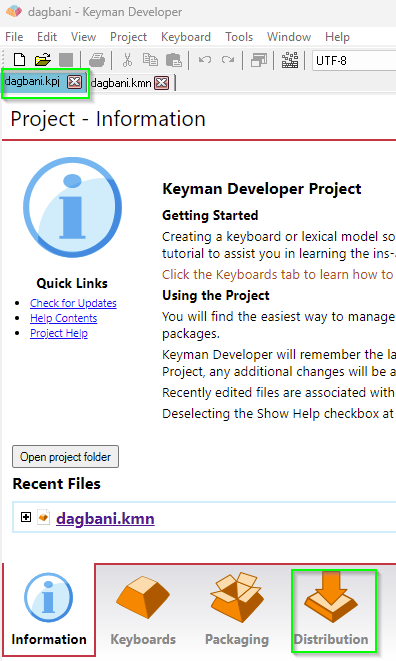

Part 7 of the [Keyman Developer Walkthrough](../walkthrough).

[< Back: Part 6 - Creating a Touch Layout](06-creating-touch-layout)

[Next: Part 8 - Preparing a Keyboard Package >](08-preparing-keyboard-package)

## Step-by-Step

- Click on the `dagbani.kpj` tab at the top (just under the menu and toolbar), then click on the `Distribution` tab at the bottom.



- There are a number of files that provide information about the keyboard. Some are for the keyboard author and for maintainers of the Keyman keyboards repository, some are to help users of the keyboard understand how it works.


- In the list of files, click on the `HISTORY.md` one to open that file. The file will open in a text editor and show you the information that you entered when setting up the keyboard project, specifically version 1.0, today’s date, and the author’s name. Since this information is correct, you can close this file by clicking on the red “X” on the righthand side of the `HISTORY.md` tab at the top of the text area.
- Click on `LICENSE.md` to open that file. This has been filled out using the Full copyright information you provided. Close the file by clicking on the red “X”.
- Click on `README.md` to open that file. This has been initialized for you. Close the file by clicking on the red “X”. (This file provides a place for information about the design of the keyboard that would be useful to a keyboard author wanting to update the keyboard or use it as a basis for a new keyboard. Don’t confuse it with the next item which is information for the keyboard user.)
- Click on `source\readme.htm` to open that file. This is the information displayed to the user just before the keyboard is installed. It has the description supplied when setting up the keyboard project. Other helpful information can be added, but the file should be kept as short as possible. Close the file.
- Click on `source\welcome.htm` to open that file. This is the help information that is packaged with the keyboard and available to the user. It should contain enough information so that the user can learn to type with the keyboard. This can be in the form of:
  - image files referenced by the welcome.htm file, or
  - a chart (in HTML format) showing how two keystrokes produce a character, or
  - descriptive text in the HTML file, or
  - some combination of the above.
- For this tutorial, we’re going to add one line of instruction. Find the following line:

```
<!-- Insert Keyboard Layout Images or HTML here -->
```

- Instead of inserting images, we're going to copy the following HTML text and paste it into the file:

`<p>Type ";" followed by e o n g z E O N G Z to produce ɛ ɔ ŋ ɣ ʒ Ɛ Ɔ Ŋ Ɣ Ʒ</p>`

- Close the welcome.htm file. Click “Yes” to save the changes.

To continue the Step-by-Step tutorial move to the next page: [Part 8 - Preparing a Keyboard Package](08-preparing-keyboard-package)

## Editing the README.md file

The `README.md` file contains information about the keyboard useful for other keyboard authors who might revise or adapt the keyboard at some future date. This information is not presented to the end user.

## Editing the LICENSE.md file

If you filled out all the information in the New Project dialog, the `LICENSE.md` file should have been set up correctly.
Normally the only thing to change here would be changing the initial date into a date range (from `2026` to `2026-2027`, for example).
Changing the date in this manner is only needed when the keyboard is updated.

## Editing the readme.htm file

The `readme.htm` file is displayed as the user begins to install the keyboard.
It should contain a brief description of the keyboard with enough information to reassure the user that the right keyboard has been selected for installation.
Instructions for using the keyboard should be reserved for the `welcome.htm` file.

## Editing the welcome.htm help file

The `welcome.htm` file provides the help that is packaged with the keyboard.
This help file is displayed after the keyboard is first installed.
The user can also ask for the help file to be displayed.

This file should contain enough information that the user can discover all the features of the keyboard.
This could be in the form of
- keyboard images for the different layers,
- a chart of how to type,
- a description of how to type (such as was used in the Step-by-Step tutorial),
- or some combination of these.

One way to create keyboard images is to use the procedure in the "Exporting an On-Screen Keyboard layout" section of [Creating a Desktop Layout](03-creating-desktop-layout).
These images can be referenced from the welcome.htm file in this fashion:

```html
<h2>Desktop keyboard layout</h2>
<h3>Default (unshifted)</h3>
<p><a href="LayoutU_.png"></a></p>
<h3>Shift</h3>
<p><a href="LayoutU_S.png"></a></p>
<h3>Right Alt (unshifted)</h3>
<p><a href="LayoutU_RA.png"></a></p>
```
All the files to be included in the package must be specified in the Keyman package source (.kps) file.
These files end up in a single directory in the Keyman package (.kmp) file.
Thus it is preferable to put images referenced by welcome.htm in the same folder as the welcome.htm file in order to allow easy local testing.

There are two approaches:
1. put the welcome.htm file and all the images it references in the `source` folder, or
2. create a `welcome` folder under the `source` folder and put the welcome.htm file and all the images it references in the `welcome` folder.

Keyman Developer's `New Project` feature follows the first approach when it creates the directory structure for the new project.
If you decide to use the second approach (which might be helpful if you have lots of images to include),
you'll need to change the location of the welcome.htm file in the list of files in the package.
The easiest way to do this is to remove the welcome.htm file from the list, then add it again by navigating to the new location.

For either of the two approaches, all the image files that are referenced by the welcome.htm file need to be added to the list of files to be included in the package.

## Editing the PHP help file

When a keyboard is submitted to the Keyman keyboards repository, a PHP file is included which provides the online help available on the [keyman.com](https://keyman.com) site. (If you do not plan to submit your keyboard to the Keyman repository, you don’t need to include this PHP help file.)

The Keyman keyboards repository requires that this PHP file have the name of the keyboard project plus the `.php` extension and be located in a folder named `help`, which is located in the `source` folder.

The PHP help file often contains the same information as is in the welcome.htm file. See [Keyman Keyboard help document (PHP help file)](https://help.keyman.com/developer/keyboards/phphelpfile) for more details.

[< Back: Part 6 - Creating a Touch Layout](06-creating-touch-layout)

[Next: Part 8 - Preparing a Keyboard Package >](08-preparing-keyboard-package)