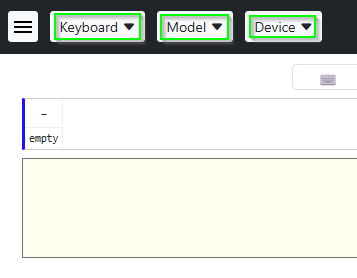
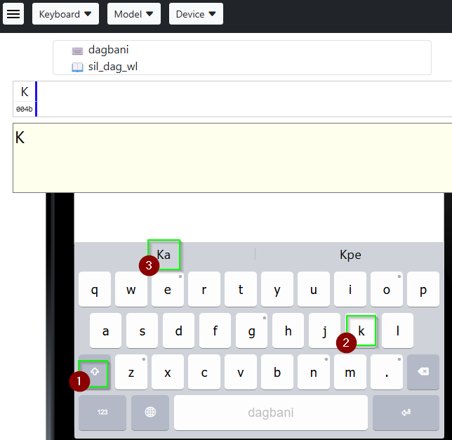
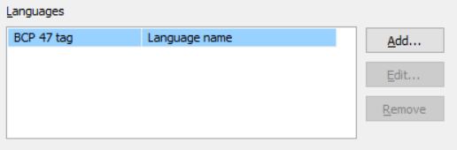
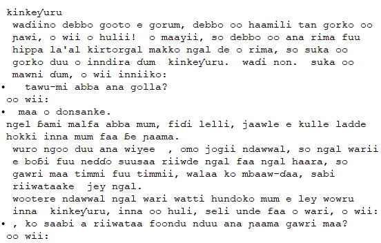
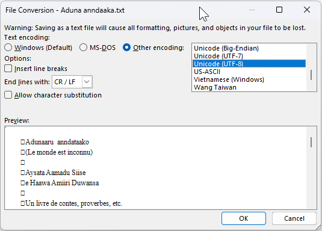

Part 10 of the [Keyman Developer Walkthrough](../walkthrough).

[← Back: Part 9 - Distributing a Keyboard Package](09-distributing-keyboard-package)

[Next: Part 11 - Installing a Keyman Lexical Model →](11-installing-lexical-model)

## Step-by-Step

For the purposes of this tutorial, we'll use a very short word list (of only 25 words)
selected from the first chapter of the gospel of Mark from the online version of Dagbani Bible
([https://www.bible.com/bible/2264/MRK.1.DBWDB](https://www.bible.com/bible/2264/MRK.1.DBWDB)).
The sample text is a verse from that chapter, so it is not a very realistic test!
This is just so that you can see how the lexical model is used for predictive text.

For a real project you would want thousands of words, ideally drawn from a number of sources.
In addition, the list of words should be reviewed.
(For details, see the discussion that follows the Step-by-Step section on this page.)

- Open Keyman Developer, and select the `Project` menu and the `New Project` menu item. In the `New Project` dialog, select `Wordlist Lexcial Model`, then `OK`.


- A `New Wordlist Lexical Model Project` dialog is displayed.
- In the `Author Name` field, put `SIL Global`. This also fills in the Copyright and Full Copyright fields.
- In the `Model Name` field, put `WL` (for `wordlist`).
- The version number defaults to `1.0` and we will keep that value.
- In the `Description` field, put **A test lexical model for Dagbani keyboard tutorial. Not for real use.**
- Select the `Add` button on the right and enter `dag` in the `Language tag` field and select `OK`
- Change the `Author ID` field from `sil_global` to `sil`.
- Verify that the `Model ID` field now shows `sil.dag.wl`, then select `OK`.
  - Note: If you are using Keyman Developer 17, it might display the message **This project file is in an old format. You should update it to the Keyman Developer 17.0 project format.** If so, select the `Upgrade project` button.

- Select the `Models` tab at the bottom of the window, then select the `sil.dag.wl.model.ts` file.
- Tick the `Language uses casing` checkbox (located on the `Details` tab)
- In this tutorial, we're going to open a file, copy its contents, then paste those lines into the `wordlist.tsv` file to replace the default content. Depending on how your browser is configured, when you open the file, it may open in a new tab or it may open in the same tab as this set of instructions. In the first case you can close the tab to return here, but in the second case you'll need to use the Back feature of your browser. (You may want to read ahead to make sure you understand the next few steps since the instructions might be hidden temporarily.)
- Click on the **dag-short-wl.txt** filename just below this paragraph to open the file (or right-click and select Open in a new tab).

[dag-short-wl.txt](./dag-short-wl.txt)

- Use <kbd>Ctrl</kbd>+<kbd>A</kbd> to select the entire contents and <kbd>Ctrl</kbd>+<kbd>C</kbd> to copy the selected text.
- Return to these instructions, either with the browser's Back feature, or by closing the newly opened tab, as appropriate.
- In Keyman Developer, select the `wordlist.tsv` tab on the left, then the `Code` tab at the bottom, then use <kbd>Ctrl</kbd>+<kbd>A</kbd> to select the entire contents and <kbd>Ctrl</kbd>+<kbd>V</kbd> to paste in the text that you just copied in a previous step.
- Use `File`, `Save` (or, alternatively, the <kbd>Ctrl</kbd>+<kbd>S</kbd> shortcut) to save the modified wordlist.tsv file.
- Select the `Build` tab on the left, then the `Compile Model` button. Verify that the **sil.dag.wl.model.ts built successfully** message is displayed.
- To test the model, we’ll first select the keyboard that we made in an earlier step. (The following instructions assume that the default location was chosen when creating the keyboard project and the lexical model project. If you chose a different location, you’ll need to navigate there.) Select the `Browse` button and Keyman Developer will open a file navigation window. Navigate to the `Documents` folder, then the `Keyman Developer` folder, then `Projects`, then `dagbani`, then `build`, then open the `dagbani.js` file. This will fill in the `Keyboard for testing` field.


- Select the `Test Lexical Model` button, then the `Open in browser` button. You should have a new browser tab that looks like:



- Select the `Keyboard` button and choose the `dagbani` keyboard from the list.
- Select the `Device` button and choose one of the `Phone Devices` from the list. (The illustrations were made with the `iPhone 5S` option.)
- Select the `Model` button and choose the `sil_dag_wl` lexical model from the list.
- Click in the text area (box with pale yellow background). The text we’re using as a test is **Ka bɛ daa dii chɛ bɛ lansi maa ka dol’ o.** You’ll be using the mouse to simulate the phone’s touch screen (unless your computer has a touch screen). Move your cursor to the desired key on the display, then click the mouse to “touch” the key.
- Click the Shift key (the key on the left with an uparrow), then <kbd>K</kbd>, then select **Ka** from the banner.



- Click <kbd>b</kbd>, then select **bɛ** from the banner.
- Since **daa** is in the banner already, select it.
- Click <kbd>d</kbd>, then select **dii** from the banner.
- Click <kbd>c</kbd>, then select **chɛ** from the banner.
- Click <kbd>b</kbd>, then select **bɛ** from the banner.
- Click <kbd>l</kbd>, <kbd>a</kbd>, <kbd>n</kbd>, <kbd>s</kbd>, <kbd>i</kbd>, and the space bar.
- Since **maa** is in the banner already, select it.
- Since **ka** is in the banner already, select it.
- Click <kbd>d</kbd>, then select **dol’** from the banner.
- Click <kbd>o</kbd> and <kbd>.</kbd> to conclude this test.
- Close the browser tab and return to Keyman Developer.
- Select `sil.dag.wl.kpj` from the top of the window (under the menu bar and toolbar), then select the `Packaging` tab at the bottom, then the `sil.dag.wl.model.kps` file.
- Select the `Details` tab on the left.
  - If the `Welcome file` field contains `(none)`, select that field and choose `welcome.htm` from the list. Use the <kbd>Ctrl</kbd>+<kbd>S</kbd> shortcut to save the change.
- Select the `Build` tab on the left. Then select the `Compile Package` button. Verify that you get the **sil.dag.wl.model.kps built successfully** message.
- Congratulations! You have successfully built and packaged a lexical model for the Dagbani language.

To continue the Step-by-Step tutorial move to the next page: [Part 11 - Installing a Keyman Lexical Model](11-installing-lexical-model)

## Introduction

A Keyman touch layout can link to a lexical model in order to suggest words to automatically finish what you are typing, based on the characters you have already entered. The currently available lexical models only predict words based on how frequently they are used in the entire language, and will not suggest next words according to context or grammatical rules. However, for languages with long words or complex character combinations, lexical models can be a valuable tool to aid users of your keyboard.

## Before You Begin

In order to create a lexical model for a language, you should have one or more sources of words in the language. Examples could be:

- Text files written in the language of your lexical model
- A lexicon or dictionary, from which you can export a list of words

You should choose sources with open licenses (such as Creative Commons, MIT, etc). You may need to ask the source for permission to relicense the list of words under the MIT license if you submit the lexical model to the Keyman lexical models repository (which always uses the MIT license).

## Creating a Lexical Model

Keyman Developer allows you to create a lexical model project, which is separate from your keyboard project. The link between a keyboard and a lexical model depends on having a BCP 47 code in common. Although it may seem confusing to make a separate project for a lexical model that is intended to go with your existing keyboard, this separation allows a lexical model to be used by any keyboard that supports that language. Similarly a keyboard user might have multiple lexical models to choose from.

In Keyman Developer, from the `Project` menu, select `New Project`. In the `New Project` dialog, select `Wordlist lexical model` from the list. Another dialog will appear to collect the basic information for your model.

### **Author Name, Author ID and Copyright**

Enter your name in the `Author Name` field. The value in this field is also used in the `Copyright`, `Full Copyright` and `Author ID` fields. If the copyright is held by an organization, adjust the name in the copyright fields. The name that appears in the copyright fields needs to be the full name of an individual or organization.

The `Author ID` value is based on your name (if you are working independently) or the name of your organization. You should use the shortest feasible version of the name (initials, for example), since the `Author ID` is the first of the three parts of a lexical model project. It will also become the parent folder in Keyman’s repository for all lexical models submitted by you or your organization.

### Model Name

This is the third of the three parts of the complete lexical model project name. It serves to distinguish between multiple lexical models by the same author for the same BCP 47 tag.

You could use:

- the name of the language this lexical model will serve
- some indication of the source of the words
- the type of lexical model, such as “wordlist” or “wl” (since Keyman currently only supports wordlist-based models)

As with the keyboard project ID, you are limited to lower case ASCII alphanumeric characters and the underscore character.

### Version

For a brand new model, there is no need to edit this. However, when making changes or additions to a lexical model, increment the first digit (for example, from `1.0` to `2.0`) for major changes, and the second digit (for example, from `1.0` to `1.1`) for minor changes. (As with the version number for keyboards, an optional third digit is available for revisions. Do not use more than three numbers. Don’t add zeroes to the beginning of numbers.)

### Languages

As with a keyboard, you must add a BCP 47 tag to your lexical model to properly identify the language it is intended for. This is the link that allows Keyman to match keyboards and lexical models. It will be used as the second of three parts of the complete lexical model project name.

Select `Add` and fill in the fields accordingly. You’ll want to use the same BCP 47 tag which you used in the [Creating a Keyboard Project](01-creating-keyboard-project) step.



It is best to use the simplest possible BCP 47 tag to identify your language. Only add Script and Region tags if you are specifically working with a script or region that differs from the most commonly used form of your language.

### Description

For the `Description` field, you can simply state that this a lexical model based on a list of words for the specific language. You might also include information about where those words were gathered. (Don’t, however, include details about how many words are included. Otherwise you’ll need to revise the description everywhere it’s used for each new version of the lexical model that changes the word count!)

Note how the `Model ID` field is automatically filled in.
The naming scheme for lexical models is `author_name`.`language-tag`.`model_name`.
The `language-tag` value is derived from the `Primary Language` that you choose, so be sure to select the correct language.
If your Author or Model names are excessively long, edit the `Author ID` and `Unique Name` fields respectively to give your project an abbreviated name. (For example, in the Step-by-Step section, the Author field was changed from "sil_global" to "sil".)

Once you have filled out all of the fields, you are ready to create your lexical model.

## Details

Keyman will place you in your `.kpj` file immediately, as with a keyboard project. Navigate to your `model.ts` file. On the `Details` tab, you’ll find some options.

Currently `Wordlist (trie-1.0)` is the only choice for the `Format` field.

You’ll normally want to keep the `default` choice for the `Word breaker` field and the `(Space U+0020)` option for the `Insert after word` field, unless you are dealing with an orthography that doesn’t use space to separate words. For scripts such as Khmer, Thai, and Lao, which have special ways to delimit words, see the Keyman documentation on [coding a custom word breaker](https://help.keyman.com/developer/current-version/guides/lexical-models/advanced/word-breaker).

You can specify the opening and closing quotation marks, and whether the language is using a right-to-left script (such as Arabic, Hebrew, Syriac, etc.)

If your language uses a script with uppercase and lowercase (such as Latin, Cyrillic, Greek, etc.) you probably will want to enable the `Language uses casing` checkbox, so that Keyman will take casing into account when matching and suggesting words. For example, if you start typing `Rab`, Keyman will propose `Rabbit` rather than `rabbit`.

The Keyman site has more details on [advanced topics](https://help.keyman.com/developer/17.0/guides/lexical-models/advanced/word-breaker).

## Editing Wordlists

On the `Details` tab, there is a field labeled `Wordlists`, where one or more wordlist files are specified. Every wordlist that you add to your lexical model will be listed in the “Wordlists” list on the “Details” tab and have its own tab below the “Details” tab.

Keyman provides a default `wordlist.tsv` file for you as an example. You can replace its contents with your own data or remove it. Use the buttons on the right to add or remove wordlists.

For a newly created project, the only wordlist present is `wordlist.tsv`.
If you open that file, you'll see some sample data included as an illustration.

For advanced information on Keyman wordlist file formats and exporting your own wordlist files, read the [TSV file documentation](https://help.keyman.com/developer/17.0/reference/file-types/tsv).

### Ignored lines

Any line beginning with `#` is ignored. You can write any notes or commentary on such lines.

### Word Form

The `Word Form` is the first column of your wordlist, and will contain every single word that you want your lexical model to suggest to users while typing. Naturally, this includes grammatical variations and other alternate forms of words used in your language.

### Count

The `Count` is the second column of your wordlist, and is a number indicating the relative frequency with which a word appears in your language. This is most commonly done by an automated count of words that occur in actual texts in your language, but it is possible to manually adjust the frequency count of one or more words.

If the `Count` field is empty for a given word, it will be counted as one. If you omit the `Count` field for all the words in a file, they will all be considered equally likely. Your lexical model will be more useful if it can suggest words according to how common they are.

Since a lexical model project can have multiple wordlist files, you could have one file with words and frequency counts derived from actual documents in the language, then add a second file extracted from a lexicon with no frequency count.
When compiling the model, Keyman Developer will add the counts.
In this way the lexicon will provide some less common words with a frequency count of one (and increase by one the frequency count of words in the first wordlist).
Thus the list from the lexicon can supplement the list formed by analyzing actual documents.

### Comment

The `Comment` is the third column of your wordlist. This is an entirely optional column, but if you would like to leave notes for certain words, you can insert your notes into the third column of your `.tsv` file and Keyman will ignore them while processing your wordlist.

### Simple Tool for Wordlist Creation

PrimerPrep is a tool that will extract words from text files and create a simple .tsv file in the correct format for use in your lexical model.
The [Generating Wordlists with PrimerPrep](#toc-generating-wordlists-with-primerprep) section at the end of this page gives a brief tutorial on how to use PrimerPrep to create a wordlist suitable for your lexical model.

### Importing Wordlists into Keyman Developer

In Keyman Developer, with your lexical model project open and the .model.ts file selected, select the `Details` tab to see the list of wordlist files included in this lexical model. If you have another file (perhaps one created with PrimerPrep) which you want to addd, select the `Add` button on the far right and navigate to the file to be included. You’ll see a dialog something like the following:


Click `Yes` so that Keyman can make a copy of this file to include with the other source files your lexical model project.

You’ll also want to `Remove` the default `wordlist.tsv` file (unless you have replaced the example content with your own data).

Note that if you remove a wordlist (the default `wordlist.tsv`, for example) from the `Wordlists` list on the `Details` tab, the file itself will not be removed from your project folder.
You will have to use a file manager to delete any unnecessary wordlist files yourself.
If you decide not to use the default `wordlist.tsv` file, you should remove it from the list on the `Details` tab, then delete it from your project files.

Once you have specified one or more wordlist files, save your project and compile it.
You should now have a lexical model that is compatible with any keyboard that uses the same BCP 47 tag as the lexical model.

## Testing Lexical Models

To test your lexical model, go to the `Build` tab of your `model.ts` file and click `Test Lexical Model`. Keyman will start up a development server to let you test keyboards and models on the web.

If you are working with your own keyboard and lexical model and have previously compiled your keyboard and run it on the Keyman development server, it will already be among the options for testing.
However, you can also add your keyboard for direct testing in the `Keyboard for testing` field. Simply click the `Browse...` button and search for your keyboard’s `.js` file. It should be located inside your keyboard’s `build` folder.

Once Keyman confirms that your testing server is active, you can scan the generated QR code with a mobile device to begin testing.

Another testing possibility is to select the `Open in Browser` button and a new browser window (or tab) will open with three dropdown lists at the top of the page: `Keyboard`, `Model`, and `Device`.
- Set the `Device` to one of the `Phone Devices` or `Tablet Devices` options.
- Set `Keyboard` to the keyboard you selected.
- Then set `Model` to the lexical model you are testing. You can then test the lexical model on the simulated keyboard.

## Packaging

Just like a keyboard, the lexical model must be packaged before it is ready for distribution and use with a Keyman keyboard.
Use the `Packaging` tab at the bottom of the screen and select your .kps file.
You can then select the `Build` tab on the left and then the `Compile Package` button to create the package (.kmp) file.

## Publishing a Lexical Model

You can submit your lexical model to the Keyman lexical models repository in a manner similar to submitting a keyboard to the keyboards repository.
This makes the lexical model available to anyone with Internet access.
See [Guide for Lexical Model Submissions](/developer/lexical-models/submission/).

The [Distribute lexical modes to Keyman Applications](../../lexical-models/distribute/packages) page details other distribution possibilities.

In addition, it is possible to use [Keyboard App Builder](https://software.sil.org/keyboardappbuilder/), which will allow you to build an app that includes Keyman, a specific keyboard and a specific lexical model.
You can then distribute this app to users directly or through the platform's source of apps.

## Generating Wordlists with PrimerPrep

Creating a wordlist manually is a difficult task.
Instead, wordlists are usually generated using a software tool that can process text files written in the given language,
identify unique words and tally up how frequently they appear in the text.

One tool that can do this is [PrimerPrep](https://software.sil.org/primerprep/), which is available for free on Windows and Linux. This tutorial will cover how to use PrimerPrep to generate a wordlist from preexisting texts.

Before generating a wordlist with this method, you must first have one or more texts to take words from. This allows you to include relevant and commonly used words and their various grammatical forms in your lexical model, rather than attempting to select appropriate words yourself.

When selecting texts to use in generating your lexical model, try to find long texts that include a variety of formats and uses of the language. This increases the likelihood that your lexical model will cover common wordforms and accurately predict the most frequently used words.

Be sure to back up the original text and save your edited version under a new name. You will need to cut various unwanted words from the document before generating a wordlist from it, which is obviously undesirable if you need the full document later.

For the purposes of this tutorial, we’ve provided a sample text that you can download and use to follow along with instructions. If you already have a project in mind and appropriate sample texts, feel free to use those instead.

The sample text is a collection of folktales for the Fulfulde language. Right-click on the **Anduna_anndaaka.txt** link below and select `Save link as` and navigate to a folder where you can save the file and work on it. After you have deleted some unneeded words from the file you'll use PrimerPrep to create a wordlist file that you will then include in the `source` folder of your lexical model project.

[Aduna_anndaaka.txt](./Aduna_anndaaka.txt)

### File Preparation

Before extracting words from a document to create a wordlist, you can first remove any words that are unlikely to be needed by users. (Alternatively, you can create the wordlist first and remove unwanted words later, but that may end up being more work.)

Generally, you'll want to exclude such words as:

- Proper nouns (names, places, etc.)
- Acronyms and abbreviations (e.g. D.I.Y., LHR)
- Numerals and extra symbols
- Anything that is not used as a regular word in the language

PrimerPrep will remove any punctuation and numerals for you when it processes your document, but you will need to remove proper nouns and acronyms before using PrimerPrep. The easiest way to do this is with Regular Expressions (Regex), which allow you to quickly find specific strings of characters and remove them from your document.

If you do not have a word processing app that supports Regex searches, you can download and use the free program [Notepad++](https://notepad-plus-plus.org/downloads/). Otherwise, feel free to use your Regex-compatible word processor of choice.

When you open the Aduna_anndaaka.txt file you’ll notice that the title page is written in French. Delete everything that comes before the following line:

```
Aysata Aamadu Siise
```

The lines before it are either in French or contain mostly acronyms or proper nouns, which we do not want to include.

In general, you will want to ensure that the text you are processing contains only text in the language for which you want to create a lexical model, so that your model won't suggest words in a different language.
This is especially important if you are using a text that contains translations or other footnotes meant for non-native speakers.

Open up the file you want to take your wordlist from in Notepad++. In our case, this is `Aduna_anndaka.txt`.
In Notepad++, press <kbd>Ctrl</kbd>+<kbd>H</kbd> (or from the `Search` menu, select `Replace`) to open the Find and Replace dialog.
Enable the `Regular Expression` setting at the very bottom.


You will need to perform several Regular Expression (Regex) search and replace operations to remove unneeded elements from the document.
For each Regex string, simply paste it into the `Find what:` field, and leave the `Replace with:` field blank.
(A blank “replacement” effectively deletes what the search finds.)

The regular expressions provided here are tailored for the Fulfulde language, which includes the characters `ɓɗɲŋƴ` and `ƁƊƝŊƳ`.
You may have to dive deeper into Regex rules to filter words in languages that use different character sets.
[Regex101](https://regex101.com/) is a great resource for building and testing regular expressions.
Just make sure that the Regex “flavor” you use on the site matches that of your word processor.

### Removing Proper Nouns

```
\b[A-ZƁƊƝŊƳ][a-zɓɗɲŋƴ]*\b
```

This Regex searches for any words that begin with an uppercase letter followed by zero or more lowercase letters.
(The `\b` represents a word boundary. `[A-ZƁƊƝŊƳ]` represents one of 31 uppercase letters. `[a-zɓɗɲŋƴ]` represents one of 31 lowercase letters, however `*` indicates that `[a-zɓɗɲŋƴ]` should be repeated zero or more times.)
Although it will also remove any words that begin a sentence (or words that are in titles), it will remove most unwanted names.
The idea is that if a word is common enough, it will appear multiple times in different places, so it is acceptable to remove the few times the word happens to begin a sentence.

- Make sure to activate the `Match case` option when using Regex to look for capitalized letters. Otherwise, it will match words of **any** case (and may replace your entire document)!


- Copy the regular expression above and paste it into the `Find what` field.
- Select the `Find Next` button a few times to see what Notepad++ is matching. It should be highlighting capitalized words only. (Note that Notepad++ highlights the matched word in one color and also, in a slightly different color, any other occurrences of the same word, **regardless of case**. This can be confusing.)
- Once you’re satisfied with the results, return to the top of the file and select `Replace All`.

### Removing Acronyms

```
\b([A-ZƁƊƝŊƳ][.-]?)+\b
```

This Regex will remove all words that are either in ALL CAPS, or in caps with separating punctuation (i.e. D.I.Y.).
Note that if the acronym does have separating punctuation, there may be one last `.` left on the end.
This is not a problem because PrimerPrep will clean up all of the punctuation for us later.

- Return to the top of the file
- Copy the regular expression above and paste it into the `Find what` field.
- Select `Find Next`. In this case, you will likely get a `Can't find...` message, indicating that no matching acronyms were found.
(If it is matching random words, ensure that `Match case` is checked.)
For this text, this particular test wasn't needed. Deleting the front matter from the text removed several acronyms already.

Your text should be ready for PrimerPrep now. It may look messy to a human, but PrimerPrep will ignore all of the extra spaces and punctuation and simply extract the words from the document. It will look something like this:



- Save your file with a new name (`Aduna_anndaaka_lowercase.txt` for example) and place it somewhere that will be easy to find.

### Generating the Wordlist

- If you haven’t already, download [PrimerPrep](https://software.sil.org/primerprep/downloads/) and run it. This is the basic appearance:


It may look complicated, but the wordlist generation only uses one of the functions of PrimerPrep.

- Select the `Add Text(s)` button
- Navigate to the text you just prepared
- Double-click on the file (or select the file and then select `Open`). It should populate the window with words and frequency counts:


- From the `File` menu, select `Save Word List` and save your wordlist file in an appropriate location. Be sure to rename it something that distinguishes it from any other wordlists you may generate. PrimerPrep suggests a `.txt` extension, but Keyman generally uses `.tsv`

That’s all you need to do. You can now exit PrimerPrep and return to Keyman Developer. PrimerPrep will warn you about unsaved data, but you can safely ignore this because you have saved the wordlist file and don't need other functions of PrimerPrep.

Note: The text provided for this tutorial is already in a `.txt` file format. For your own project, you may be working with files in other formats and you will need to convert them to a `.txt` file in UTF-8 Unicode encoding in order to import them into PrimerPrep. For example, if your files are in Microsoft Word format, the dialog for saving a `.txt` file would look something like this:



[← Back: Part 9 - Distributing a Keyboard Package](09-distributing-keyboard-package)

[Next: Part 11 - Installing a Keyman Lexical Model →](11-installing-lexical-model)
